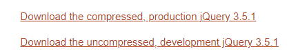
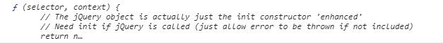

# jQuery-day01

> 今天是jQuery的第一天


## 01-课程介绍

> 这个阶段的学习安排


(**ppt**)

Hello,同学们好!

​		从今天开始我们要进入到一个新的学习阶段了,jQuery.

在正式开始学习之前先简单的介绍一下阶段 目标和课程安排。

这个阶段的终极目标就是能够使用jQuery来开发常见的网页应用.

​		之前我们用原生的dom语法,并且 开发过不少网页应用,但是代码较为繁琐,学习了jQuery之后可以毫不夸张的说,同样的功能用jQuery来写的话,代码会简单到令人发指,注意是发指哦!

​		jQuery的课程一共有3天:

1. 认识jQuery , 基本使用

   首先认识一下jQuery,然后学习他的基本使用,用它来实现一些常见的网页效果,在学习过程中大伙应该可以很容易的感受到他的简洁和强大


2. 动画,节点

   第二天我们会学习如何使用jQ实现常见的网页动画,并且对节点进行各类操作

3. 表单 , 插件

   第三天也是最后一天,学习jq中和表单相关的方法,及插件系统

更为细节的内容会在后续的课程中慢慢展开,这里就先不扩展啦!

今天是第一天,为了让知识更好的学以致用,有4个精心准备的案例，分别是

1. 计数器:首先是一个很简单的小计数器
2. 图片切换:接下来是一个图片切换效果
3. 输入统计:然后是输入统计页
4. 多模式登录:最后是一个这样的登录界面

当然，大伙学完了之后可以尝试把之前的案例用`jQuery`实现,练得越多会越熟练的呢!


好啦！这就是课程介绍的所有内容,咱们来小结一下:

1. 这个阶段的学习内容是什么?

   jQuery

2. 课程一共有几天?

   3天

3. 终极目标是什么?

   使用 jQuery 开发常见的网页应用


说了这么多的jQuery，咱们下一节就来好好的认识一下他

## 02-认识jQuery

> 从今天开始学习的jQuery是个什么东西呢?

(**ppt**)

hello，同学们好！

这一节咱们来一起认识一下什么是jQuery：

1. JavaScript 类库(js文件)

   说的通俗一些就是一个js文件

2. 封装了很多简单易用的方法 (浏览器兼容)

   并且考虑了浏览器的兼容问题，我们只管用就好

3. 绝大多数用来简化 DOM 操作

   咱们这个阶段的学习重点就是这些方法，通过调用他们可以大大减少代码量，从而提升开发效率

4. 提升开发效率

这些就是他提供的方法，别被这密密麻麻的一片给吓到，咱们只需要学会常用的即可，而且很多方法的使用套路类似，用熟悉了之后，就算碰到没见过的方法也能够很快上手.


接下来咱们来具体的感受一下使用jQuery的方法对开发效率的提升

(**编辑器**)

现在我们切换到了编辑器，右侧是通过liveserver插件打开的浏览器(**放个截图**)。为了便于测试页面中准备了一些基础的标签:一会我们就通过ul中的li标签来进行测试。

```html
<ul>
  <li>西兰花</li>
  <li>西红柿</li>
  <li>西瓜</li>
  <li>西葫芦</li>
</ul>
```

​		测试的方法是：我们分别使用dom语法和jQuery的方法来实现一个相同的需求，看看代码量有什么差别.需求这样的:

​		*为所有的li绑定 点击事件 , 点击时修改背景色为 粉色*

​	首先测试dom语法，li标签个数较多，我们首先要获取所有，用哪个方法呢？**nice,document.querySelectorAll**,这个方法获取到的是所有的li标签，我们使用循环的方式为他们挨个绑定点击事件，在点击事件中通过this找到当前点击的dom元素，然后通过style属性点出backgroundColor接着设置为粉色，粉色咋写来着？对啦，pink。

```javascript
// 原生js
let liArr = document.querySelectorAll('li')
for (let i = 0; i < liArr.length; i++) {
  liArr[i].onclick = function () {
    this.style.backgroundColor = 'orange'
  }
}
```


​		保存之后切换到浏览器测试一下，点点点，怎么样是不是点谁谁就变红啦！算一下代码一共有几行？1234一共6行

​		接下来使用jQuery测试一下，咱们还没学过他的语法，所以看不明白没关系（**问号表情**），重点对比代码量即可

```javascript
// jQuery  
$('li').click(function () {
    $(this).css('backgroundColor', 'orange')
})
```

​	保存之后切换到浏览器测试一下，点点点，效果是不是完全一样啊！算一下代码一共有几行？1234一共3行，少了整整一半哦，写代码的速度同样的情况下，同样的功能肯定是代码越少效率越高，而且我们稍微看看刚刚写的内容有一些单词还是比较容易理解的，比如点击，css是样式的意思，背景色等等

好啦，以上这一小节的所有内容，小结一下

(**ppt**)

**小结一下**

​		这一节咱们简单认识了一下jQuery:他呢，是一个**JavaScript**类库

使用它封装的方法可以极大的提升开发效率。

​		这点通过刚刚的两份代码应该看的特别明显。是不是有点跃跃欲试啦(**安排表情**)，咱们下一节就来把使用jQuery需要做的准备工作给做啦！


## 03-使用准备

> 为了使用jQuery需要做什么准备工作?

(**ppt**)

hello,同学们好!

​	上一节咱们通过Dom和`jQuery`的方式实现了同样的功能，**哪一种简单一些呀？**

```javascript
  // 原生js
  let liArr = document.querySelectorAll('li')
  for (let i = 0; i < liArr.length; i++) {
    liArr[i].onclick = function () {
      this.style.backgroundColor = 'orange'
    }
  }
```

```javascript
// jQuery  
$('li').click(function () {
    $(this).css('backgroundColor', 'orange')
})
```

​	答案非常明显对不对，`jquery`简单的多，什么为什么早不学这个？这个问题问得好，学习要循序渐进，一步一个脚印。步子太大，就很容易摔跤（笑容表情），而且咱们这不是已经开始学习了嘛

这一节我们就来吧使用`jQuery`的准备工作做好,步骤不多,就2步:

1. 下包:你得先把这个别人写好`js`文件下载到本地
2. 导包:下载完毕之后需要导入到使用的页面中

做完了准备工作之后就可以进入下一步啦

​	用包:使用`jQuery`提供的功能,鉴于还没学习语法,我们一会就做2个简单的测试,一个是输出非常关键的一个对象,第二个是调用一个jQuery的方法，这段代码之后会有专门的章节进行讲解，咱们先用！

咱们先去下包:官网地址是这个:

https://jquery.com/

这是英文官网，不用都看明白，找下载按钮就好，**看到了没？**

对咯，就是右边最大的那个，点他，又打开了一个全是英文的页面，这次的下载位置不太明显，大伙看仔细啦！



这两个下载连接下载的`js`文件从功能上完全一致:

1. 第一个是压缩版本
2. 第二个是完整版本

具体的区别我们一会直接去下载好的源文件，看起来会更加直观一些呢

这两个我们都下载好了，来看看区别是啥：

1. 第一个换行缩进，注释都有呢
2. 第二个不包含换行、缩进等，甚至变量名也被处理成单个字母形式，这样做的目的是压缩代码量

大伙猜猜哪个**大哪个小呢？**


肯定是第二个啦,那么再问一个问题，**项目开发完毕上线之后用哪个会比较合适呢？**提示要考虑传输量哦!

没错，上线之后用压缩版本，因为文件越小，在网速不变的情况下使用压缩的版本的传输的数据量小，那么网页打开的速度会快一些呢。

那个没有压缩的版本在开发阶段使用就好，出错的话提示会更加详细，如果要看源码也看的更清楚一些。

（**编辑器**）

下包已经搞定，接下来就是导包和测试咯，我们切换到编辑器，右侧是通过live server插件打开的浏览器

1. 先导包
2. 打印一下导入`jQuery`之后页面中会额外增加的一个全局变量，他是`jQuery`学习阶段最为重要的一个对象，基本上所有的方法都是通过他开头哦，说了这么多这个对象叫啥呢,美元符号大伙会不会写呀？对啦，就是s中间加个竖线，在键盘的4上面的那个

另起一行`script`输出一下`$`,看看是否输出了下图内容:

```javascript
console.log($)	
```




如何咱们一样，那么恭喜你准备工作全部搞定。如果出错的话的话也不要担心，十有八九是导入错了,我们来试试看。把导入的代码注释掉之后，就会出现错误的提示啦。

确保上一步做完之后,我们写一段测试代码

```javascript
$('body').css('backgroundColor','yellowgreen')
```

虽然还没学过`jQuery`的任何方法，但是这行代码相信我觉得肯定看一眼就知道是什么意思把，不信我问大伙两个问题。这段代码操纵的是什么元素呢？**对啦，body**。设置的又是什么样式呢？**nice，背景色**

如果没有出错,`body`的背景色应该变为黄绿色.**那如果变成粉色怎么写呀？**

`nice`，把`yellowgreen`变成`pink`就好，走你！！！

为了测试`mini`版本和`完整版本`功能一样,我们把导入的`js`换一下.怎么样,效果是不是一样呢

(**ppt**)

好啦，以上就是这一节的所有内容，小结一下

1. 使用jQuery的准备工作是哪两步？

   下包，导包

2. 完整版本和压缩版本的jQuery功能上有区别吗？

   没有

3. 文件名中有mini的是压缩版本还是完整版本？

   压缩版本

通过这一节的学习，咱们已经把使用jQuery的准备工作做好啦，下一节学习选择器，学习如何在jQuery中去获取要操纵的元素!


## 04-选择器

> jQuery中如何获取需要操纵的元素?

(**ppt**)

hello,同学们好!

这一节我们来学习`jQuery`的选择器，为什么先学他呢（**问号表情**），咱们来一起回忆一下,在学习css的时候为了给元素设置样式，首先要干嘛？学习Dom语法的时候为了操纵元素，又得先干嘛呢？是**不是要先找到元素啊**

`jQuery`中也是一样的,先得找到要操纵的元素,然后再去操纵他们,所以先来学习`选择器`，学习如何通过`jQuery`的方式去获取元素,语法很简单:

```javascript
// 基本用法
$('选择器')

```

直接调用$方法即可，选择器通过字符串的方式传递进去,基本上兼容所有`css`的选择器，比如标签选择器，类选择器，后代选择器等。这里大伙没准有点疑问这个$是哪里来的。咱们回忆一下上一节的内容，导入了jQuery之后我们通过console的方式了$这个全局变量，打印的是一个函数哦。既然是函数加括号是不是就是调用他呢。只不过之前的函数名都不是$而已，大伙想想是不是这么一回事。

考虑到还没学习其他的方法，这里依旧通过修改元素的背景色来进行测试，咱们去测试一下是不是可以直接使用css的选择器.

（**编辑器+浏览器**）

咱们先来测试一下标签选择器,所有元素都生效了哦，记住这个特点哦

```javascript
// 标签选择器
$('p').css('background', 'red');
```

再来测试一下类选择器，页面上哪个元素有类名呀？

```javascript
// 类选择器
$('.p').css('background', 'blue');
```

下一个是id选择器,看到那个有id的元素了吗

> 大伙id选择器的符号还记得吗？

```javascript
// id 选择器
$('#p').css('background', 'green');
```

最后测试一下后代选择器,这里考考大家,如果不想改背景色啦，**想改字体颜色咋写呀?**

对咯,写成`color`就好，保存之后页面上`body`内部的所有p标签就改变了呢

```javascript
// 后代选择器
$('body p').css('color', 'white');
```

因为后续的课程中会陆续用到其他的选择器所以这里就不再单独演示啦

好了，以上就是这一节的所有内容，小结一下

（**ppt中**）

**小结:**

选择器的语法咋写来着？

​		不知道大伙和我想的是不是一样，调用$方法然后以字符串的方式传入css的选择器即可。

这一节咱们通过修改元素的背景色进行测试，写法和之前完全不一样，Dom阶段是肯定没有这个方法的，这个疑问学完了下一节jQuery对象之后大伙就能够搞明白啦！


## 05-jQuery对象

> 只有jQuery对象才可以使用那些高级的方法,他是什么呢

(**ppt**)

hello，同学们好！

​		这一节咱们学习的是jQuery对象。

​		jQuery 中利用选择器获取到的并非原生的 DOM 对象，而是 jQuery 对象，所以上一节我们在学习jQ选择器的时候，调用$方法获取到的返回值就是jQuery对象，jQuery提供的绝大多数方法都需要通过jQuery对象才可以访问，包括我们上一节用来测试的css方法。

```javascript
// jQuery
$('p')
```

然后我们通过css方法把元素的背景色变成了粉色

```javascript
// jQuery
$('p').css('backgroundColor','pink')
```

​		类似的逻辑如果通过dom对象来实现,写法会略有不同:我们首先获取到dom对象，然后通过点语法访问style属性，接着为backgroundColor赋值.

```javascript
 document.querySelector('p').style.backgroundColor = 'pink'
```

​		两者之前的语法虽然有类似的部分，但是可不能混着写哦，比如：通过jQ对象点出style属性，然后为backgroundColor赋值，或者通过dom对象调用css方法.

```javascript
$('选择器').style.backgroundColor = 'pink'
document.querySelector('选择器').css('backgroundColor', 'pink')
```

​		大伙觉得这样写对不对呀？**有同学犹豫了，不用犹豫就是不行**，原因刚刚已经说过啦，jQ对象和dom对象是不一样的东西，他们各自有自己的语法，如果硬要混着写那就只能报错啦，一会去编辑器看看具体的错误提示，让大伙感受的更深一些。

​		除了通过选择器以外，我们还可以把dom对象直接丢到$方法中，他返回的也是一个jQ对象，就可以使用jQuery提供的那些高级方法咯

```javascript
$('选择器')
$(dom对象)
```

走！咱们去编辑器测试一下这种写法，顺便看看jQuery对象的组成


（**编辑器**）

现在我们来到了编辑器，右侧是通过插件打开的浏览器，在页面中准备了一些用来测试的元素，喏就是这些li标签啦（红色箭头）

```html
<ul>
  <li>html</li>
  <li>css</li>
  <li>javascript</li>
</ul>
```

​		我们分别获取一下dom对象和jQuery对象然后打印看看他俩的区别:在保存jQuery对象的时候建议使用$开头，避免和普通的对象弄混

```javascript
let li = document.querySelector('li')
let $li = $('li')
console.log('li:', li)
console.log('$li:', $li)
```

​		打印之后可以很明显的看到两者的区别，第一个是dom对象，就是页面上第一个li标签啦，第二个是jQuery对象，看起来有点复杂，我们点开看看，可以看到里面有所有符合选择器的dom元素，就是那3个li标签。

​	那我们上一节调用的css方法在哪里呢，现在展开的部分有没有？**好像没有看到呢**，咱们往下看这里有个__proto__，还记得是什么吗？**nice，原型。**原型里面的属性和方法会被所有的实例对象共享，我们点开看看，找c开头，css方法就在这呢,而且还有很多其他的方法，这些都是可以调用的，具体的用法咱们慢慢学习，别着急。

​		我们再来调用一下看看。123走你，哇塞所有的li标签的背景色都变成粉色了，注意是所有哦。

```javascript
$li.css('backgroundColor','pink')
```

​		如果页面上有4个li标签可以吗，试试看嘛，我们加多一个li标签,保存以后注意看咯，amazing，继续加还是ok的呢.

```html
<li>jQuery</li>
```

​		在我们调用jQuery对象的方法时生效的是所有在jQ对象内部的dom元素，或者说选择器命中的所有dom元素，无论是4个还是40个

​		我们再来测试一下混着使用，上面的变量li保存的是dom元素，我们直接用他来调用css方法，修改背景色为天蓝色，这段代码是否可以正常运行呢？**对啦 就是要坚决，他不可以**。保存之后，怎么样是不是就报错啦！直接提示css 不是一个方法。大伙也要注意别混着用呢。

```javascript
li.css('backgroundColor', 'skyblue')
```

​		最后测试一下把dom对象转jQ对象，我们调用$方法然后把变量li丢进去,然后调用css方法把背景色变成天蓝色，保存之后，nice是不是就变色了，也就是说可以通过$方法把dom对象转为jQ对象.


好啦，以上就是这一节的所有内容，小结一下

(**ppt**)

这一节咱们学习的是jQuery对象，其中！

1. 调用$方法传入选择器或dom元素获取到的是什么对象  ？

   **jQuery对象**

2. jQuery对象的方法,比如css方法放在什么位置？

   **原型上**


目前的代码都是保存之后立刻执行，可以通过事件来触发吗，比如点击事件？肯定可以啊(**手指狗狗表情**)，咱们下一节就来学习jQuery中的事件绑定！

## 06-事件绑定

> jQuery中如何进行快捷事件绑定?

（**ppt**）

Hello，同学们好！

​		这一节咱们学习的是jQuery中的的事件绑定。

​		在 jQuery 中以原生事件类型的名称为依据 , 封装了相对应的事件处理方法

​		语法是这样的：先通过选择器找到希望绑定的元素，然后然后调用对应的事件名方法，传入回调函数，逻辑直接写在回调函数里面即可。

```javascript
$('选择器').事件名(function () {
  // 逻辑....
})
```

​		事件名咋写呢？比如点击事件，直接写click就好，双击事件大伙还记得吗？**nice，dblclick。**可别写成了doublekill哦。逻辑和之前一样直接写在回调函数里面就好。

​		不知道大伙发现了规律没，和之前dom阶段相比事件的名字就是少了一个on，之前咱们学过的所有事件都可以套用进来哦，同时不再是使用等号赋值了，而是直接调用方法,传入回调函数。

​		如果要获取触发事件的dom元素咋办呢？直接在回调函数中通过this即可。

​		走去编辑器里面测试一下，


（**编辑器**）

​		现在我们切换到了编辑器，为了便于测试准备了一些基本的标签：

首先是一个类名叫做button的按钮，一会为他绑定点击事件，接下来是类名叫做text的输入框，一会为他绑定获取焦点和失去焦点事件。最后是一个类名叫做box的盒子，一会用它来测试鼠标的移入和移出事件。

```html
<ul>
  <li>黑马程序员</li>
  <li>北京校区</li>
  <li>上海校区</li>
  <li>广州校区</li>
  <li>深圳校区</li>
</ul>
<br />
<input type="text" class="text" />
<div class="box"></div>
```

​		首先通过选择器找到按钮，接下来为他绑定点击事件，我这么写对不对? nice，这么写是错误的。也是把dom对象和jQuery对象弄混啦

```javascript
$('li').click=function(){}
```

​		jQuery对象在绑定事件时直接调用方法即可，所以这里要改成调用click方法的形式，然后把回调函数传递进去，我们先输出一些内容,比如click.保存之后切换到浏览器，打开console界面，点点点，怎么样一直在打印内容，事件是不是就绑定上去啦！

```javascript
$('li').click(function(){
	console.log('click')
})
```

​		接着来测试this，我们输出一下,保存之后再次切换到浏览器进行测试，点点点，看到了没，打印的就是点击的那个dom对象,可以这样来更改他的背景色吗?对啦，不可以哦，css是jQuery对象的方法，dom对象无法调用呢。

```javascript
$('li').click(function(){
	console.log('click')
	console.log(this)
	this.css('backgroundColor','pink')
})
```

​		为了调用需要转为jQuery对象，调用$方法把this丢进去就好啦，我们在测试一下，点点点，是不是点谁谁就变粉啦

```javascript
$('li').click(function(){
	console.log('click')
	console.log(this)
	$(this).css('backgroundColor','pink')
})
```

​		接下来测试一下其他的事件，通过选择器找到输入框，首先为他绑定获得焦点事件，事件名叫啥来着?**nice,focus**。然后传入回调函数，和之前一样先打印一些内容，保存之后去测试一下，鼠标点进去，打印啦。

```javascript
$('.text').focus(function () {
  console.log('focus')
})
```

​		接下来为他绑定失去焦点事件，代码和上面类似，我们直接拷贝过来，把事件名换了就好，失去焦点叫什么来着？**对啦，blur**，我们把事件名和输出的内容都换成blur。保存之后去测试一下，点进去，获取焦点，点出来，失去焦点。我又点进去啦，我又点出来啦。。

```javascript
$('.text').blur(function () {
  console.log('blur')
})
```

​		为了视觉效果给他添加一些样式吧，获得焦点让他变粉，失去焦点变回白色，代码和上面类似我直接拷贝过来，获取焦点设置为粉色，失去焦点设置为白色。保存之后测试一下，点进去变粉啦，点出来有还原啦。

```javascript
// 2.为 .text 添加获得焦点事件
$('.text').focus(function () {
  console.log('focus')
  $(this).css('backgroundColor', 'pink')
})

// 3.为 .text 添加失去焦点事件
$('.text').blur(function () {
  console.log('blur')
  $(this).css('backgroundColor', 'white')
})
```

​		最后我们再测试一下鼠标的移入和移出事件，通过选择器找到那个盒子，鼠标移入事件叫什么来着？**nice，mouseenter**		和之前一样我们输出一些内容，比如事件名，然后是鼠标移出事件，代码类似我们直接拷贝一份，然后调整内容，事件名咋写来着？**对啦，叫做mouseleave**，我们把方法和输出的内容都换掉，保存之后切换到浏览器去测试一下，鼠标移进去打印啦，移出来，也打印啦。事件是不是就绑定上去了呀。

​		好以上就是这一节的所有内容，小结一下


(**ppt**)

这一节咱们学习的jQuery中的事件绑定。

1. 为jQuery对象绑定事件时，方法名字中有没有on？

   没有，$('选择器').

2. 传入的回调函数中，如何获取触发事件的dom元素?

   this,可以调用$方法将他转为jQuery对象，从而使用jQuery对象强大的方法

这一节我们在为相同的元素绑定多个事件时，每次都要另起一行，可以更简单吗？可以的哦(**笑的表情**)，咱们下一节就来学习更为简单的写法。

```javascript
$('.text').focus(function(){})
$('.text').blur(function(){})
```

## 07-链式编程

> 链式编程的概念,及使用方法

(**ppt**)

hello，同学们好！

​		这一节咱们来学习链式编程

​		链式编程并不是一个新的语法 .他指的是通过点把多个操作（**方法**）连续的写下去，这样形成的结构和链子一样，所以叫做链式编程。

​	咱们先来看一段代码

```javascript
$('.text').focus(function () {
  console.log('获取焦点')
})
$('.text').blur(function () {
  console.log('失去焦点')
})

```

这段代码中为`.text`这个标签绑定了2个事件，上一节使用的就是这样的写法，功能可以实现，但是有重复的部分。这部分内容如果用链式编程怎么写呢？

```javascript
$('.text')
  .focus(function () {
    console.log('获取焦点')
  })
  .blur(function () {
    console.log('失去焦点')
  })
```

我们在`.focus`方法的后面继续点`.blur`就可以再为他绑定失去焦点事件啦。还能这么写啊。为了让大伙看的更清楚一点，我们删除一部分代码,并且把它变成一行，怎么样有点意思了吧

```javascript
$('.text').focus(回调函数).blur(回调函数)
```

如果后面再多点几次，看起来就更像链子啦！

```javascript
$('.text').focus(回调函数).blur(回调函数).change(回调函数)
```

​		为什么可以这么写呢？（**问号表情**）通过`jQuery`对象调用的大部分方法返回的还是同一个`jQuery`对象，既然是同一个jQ对象，不就可以继续通过点语法调用他的其他方法了吗？


（**编辑器**）

​		走，我们去编辑器里面测试一下

​		现在切换到了编辑器，右侧是通过插件打开的浏览器，为了便于测试页面中准备了一个输入框，类名叫做text,一会就通过他来测试链式编程。

​		我们首先用分来的方式为他绑定获取和失去焦点事件：首先是获取焦点事件，咋写来着？**nice focus**，输出一些内容，失去焦点的写法类似，直接c+v把事件名和输出的内容改了，失去焦点怎么写呢？**对啦，blur**,输出的内容也改成失去焦点。保存之后切换到浏览器，打开console界面，注意看咯，点进去，获取焦点，点出来，失去焦点，分开的写法没有任何问题。

```javascript
$('.text').focus(function () {
  console.log('获得焦点')
})
$('.text').blur(function () {
  console.log('失去焦点')
})
```

​		接下来测试一下链式编程,我们把之前的代码拷贝一份然后注释掉，接下来稍作调整，链式编程的写法是在上一个方法后面继续用点语法写上其他的操作,我们直接把blur写在focus方法的后面，注意别写错啦.保存之后去浏览器测试一下，点进去，在点出来，怎么样两个事件就都绑定上去啦！

```javascript
$('.text')
  .focus(function () {
    console.log('链式编程-获得焦点')
  })
  .blur(function () {
    console.log('链式编程-失去焦点')
  })
```

​		我们再绑一个事件，让他看起来更像练字，内容改变事件还记得怎么写吗？**nice，change事件**，直接在失去焦点后面用点语法写上去，里面也输出一些内容，内容改变。保存之后切换到浏览器测试一下，点进去，在点出来、哎呀，怎么change不触发呢？change事件的触发条件可不仅仅是失去焦点哦，内容要不要改变呀？对啦，需要改变的，我们这次写点内容。点进去，打字，点出来，怎么样没有任何问题吧，所以刚刚触发不了并不是我们语法写错了，而是没有满足触发条件

```javascript
$('.text')
  .focus(function () {
    console.log('获得焦点')
  })
  .blur(function () {
    console.log('失去焦点')
  })
  .change(function(){
  	console.log('内容改变')
  })
```

​		最后再来测试一下返回的是不是同一个jQ对象,先把之前的代码注释掉。然后通过选择器获取输入框，为了方便对比直接把他保存到变量中，jQuery对象的变量命名建议用什么开头呢？**对啦,$开头**接下来我们通过这个保存的JQ对象绑定获取焦点事件并且把方法的返回值保存下来，用$text2保存。最后用等号进行比较。保存之后去浏览器测试一下，打印的是true哦，也就意味着确实是同一个jQ对象，既然是同一个jQ对象，是不是就可以再后面继续点下去啦。

```javascript
let $text = $('.text')
let $text2 = $text.focus(function () {
  console.log('获得焦点')
})
console.log($text===$text2)
```

从结果来看，分开写和用链式编程来写是一样的，但是链式编程的代码更为简洁,大伙在编码的时候可以根据喜欢选择自己喜欢的方式.


(**ppt**)

好了,以上就是这一节的所有内容,咱们小结一下:

这一节咱们学习的是链式编程

1. 链式编程的含义是?

   通过 点 把多个操作连续的写下去, 形成和 链子 一样的结构

2. 有没有特殊情况?

   有

虽然绝大多数jQ方法返回的都是同一个对象,但是也有特殊的情况呢,比如我们下一节学习的内容操纵方法!


## 08-内容操纵

> 如何通过jQuery操纵元素的内容

(**ppt**)

Hello，同学们好

​		这一节咱们学习的内容是内容操纵。

​		jQuery封装了2个方法让我们对元素的文本进行设置或者,根据是否传参功能是不一样的,如何使用呢?

​		首先通过旋转器获取到希望操纵的元素,然后调用对应的方法即可.如果传递参数就是设置,不传递参数就是取值

```javascript
// 设置
$('选择器').html('内容')
$('选择器').text('内容')
// 取值
$('选择器').html()
$('选择器').text()
```

​		既然功能都是设置和取值,为什么需要2个方法呢?其实从名字就很容易看出来.如果设置的内容中有标签,大伙觉得哪个方法设置会解析呢?**对啦,就是html方法**.名字已经出卖了他.同样的在获取内容的时候如果只希望获取文本不希望获取标签大伙觉得是哪个方法呢?**nice,就是text方法**,和上一个问题一样只需要看名字就可以猜一个大概了.

​		还一个问题咱们一起分析一下,上一节说过内容操纵不支持链式编程,但并不是所有的用法都不支持哦, 大伙先思考一下具体是哪种用法不支持呢?

​		接下来咱们一起去编辑器里面测试一下基础语法和对链式编程的支持吧


(**编辑器**)

​		现在我们切换到了编辑器,右侧是通过插件打开的浏览器,页面中准备了两个用来测试的盒子分别叫做box1和box2,box1是黄绿色,box2是天蓝色

```javascript
<div class="box1"></div>
<div class="box2"></div>
```

​		首先测试赋值,我们使用html方法为box1赋值,内容就设置为黑马程序员,接下来用text方法为box2赋值,内容也写成黑马程序员,保存之后大伙觉着结果是否相同?**对啦,肯定是一样的**,因为这一次设置的内容中并没有标签.

```javascript
//  1. 设置普通文本
$('.box1').html('黑马程序员')
$('.box2').text('黑马程序员')
```

​		接下来测试设置标签,我们传入一个a标签的文本进去,大伙觉着哪个方法会解析标签呢?nice,就是html方法.保存之后,1,2,3走你,和我们猜测的结果一样把!

```javascript
// 2. 设置标签
$('.box1').html(' <a href="#">黑马程序员</a>')
$('.box2').text(' <a href="#">黑马程序员</a>')
```

​		然后测试一起取值,为了更好的对比效果,我们以现在的box1为取值对象,因为他现在里面有个a标签,我们来看看两种方法的返回值有什么区别,都保存到变量里面,然后分别输出一下,两个方法获取到的都是字符串,但是内容略有不同.,html方法获取到的内容中包含了标签,而text方法只能够获取到文本

​		取值和赋值的使用都测试完毕啦,会到我们之前的那个问题,哪种用法不支持链式编程,是设置还是取值呢? 我们来回忆一下如果方法执行的返回值还是同一个jQ对象,那么就可以继续点出其他的jQ方法去操纵他,如果返回的类型不是jQ对象了,不就点不下去了吗?现在我们来看看这两种用法,取值获取到的是字符串,不能再点jq方法啦,那么用排除法的话就只剩下赋值啦,真是这样的吗,我们来测试一下,首先获取jQ选择器的返回值,然后调用html方法赋值,并获取返回值.最后比较一下,哇塞,果然是true,说明$box1和$res是同一个jq对象,那么进行赋值操作的时候就可以调用其他的jq方法啦.

```javascript
let $box1 = $('.box1')
let $res =  $box1.html('传智教育')
console.log($box1===$res) // true
```

​		我们为 他再绑定一个点击事件,直接在html方法的后面点出click,在回调函数中输出一些内容,点击事件.保存之后去测试一下,页面上的内容改变啦,点点看,内容也输出啦,怎么样可以链式编程吧.

```javascript
$box1.html('传智教育').click(function(){ console.log('点击事件') })
```

​		好啦,以上就是这一节的所有内容,小结一下

(**ppt**)

 1. 哪个方法设置的标签会被正常解析？

    html方法

2. 只获取元素的文本使用哪个方法?

   text方法

3. 设置还是取值支持链式编程?

   ​	设置

## 09-计数器

> 完成计数器案例

(**ppt**)

​		Hello!同学们好

​		这一节，咱们学习的是计数器这个的案例，通过它来巩固我们目前所学的知识.

​		具体有哪些需求呢？我们去浏览器里面确认一下!

(**浏览器**)

​		现在我来到浏览器,操作的区域呢，就是中间这块.当我点击加号，中间的个数会变大,点击减号呢，数字就会变小.当他到了零的时候你再点会有提示，那累加呢?我们点点看,哎呀,到了十以后，我再点，也会有一个提示的效果，这就是我们这一节要实现的需求,累加和递减,范围是0到10.

​		接下来我们通过审查元素的方式看看涉及到哪些元素,减号是一个按钮,在他下面是span标签数字放在他的里面,最后的加号和减号一样也是一个按钮,他们公共的父元素的是个div叫做input-num

```html
  <div class="input-num">
    <!-- 减号 -->
    <button> - </button>
    <!-- 内容 -->
    <span>0</span>
    <!-- 加号 -->
    <button> + </button>
  </div>
```

​		具体的需求和设计的元素咱们已经确认完毕啦,接下来分析一下如何实现他们.

(**ppt**)

 	1. 绑定点击事件(**click,first-child,last-child**)

​		逻辑的触发是通过点击来实现的,那么首先的任务就是绑定点击事件,减号和加号按钮并没有各自的类名,如果直接用选择器button会直接命中他俩,但是很明显他们的逻辑是不同的.

​		咱们有没有学过这么一个css的选择器,可以直接找到 第一个 或者最后一个子元呢,第一个叫做first,子元素叫做-child?回忆起来了吗?**对啦 叫做first-child**那最后一个子元素的选择器也呼之欲出,叫做last-..?**nice,last-child**

2. 修改文本(**text方法**)

​       在点击事件中的逻辑是基于原始的数字进行累加或者递减,所以我们首先得获取到span里面的文本,修改完之后还要再设置回去,上一节咱们学了个什么方法来着可以设置和获取文本呢?对啦,有2个方法text和html,这里的内容中并没有标签所以用哪个都可以,这里我们就选用text方法吧.

3. 判断并提示用户(**0到10**)

累加和递减是有范围的,所以这里加上判断并且提示用户即可,临界值是 0 和 10


实现的思路已经分析完毕啦,走!去编辑器搞定他!


(**编辑器**)

​		现在我们来到了编辑器,右侧是通过插件运行的浏览器,我们现在打开的是基础模板,所以jQ的导入还有默认的元素都已经准备好了.

​		首先来测试一下事件的绑定,我们通过伪类选择器找到第一个按钮,他对应的逻辑是什么?对啦是递减.然后直接c+v把选择器改成last-child,输出的内容改成累加.

​		保存之后切换到浏览器测试一下,打开console界面,点击递减,ok,点击累加,**完美**.css的选择器基本上都是支持的哦.

```javascript
  $('.input-num button:first-child').click(function(){
    console.log('递减')
  })
  $('.input-num button:last-child').click(function(){
    console.log('累加')
  })
```

​		接下来就简单啦,取值,修改,然后再设置回去.我们先做累加吧,找到第二个点击事件,通过选择器找到span标签,然后用哪个方法获取内容来着?**对啦,text方法**,我们通过text方法获取默认的文本,为了便于操作我们把他保存到变量里面,就叫做num.

​		继续推进之前先console一下看看是否可以获取到,通过console的方式进行测试.保存之后去点一下,**nice**.

​		然后就可以放心大胆的继续往后写啦!首先累加,然后再次调用text方法把num的值设置回去.保存之后切换到浏览器测试一下,点一下,加一个,再点一下,再加一个,点点点,加加加(**指的表情**)

```javascript
  $('.input-num button:last-child').click(function () {
    console.log('累加')
    let num = $('.input-num span').text()
    console.log('num:', num)
    $('.input-num span').text(num)
  })
```

​		最后加上判断就好了,在累加之前判断一下,如果小于几就可以继续累加呢?**nice,小于10**,那么else里面就是已经到了10,这个时候直接提示用户即可,谈个框框,哥们,别点啦,到头啦!

```javascript
  $('.input-num button:last-child').click(function () {
    console.log('累加')
    let num = $('.input-num span').text()
    console.log('num:', num)
    if (num < 10) {
      num++
      $('.input-num span').text(num)
    } else {
      alert('哥们别点啦,到头啦!')
    }
  })
```


​			递减的逻辑基本上就是把这个反过来,我们直接拷贝,一份,然后从上往下调整,判断改不改?**nice,改成大于0**累加改不改?**对啦改成递减.**最后把提示再调整一下,不是到头啦,而是到底啦!

```javascript
  $('.input-num button:first-child').click(function () {
    console.log('递减')
    let num = $('.input-num span').text()
    if (num > 0) {
      num--
      $('.input-num span').text(num)
    } else {
      alert('哥们,别点啦,到底啦!')
    }
  })
```


​			保存之后切换到浏览器测试一下,默认是0点点击递减,提示了.我们加几个值,这个时候就可以点击递减啦.

​		好啦,计数器的所有需求就搞定啦,咱们小结一下

(**ppt**)

1. last-child和first-child叫做什么选择器?

   伪类选择器

2. span里面的文本设置和取值用的是什么方法

   text方法

案例中按钮的获取是通过伪类选择器完成的,写的都是字符串,而且没有提示,下一节咱们学习一个更好的方法来获取指定的元素.

## 10-过滤方法

> 使用jQuery的过滤方法对找到的元素再次筛选

(**ppt**)

hello,同学们好!

​		这一节咱们来学习jQuery中的过滤方法,作用是对jQuery对象中的dom元素再次进行筛选,让我们更精确的定位到希望操纵的元素.还记得上一节的计数器案例吗,我们为了获取到第一个和最后一个按钮用到了伪类选择器,功能没有问题,但是代码较多,一会基础的语法学习完毕之后咱们回过头去把那段代码给优化一下.

​		方法一共有3个,分别是first,last,和eq,其中first和last不需要传递参数,作用分别是获取到第一个和最后一个元素,eq方法需要传递索引作为参数,索引从0开始.这三个方法返回的都是jQ对象,这就意味着我们可以直接用点语法调用我们目前学过的那些方法,比如绑定事件,修改内容等等

(**编辑器**)

​		基础的语法咱们已经看完啦,咱们先切换到编辑器测试一下,然后再去把上一节的案例优化一下.

​		现在我们切换到了编辑器,页面中准备了3个用来测试的li标签,一会就通过他们来分别测试first,last还有eq方法.首先我们通过选择器找到所有的li标签,如果现在直接调用css方法把背景色变成粉色,页面的li标签是否都会改变?**对啦,都会改变**,保存之后是不是就都变啦!在我们调用jQ对象方法的时候在他内部的所有dom元素都生效.如果我希望第一个生效就可以通过first方法进行筛选啦,我们在选择器和css方法的中间加上first方法保存之后,是不是只有第一个生效啦.

​		接下来测试last方法,直接把上面的代码拷贝过滤,然后把first方法改为last,为了区分颜色我们也换了,改成黄绿色.保存之后最后一个li标签的内容是不是就变啦!

​		最后是eq方法,参数是索引,和数组一样从0开始计算,那现在我希望修改中间那个li标签,索引给几呀?**nice,给1**,我们来算一下,第一个是0,第二个是1.然后继续用css方法修改背景色,这次改成天蓝色,保存之后,怎么样中间的那个li就改变啦

(**编辑器--案例**)

​		基础的语法已经测试完毕啦,接下来咱们去把上一节的案例给优化一下,就用刚刚学习的这几个方法.

​		现在我们打开的是上一节写的代码,需要调优的位置就是两个伪类选择器,首先找到累加,:last-child可以换成哪个方法呀?**对啦,last方法**,我们把原本的代码注释掉,然后拷贝一份,接着删除last-child,在他后面通过last方法进行连接,保存之后切换到浏览器测试一下,点点点,效果是不是一样呀.

​		接下来是递减,和上一个一样,注释掉,然后拷贝一份,把first-child替换为first方法,保存之后也去测试一下,点点点,怎么样,效果是不是完全一样呀!

(**ppt**)

​		好啦,以上就是这一节的所有内容,咱们小结一下

1. first方法和last方法筛选出来的分别是第几个元素?

   first第一个,last最后一个

2. eq方法的索引是从几开始计算?

   从0开始

3. 这三个方法的返回值是什么对象?

   jQ对象

为了视觉效果我们测试的时候用的是css方法修改元素的背景色,难道这个方法只有这个功能吗?不是的哦,下一节我们就来学习jQ中的样式操纵

## 11-样式操纵

> 使用jQuery提供的方法操纵元素样式

(**ppt**)

hello,同学们好!

​		这一节咱们学习的是jQ中操纵样式的方法,就只有一个方法,名字也非常好记叫做css.根据传递参数的不同有两种用法,一种是赋值一种是取值

​		赋值的支持两种不同的方式,第一种是直接设置键值对,第一个参数是样式的名字,第二个参数是样的值,比如我们之前一直用来测试的修改背景色.如果要修改其他的样式直接修改对应参数的值即可.

```javascript
.css('样式名','值')
.css('backgroundColor','pink')
```

​		比如文字颜色可以这样写,把样式名改成color,宽度的话两个参数都要改了,样式名改成width,值改成一个具体的值,比如100px,如果设置的是数值类的样式,属性的值可以不写单位,**默认的单位是px**

```javascript
.css('样式名','值')
.css('backgroundColor','pink')
.css('color','red')
.css('width','200px')
.css('height',200)
```

​		如果要使用这种写法为同一个jQ对象设置多个样式,就需要写很多行,较为繁琐,这种时候就可以使用赋值的另外一种写法,传递对象,把这些个键值对设置到同一个对象中即可,比如刚刚演示的代码可以改写成这样,这种写法比较适合一次性设置多个样式,不知道大伙觉着哪种写法舒服呢?**哈哈,喜欢哪种都无所谓,重点是把功能给实现咯**

```javascript
  .css(对象)
  .css({
    backgroundColor:'pink',
    color:'red',
    width:'200px',
    height:200
  })
```

​		刚刚演示的是赋值的写法,如果要取值我们只需要传递希望获取的样式名即可,比如获取宽度

```javascript
.css('样式名')
.css('width')
```

(**编辑器**)

基础的语法已经演示完毕,咱们切换到编辑器去测试一下

​		现在咱们来到了编辑器,为了便于测试页面中准备了一些基本的标签,首先是3个按钮,一会通过他们的点击事件来测试不同的用法.在他们的下面用一个叫做box的盒子,一会就来操纵他的样式吧

```html
<!-- 操纵用的按钮 -->
<input type="button" class="kv" value="键值对设置" />
<input type="button" class="obj" value="对象方式设置" />
<input type="button" class="get" value="样式获取" />
<!-- 测试用的盒子 -->
<div class="box"></div>
```

​		首先我们来测试键值对的方式进行赋值,先用一个我们写了很多的次的背景色来进行测试,属性名叫做`backgroundColor`,给一个天蓝色吧:`skyblue`,保存之后,没有任何问题

​		然后测试一下边框,这个样式名怎么写来着?**对啦,叫做border**,把他变大一点,然后修改一下颜色,改成橘色吧,保存之后切换到浏览器进行测试,123走你,nice

​		再试试看宽度,width,默认的宽度是200,我们把他变大一些,改成250px吧,保存之后,怎么样变宽了吧

​		最后测试一下高度,height,这次我们不给单位,默认用的是什么单位呢? 对啦,默认的是px,保存之后,现在高度就和宽度一样都是250px啦!

```javascript
// 1. 键值对设置
$('.box').css('backgroundColor', 'skyblue')
$('.box').css('border', '10px solid orange')
$('.box').css('width', '250px')
$('.box').css('height', 250)
```

​		使用键值对的方式赋值代码量较多,接下来测试一下通过对象的方式进行赋值,我们把上面的样式都弄过来,然后稍微调整一下值,背景色变成深天蓝,deepskyblue,边框的颜色变成黄绿色,宽高变小一些,都变成100,这里就不写单位啦,保存之后,amazing!这些个样式是不是就都设置上去啦!

​		两种设置的方式都已经演示完啦,不知道大伙觉得哪种更简单一些呢?**哈哈,无所谓啦,功能搞定就好.**

​		设置了这么多的样式，jQuery是通过哪种方法设置的呢？咱们通过审查元素的方式去确认一下，打开之后注意看，全部都是使用行内的方式进行设置的哦，和我们自己用dom的语法去设置是一样的呢

```javascript
  // 2. 对象方式设置
  $('.box').css({
    backgroundColor: 'pink',
    color: 'red',
    width: '200px',
    height: 200
  })
```

​		最后再来测试一下取值,是直接调用css方法还是需要传递参数呢?**nice,需要传递参数,**因为样式有很多种,需要明确的告诉他希望获取到哪种样式.我们来获取一下宽度并且打印出来。保存之后切换到浏览器然后打开console窗口，最后一次设置的宽度是200，打印的结果也是200吧，完美！！

```javascript
  // 3. 样式获取
  let width = $('.box').css('width')
  console.log('width:', width)
```


(**ppt**)

好啦,以上就是这一小节的所有内容,咱们来小结一下

1. css方法取值时是否需要传递参数?

   需要，需要告诉css方法希望获取的是什么样式

2. 设置时数值类的样式省略单位,默认值是什么？

   px

2. css方法设置的样式在元素什么位置?

   行内

大伙记住了没！


## 12-属性操纵

> 使用jQuery提供的方法操纵元素的属性

（**ppt**）

​		hello,同学们好!

​		这一节咱们来学习jQuery中的属性操纵方法，什么是属性呢？a标签的href属性算不算？**算**，img的src属性算不算？**算**，那这个自定义的info属性算不算呢？有同学犹豫啦，无论是内置的，还是自定义的，这些都是元素的属性呢，只要是属性，咱们这一节学习的方法就可以操纵他们

```html
<a href="https://www.baidu.com">黑马程序员</a>

```

​		方法有2个，分别是`attr`和`removeAttr`，其中attr方法可以用来设置或者读取属性，`removeAttr`的作用是删除属性

​		我们先来看看attr方法的用法

1. 设置属性是通过attr方法传入两个参数，分别是属性名和设置的值
2. 取值的话大伙觉着传入什么参数呢，提示一下可以类比上一节的`css`方法？**nice，传入属性名就好，和css方法是一致的呢！**

```javascript
// 赋值
.attr('属性名','值')
// 取值
.attr('属性名')
```


那么removeAttr方法呢？要不要传递参数呢？**对啦，要传哦**，你得告诉他删什么属性嘛！

```javascript
// 删除属性
.removeAttr('属性名')
```

好啦，基本的语法已经演示完毕啦，咱们去编辑器里面测试一下

（**编辑器**）

现在我们切换到了编辑器，页面中准备了2个用来测试的标签：一个是a标签一个是img标签一会就为他俩来设置原生属性和自定义属性

```javascript
<a href="#">黑马程序员</a>

```


​		首先来测试属性赋值，现在a标签的href是#号，点击之后并不会跳转页面，我们直接把黑马官网的地址设置给他，首先通过选择器找到页面上唯一一个a标签，方法的名字叫什么来着？**对啦，attr**我们直接修改他的href属性为黑马官网，保存之后切换到浏览器，我点！怎么样是不是就跳转到黑马首页啦！

​		接下来我们为img标签设置图片地址，属性名叫做src，我们直接把黑马的logo设置给他,保存之后注意看咯，图片是不是就出来了呀！刚刚测试的都是原生属性，对于自定义属性的支持怎么样呢?我们为他随意添加一个属性，比如info，设置的内容就叫做黑马程序员。保存之后在页面上看不到，我们需要通过审查元素的方式查看，打开之后我们可以到img标签上面就多了一个info属性，属性的值就叫做黑马程序员！nice

```javascript
// 设置
$('a').attr('href', 'http://www.itheima.com/')
$('img').attr('src', 'http://www.itheima.com/images/logo.png')
$('img').attr('info','itheima')
```

​		刚刚测试完了属性赋值，接下来我们测试一下属性的取值，通过选择器找到a标签，我们先来获取一下他的href属性吧，取值的方法就是attr，把href传递进去，只传递一个参数就是取值，我们把方法的返回值保存一下，然后打印出来！保存之后切换到浏览器，然后打开console窗口，怎么样黑马程序员的官网就打印出来啦！

​		自定义属性获取得到吗？咱们也来测试一下，通过选择器找到img标签，然后通过attr方法获取我们刚刚设置的info属性，然后把它打印出来，1,2,3走你，怎么样黑马程序员就打印出来了哦。

```javascript
// 设置
console.log($('a').attr('href'))
console.log($('img').attr('info'))
```

​		最后我们来测试一下删除属性，把刚刚添加上去的属性全部删掉,首先通过选择器找到a标签，然后调用removeAttr方法，要删那个属性就传入哪个属性的名字，我们把href穿进去，主要看咯，123走你，href被干掉啦！接下来去删掉img上面的属性，我们先传入src，1,2,3走你，href被干掉啦，最后是自定义属性，我们把info传进去，1,2,3走你，是不是也被干掉啦！

```javascript
// 删除
$('a').removeAttr('href')
$('img').removeAttr('info')
```

（**ppt**）

好啦，这就是本节的所有内容，咱们来小结一下！

1. attr方法赋值操作时需要传递几个参数？

   2个，参数1是属性名，参数2是属性值

2. attr方法传递一个参数的作用是什么？

   取值，要获取什么属性的值，传入对应的名字就ok啦！

3. 删除属性的方法名叫什么？

   removeAttr

## 13-图片切换

> 完成图片切换demo

（**ppt**）

​		hello,同学们好！

​		这一节咱们来学习一个图片切换的案例，通过他那来巩固我们到目前所学的知识,首先咱们切换到浏览器去确认一下具体有哪些需求！

（**浏览器-示例代码**）

​		现在打开的是实例程序，我们可以看到中间默认展示了一张图片，同时在右侧有个箭头，我们去试一下。鼠标放上去，哎呀他变大了，离开之后又还原为默认的大小，如果点一下会怎么样呢？123走你，点击之后中间的图片变了，同时左侧多出来了一个箭头，先不管他继续点，点点点。。。没点一次中间的图片都会切换一次，哎呀，好像到头了，右侧的箭头消失了。我们回过头去看左侧的箭头，鼠标放上去之后也有放大的效果，点一下会怎么样呢？哎呀图片变成了上一张，同时右侧的箭头出现了，我们继续点，点点点。。。点到了最开始的那张图片之后左侧箭头就消失不见啦。 

​		好啦，刚刚演示的就是咱们要实现的所有需求，就是点击左右箭头切换显示的图片，在特定的时候箭头还会隐藏起来。为了更好的分析实现的思路，咱们去看看具体涉及了哪些标签!

(**浏览器-模板**)

​		现在我们打开的是基础的模板，通过审查元素的方式来确认涉及的标签，右键审查元素，我们可以看到图片是通过img标签进行展示的，现在他的src属性设置的就是当前这张图，背景色是蓝色。左右两侧的箭头都是a标签包裹了img，鼠标放上去之后并没有缩放效果，一会咱们也来搞定他！

​		具体的需求和设计的元素咱们已经确认完毕啦，现在来分析一下如何实现他们！


### 箭头缩放

(**ppt-缩放**)

​		需求一共有2个：分别是箭头的缩放效果，图片切换效果，按钮的显示隐藏是和图片的切换效果一起的，咱们先来分析并完成第一个需求：箭头缩放！

​		逻辑的触发时机是鼠标移入和移出，咱们有没有学过对应的事件呢？提示一下mouse开头，进入是什么来着？**对啦mouseenter**，离开呢？**nice**,**mouseleave**。

​		鼠标移入时需要变大，移出时会还原为默认的状态，有哪个样式可以非常便捷的吧元素整个进行缩放呢,transform可不可以？恩 可以，缩放的话需要设置什么值呢？提示一下sca。。。**对啦，scale**设置为1就是默认大小，比1大就是放大，比1小就是缩小

​		好啦，实现的步骤已经分析完毕啦，咱们切换到编辑器去实现他！

(**编辑器-缩放**)

​		我们切换到编辑器，首先来搞定按钮的缩放效果，两边的按钮类名各不相同，但是他们都是a标签并且父元素都是center，那我们直接通过这个作为选择器找到他们。

然后绑定鼠标移入事件，输出一些内容。然后是鼠标移出事件，可以继续点下去吗？**对啦，可以**，这个叫做链式编程来着,我们也输出一些内容,保存之后咱们去测试一下，鼠标移入，触发啦，移出也触发啦，事件是不是就绑定上去啦！

```javascript
  $('.center a')
    .mouseenter(function () {
      console.log('移入')
    })
    .mouseleave(function () {
      console.log('移出')
    })
```

​		接下来就是缩放和还原啦，我们需要在事件中获取触发的dom元素，通过哪个关键字来着？**nice this**，但是this是dom元素哦我们需要用$方法转一下，然后再调用css方法，移入是变大，我们设置的比1大一些,比如1.1，然后移出事件里面把他还原为1就好啦。

​		保存之后切换到浏览器测试一下，鼠标移入，变大了，鼠标移出又还原为默认的状态啦。。很奇怪，怎么会有动画效果呢？刚刚的代码里面并没有添加动画哦。我们通过审查元素的方式来看看，找到啦。a标签上有一个transition，所以我们在改变他样式的时候就会有动画啦！

```javascript
  // 1. 按钮缩放
  $('.center a')
    .mouseenter(function () {
      console.log('移入')
      $(this).css('transform', 'scale(1.1)')
    })
    .mouseleave(function () {
      console.log('移出')
      $(this).css('transform', 'scale(1)')
    })
```

### 图片切换

（**ppt**）

​		第一个需求箭头缩放已经搞定啦，现在咱们来分析并实现第二个需求图片切换：

​		模板中两个箭头都是显示状态，但是默认为第一张图片，不应该显示左侧箭头，所以我们要干的第一件事就是把左箭头给藏起来，设置display为什么就是隐藏呢？**nice，设置为none**

​		然后就是切换效果啦！逻辑是通过点击来触发的，这就需要为两边的箭头分别绑定点击事件

​		在点击事件中需要切换img标签显示的图片，更改哪个属性就可以了呢？**sr。。。对啦，src属性**，项目中准备的图片素材有5张，名字分别是1,2,3,4,5后缀名都是png，默认显示的是第一张，点一次就是第二张，再点就是第三章，这里我们可以定义一个索引来记录吗？**嗯呢，肯定可以呢**之前应该做过类似的逻辑

​		最后就是更改箭头的显示状态啦，如果是第一张，或者说索引为1那么隐藏左箭头，如果索引为5那么隐藏右箭头。显示状态的切换直接修改display就好啦，none是隐藏，block是显示

​		好啦，实现的思路已经分析完毕啦，咱们切换去编辑器搞定他！

（**编辑器**）

​		现在我们来到了编辑器，默认是第一张图片，我们先把左箭头藏起来，通过选择器找到他，然后调用css方法修改display为none，保存之后左箭头就看不到啦！

```javascript
$('.left').css('display','none')
```

​		接下来为右箭头绑定点击事件，点击的次数我们通过索引来记录，所以再来定义一个变量保存一下，就叫做Index吧，默认给几呀？**对啦！给1**,这样点击之后累加就是2了。

​		然后来到点击事件中，每次触发吧索引累加，接下来就要去修改图片的显示啦，通过选择器找到img标签，类名叫做cover，然后通过哪个方法修改src属性来着？**nice，attr方法**，第一个参数给attr，第二个参数给图片的名字

​		图片的地址我们来确认一下，和当前页面平级的images文件夹下面有那5张图片，名字分别是12345，没错把。会到编辑器，把地址给设置一下，其中数字部分不能写死，这里可以使用模板字符串来简化编码，需要替换的部分用特殊的符号挖个坑即可，$后面跟上什么来着？**对啦，大括号,**然后把索引丢进去,哎呀，怎么没有变色呢？模板字符串的用的可不是单引号哦，是在1左边的那个符号，我们改一下，现在是不是就可以啦！

```javascript
  let index = 1
  $('.right').click(function () {
    index++
    $('.cover').attr('src', `/images/${index}.png`)
  })
```

​		保存之后切换到浏览器我们测试一下，点一下换一张，多点几次，哎呀，怎么图片没有啦，当到了最后一张的时候需要把箭头给隐藏起来哦。

​		我们去添加判断，当index为5的时候直接把下一张的箭头藏起来！

​		保存之后我们再去点一次，怎么样，最后一张的时候就不能继续点啦。

```javascript
  $('.right').click(function () {
    index++
    $('.cover').attr('src', `/images/${index}.png`)
    if (index === 5) {
      $(this).css('display', 'none')
    }
  })
```

​		唉，左箭头咋看不到呢？咱们默认把他隐藏起来之后，并没有通过任何的代码将他显示出来，逻辑上只要不是第一张，左箭头就需要显示出来哦。这个逻辑写哪里呢？默认是第一张，当我们点击了下一张之后，左箭头是不是就要显示出来了呀？那逻辑下一张的里面不就得啦，直接找到左箭头设置display为block。保存之后咱们去测试一下。点击下一张，左箭头是不是就出来啦！

```javascript
  $('.right').click(function () {
    index++
    $('.cover').attr('src', `/images/${index}.png`)
    $('.left').css('display', 'block')
    if (index === 5) {
      $(this).css('display', 'none')
    }
  })
```

​		切换上一张的逻辑和下一张类似，我们直接拷贝一份，然后从上往下调整,选择器要不要改？**要，改成left**,累加要不要改？**要，改成递减**。修改图片地址的代码要不要改？**这个不需要**，left选择器改不改？改，上一张的逻辑里面，显示的应该是右箭头，判断要不要改？要，第一张索引为几啊？**nice是1**

```javascript
  $('.left').click(function () {
    index--
    $('.cover').attr('src', `/images/${index}.png`)
    $('.right').css('display', 'block')
    if (index === 1) {
      $(this).css('display', 'none')
    }
  })
```

​		保存之后我们切换到浏览器，先点击下一张，左箭头出来啦，点到底，右箭头消失啦，点击左箭头，右箭头出来啦，点到底，左箭头消失啦，完美！

​		现在第二个需求图片的切换效果也搞定啦！咱们来小结一下！

(**ppt**)

1. 为transform设置什么可以调整元素缩放?

   scale

2. 使用什么方法修改元素属性？

   attr方法

3. 使用什么方法修改元素样式

   css方法


## 14-操纵value

> 使用jQuery提供的方法操纵表单元素的value值

（**ppt**）

Hello,同学们好！

这一节咱们来学习`jQuery`中如何去操纵表单元素的`value`值，在网页开发中获取用户的输入也是必不可少的呢。语法很简单，就是一个方法`.val`,比属性的名字都短呢！

```javascript
// 取值
$('选择器').val()
// 赋值
$('选择器').val('值')
```

跟咱们之前学习的不少`jQuery`方法类似，`val`也有两种用法，取值和赋值，大伙觉得不传递参数是取值还是赋值呢？nice，取值，和之前学习的方法是不是非常类似呀，走去编辑器测试一下


(**编辑器**)

和之前一样，左侧是编辑器，右侧是通过`liveServer`打开的浏览器，为了方便测试这里准备了一个`input`标签，就用它来取值和赋值吧。

```javascript
$('input').val('黑马程序员')
```

首先通过选择器获取到输入框，然后调用`val`方法，传入内容进行赋值的测试，注意看浏览器，目前输入框是没有内容的，我们传入`黑马程序员`保存。当当当当!!!!  内容就设置进去啦。接下来继续测试取值，增加一些交互效果吧。我们在失去焦点时来获取输入的内容，失去焦点咋写来着？

```javascript
$('input').focus(function () {
  console.log($(this).val())
})
```

首先通过选择器获取输入框，然后为他绑定失去焦点事件，失去焦点之后通过`$(this）`的方式把他转化为`jQuery`对象，然后调用`val`方法不传入任何参数进行取值。保存之后我们打开开发者界面，切换到`console`界面注意看咯，先点击输入框获取检点，输入一些内容，点击外部让他失焦，内容就获取到啦！


（ppt）

取值和赋值都测试完毕啦，小结一下。

1. val方法是操纵元素的什么属性?

   value属性

2. 获取value是否需要传递参数


## 15-查找方法

> 使用jQuery提供的查找方法对元素再次检索

（**ppt**）

hello,同学们好！

​		咱们这一节来学习查找方法，前端开发中标签的嵌套关系一般不只有一两层这么简单，可能会有更为复杂的嵌套关系。为了让我们更好的去检索元素，jQuery提供了一些查找元素的方法，咱们这一节来学习常用的几个，通过这些方法咱们就可以通过元素去查找他的父元素，兄弟元素，子元素和后代元素啦。

​		方法有4个，但是非常好理解：parent方法用来获取父元素，children方法用来获取子元素，siblings用来获取兄弟元素，find用来获取后代元素，考虑到后代元素种类比较多，所以find方法必须传入选择器

​		children和siblings也支持渲染选择器进行筛选那么问题来啦，为什么parent方法不支持传递参数呢？元素的父元素如果有的话最多就只有一个，有没有可能出现多个？**什么，父元素的父元素**，那种关系叫爷爷元素，而parent方法获取到的仅仅是父元素而已，大伙想一下是不是这么回事。

​		这几个方法返回的都是jQ对象，所以咱们之前学习的那些方法都可以直接在这里使用呢！

（**编辑器**）

​		走，咱们切换到编辑器去测试一下。

​		现在我们来到了编辑器，页面中准备了一些测试用的标签结构：最外层是一个叫做container的盒子，他的子元素有h4标签和ul标签，ul标签的子元素是li标签

```html
<div class="container">
  <h4>课程列表</h4>
  <ul class="course">
    <li>html</li>
    <li>css</li>
    <li>javascript</li>
  </ul>
  <h4>校区列表</h4>
  <ul class="campus">
    <li class="bj">北京校区</li>
    <li class="sh">上海校区</li>
    <li class="gz">广州校区</li>
    <li class="sz">深圳校区</li>
  </ul>
</div>
```

​		我们先来测试一下parent方法，就用第一个ul标签吧，他的类名叫做course，他的父元素是谁呀？**nice，是这个类名叫做container的div**。我们通过css方法来想修改他的背景色，改成粉色吧，123走你，怎么样这个盒子的背景色就改变咯，

```javascript
  $('.course')
    .parent()
    .css('backgroundColor', 'pink')
```

​		接下来我们测试一下children方法，children找到的是子元素，依旧用course这个ul为例，他的子元素都是li标签，我们通过css方法来修改背景色，看看是否生效，改成天蓝色吧！123走你，怎么样li标签的背景色就变成了天蓝色

​		children方法还支持传入选择器,我们用下面那个ul为例，我们通过选择器找到下面的ul标签，他的类名叫做campus,他的子元素li标签各自都有自己的类名，这4个都是咱们黑马众多校区中的一部分，这4个校区里面哪个在北方呢？**对啦，北京校区**，我们传入选择器bj，把他的背景色改成粉色,123走你，类名叫做的bj的li标签的背景色就改变啦！

```javascript
  $('.course')
    .children()
    .css('backgroundColor', 'skyblue')
  $('.campus')
    .children('.bj')
    .css('backgroundColor', 'pink')
```

​		接下来测试一下兄弟元素，就用最后一个li标签深圳校区来进行定位吧，我们首先找到他，如果直接调用siblings方法获取到的是他的所有兄弟，是否包含他自己呢？**额 大伙不是很确定哈**，我们来测试一下，修改字体颜色为红色，123走你，除了他自己以外的li标签字体颜色都变咯，所以调用siblings方法的时候获取到的是元素的兄弟，并不包含他自己哦

​		siblings方法还支持传入选择器，这3个城市里面哪个在深圳的隔壁呢？**对啦，广州**,我们传入他的类名,把他的背景色改了把，改成粉色，123,走你，怎么样选择器的效果就生效啦！

```javascript
  $('.sz')
    .siblings()
    .css('color', 'red')
  $('.sz')
    .siblings('.gz')
    .css('backgroundColor', 'pink')
```

​		最后测试一下find方法，我们找到最外面这个盒子container，find方法的作用是找后代，并且要传入选择器，因为后代元素的范围太广了，h4是不是他的后代？ ul是不是他的后代？这些li标签呢？**这些都是**我们先来试试h4标签，把背景色改成黄绿色，123走你，h4的背景色就改变啦。接下来再来测试一下li标签，这次加个边框，10px solid orange，123走你，怎么是不是就都命中啦！

​		好啦，这就是这一节的所有内容，咱们来小结一下

（**ppt**）

1. parent方法是否需要传递参数？

   不需要，父元素只有一个

2. 获取子元素的方法是什么？

   children方法

3. siblings方法一定要传入选择器吗？

   不一定，不传入获取所有兄弟元素，不传入的话就是进行筛选啦

4. find方法是否可以获取到子元素?

   可以，子元素也是后代元素的一种

大伙记住了没！


## 16-操纵类名

> 使用jQuery提供的方法操纵元素的类名

（**ppt**）

hello,同学们好！

​		这一节咱们来学习在jQuery中如何操纵类名，通过操纵类名达到切换样式的目的。听到这可能有同学要说啦，咱们之前不是学过操纵样式的方法吗，没错！大伙还记得名字嘛？**nice css方法**

​		在样式不多的情况下,比如就一个背景色，微微一笑就写好啦，so easy(**手指表情**)

```javascript
$('选择器').css({
  backgroundColor: 'orange',
})
```

​		如果样式多起来了呢？估计脸上的笑容就会逐渐消失啦（**表情复杂表情**）。但是没有关系，咱们这一节就是来学习如何解决这个问题的。咱们别改样式啦，把样式写到类里面，去操纵类名吧！有哪些方法呢？

​		名字非常好记，这一节要学习的方法都是通过class结尾的，结合不同的单词产生不同的效果

* `addClass`就是添加类名
* `removeClass`就是移除类名
* `hasClass`是判断类名是否存在，返回的是`布尔值`
* `toggleClass`可以对类名进行切换，有就移除，没有就添加。

参数都一样，直接传入需要操纵的类名即可

走，咱们去编辑器测试一下！


(**编辑器**)

现在我们切换到了编辑器

​		为了便于测试准备了一些基础的元素，首先是一个类名叫做test的盒子，一会就来操纵他的类名。

​		然后是下面这一堆按钮分别对应到刚刚演示的4个方法，添加移除，判断和切换。

```html
<!-- 操纵的盒子 -->
<div class="test"></div>
<hr />
<!-- 测试用按钮 -->
<button class="add">添加类名</button>
<button class="remove">移除类名</button>
<button class="has">判断类名</button>
<button class="toggle">切换类名</button>
```

​		这一节咱们测试的是操纵类名，所以还额外的准备了一些类:盒子默认的类名叫做test，有宽高和一个背景色,然后是然后active这个类名，设置了红色的背景和天蓝色的边框

```css
  .test {
    width: 200px;
    height: 100px;
    background-color: green;
  }
  .active {
    background-color: red;
    border: 2px solid yellow;
  }
```

​		我们首先来测试添加类名，通过选择器找到add这个按钮，为他绑定点击事件，是用等号吗? **对啦，不是哦**，这样和dom语法就弄混啦。这里是调用click方法然后传入回调函数

```javascript
$('.add').click = function(){}
$('.add').click(function(){})
```

​		我们通过选择器找到test这个盒子，接下来调用添加类名的方法，叫add什么呢？**nice addClass**,然后把准备好的active这个类名添加上去，保存之后，123走你，怎么样类名就加上去啦

```javascript
  // 1.  添加类名
  $('.add').click(function () {
    $('.test').addClass('active')
  })
```

​		接下来是移除类名，找到第二个按钮为他绑定点击事件,在点击事件中找到test这个盒子，然后移除active这个类名，保存之后我们先点击第一个按钮，类名加上去啦，然后点击第二个按钮，123走你，怎么样类名就移除啦！

```javascript
// 2. 移除类名
  $('.remove').click(function () {
    $('.test').removeClass('active')
  })
```

​		下一个方法是判断类名是否存在，我们为第三个按钮绑定点击事件，在点击事件中找到test这个盒子然后调用hasClass这个方法，就判断active这个类名吧，这个方法的作用是用来判断类名是否存在的，返回值是布尔值我们拿到返回然后输出一下，默认是没有active这个类名的，大伙觉得这次输出的是true还是false呢？**什么？应该是false**，咱们来试试看，打开开发者界面切换到console窗口，我点，果然是false。我们点击第一个按钮，把类名加上去，然后再来判断一次，这次就是true啦。所以记住咯,类名存在就是？对啦true，不存在就是false

```javascript
 // 3. 判断类名
  $('.has').click(function () {
    let res = $('.test').hasClass('active')
    console.log('res:', res)
  })
```

​		最后一个方法就厉害啦！他会自动判断类名是否存在，存在就干掉他，不存在就添加上去，走走走！试试看。找到最后一个按钮，为他绑定点击事件，在点击事件中获取到盒子，然后调用toggleClass方法，默认类名是不存在的，我点一下，加上去啦，再点一下移除啦。多点几次，怎么样在自动切换吧！

```javascript
  // 4. 切换类名
  $('.toggle').click(function () {
    $('.test').toggleClass('active')
  })
```

好啦，4个方法都演示完毕啦，咱们来小结一下！


(**ppt**)

好啦，以上就是这一小节的所有内容，咱们来小结一下

(**ppt**)

1. 这一节学习的方法是否需要传递参数?

   需要，这一节学习的4个方法都需要传递类名作为参数

2. hasClass方法的返回值是什么？

   布尔值，hasClass方法的作用是判断类名是否存在，true就是存在，false就是不存在

3. addClass是添加类名，removeClass是移除类名，切换类名的方法叫做?

   toggleClass，类名存在就移除，不存在就添加

大伙记住了没！

## 17-事件进阶

> 更为强大的事件绑定,还能解绑哦

`hello`，同学们好！

​		咱们这节一起来学习`jQuery`的事件进阶，学习更为灵活更为方便的事件操纵方法。

​		有同学可能要纳闷了（**问号表情**），咱们不是学过`.click`,`.focus`这些方法可以快捷的进行事件绑定吗。为啥还要学新的呢？

```javascript
  // 绑定点击事件
  $('选择器').click(function () {})
  // 绑定获得焦点事件
  $('选择器').focus(function () {})
```

就知道你会这么想，直接使用事件方法进行绑定确实简便，但也正因为太简便了，带来了一些限制，比如：

1. 对于没有提供的方法的事件无法绑定，比如`input`，不知道大伙用过这个事件没，咱们一会演示一下！
2. 对于绑定的事件如何移除呢？

有些更高级的需求也不好实现，比如：绑定一次性事件，就是只能触发一次的事件！

​		这一节我们学的方法刚好就给可以解决这几个问题。首先是注册事件，我们可以直接使用on方法，来注册所有的事件，他是要传递两个参数，第1个是事件名，比如点击事件写click就好，第2个是回调函数

​		如果要删除事件呢，可以使用off这个方法，想要删除什么事件，就传入什么事件名!

​		如果不传入事件名，会删除所有哦，是不是特别暴力啊！

​		最后一个是注册一次性事件，用法和on类似，方法名换成了one


```javascript
// 1. 注册事件
.on('事件名', function(){})
// 2. 移除指定事件
.off('事件名')
// 3. 移除所有事件
.off()
// 4. 注册一次性事件
.one('事件名', function(){})
```

​		使用on和one方法注册的事件时，回调函数中的this就是触发事件的dom元素，这点和之前是一样的

​		走咱们去编辑器里面测试一下

（**编辑器**）

​		现在咱们切换到了编辑器，页面中准备了一些测试用的标签:首先是一个输入框，在他下面还有一个按钮

```html
<!-- 测试标签 -->
<input type="text" class="onoff" />
<br />
<button class="one">支付</button>
```

​		我们首先来测试一下注册事件，通过选择器找到输入框，类名叫做onoff,先为他绑定获取焦点事件，如果用之前的写法，方法名叫什么来着？**对啦focus**

​		但是咱们这一节用的是on方法，所以把这个名字剪切掉，改成on方法，第一个参数传递的是事件名，我们把刚刚剪切的内容丢过来，第二个参数是回调函数，我们输出一些内容。

​		保存之后切换到浏览器，鼠标点击去，有内容输出，事件就绑上去啦！	

​		然后绑定失去焦点事件，代码和上面类似，直接c+v，把事件名和输出的内容调整一下，保存之后切换到浏览器，点进去，获取焦点，点出来，失去焦点，完美！

```javascript
  $('.onoff').on('focus', function () {
    console.log('获取焦点')
  })
  $('.onoff').on('blur', function () {
    console.log('失去焦点')
  })
```

​		事件的绑定没有问题，但是和之前的写法相比没有什么优势，因为直接通过事件方法也是可以绑上去的，我们再来测试一下input事件，在回调函数中输出一些内容，咱们来看看他在什么时候触发。

​		保存之后切换到浏览器，鼠标点进去，点出来，并没有触发，我们再点进去，输入一些内容，删除一些内容。发现了没只要内容在改变就会一直触发input事件，和change有点类似，但是change的触发前提是失去焦点，input并不需要失去焦点，触发的频率更高。

​		我们来测试一下this，把他打印出来，保存之后切换到浏览器确认一下，怎么样 就是这个输入框吧。如果使用jQ的方法获取他的value值可以使用哪个方法呢？nice，val方法。我们输出一下。完美！

```javascript
  $('.onoff').on('input', function () {
    console.log('input事件')
  })
```

​		那么input事件可以直接通过方法绑定吗，我们来测试一下。直接写input方法，然后传入回调函数，保存之后切换到浏览器，**额。。直接就报错**，这个错误的意思是找到的input方法吗？**nice 找不到。**jQuery并没有对所有的事件提供方法，这个时候就只能通过on方法来绑定啦，看出强大之处了吧！

```javascript
  // $('.onoff').input(function () {
  //   console.log('input事件')
  // })
```

​		接下来测试一下移除事件，通过选择器找到输入框，然后调用off方法，我们先移除获取焦点事件吧。保存之后，鼠标点进去，没有输出任何内容，事件被移除啦！

​		如果什么参数都不传呢？保存之后，鼠标点进去，输入内容，点出来，什么事情都没有发生，刚刚绑定的所有事件就都被移除啦，是不是很暴力啊！

```javascript
$('.onoff').off('input')
$('.onoff').off()
```

​		最后测试一下一次性事件，用法和on基本一致，我们为按钮绑定一个点击事件，第一个参数传入click，第二个参数传入回调函数，这里我们用弹框来提示用户，支付成功，保存之后我们去点点看，第一次可以看到弹框，我再点一次，点点点，额。。。没有任何事情发生。确实是一次性的吧!对于只需要触发一次的事件就可以使用这个方法进行绑定

```javascript
  $('.one').one('click', function () {
    alert('支付成功998元！')
  })
```

(**ppt**)

好啦，这就是这一小节的所有内容，咱们来小结一下

1. 使用on方法进行事件绑定时，第一个参数是什么?

   事件名

2. 使用off方法时可以不传递参数吗？

   可以，删除所有事件，比较暴力

3. 一次性事件通过什么方法绑定？

   one

   


## 18-输入统计

> 完成输入统计案例

### 需求交接

(**ppt**)

hello，同学们好！

​		这一节咱们来一起实现输入统计这个案例，通过他来巩固目前所有的知识，咱们首先切换到浏览器去确认一下有哪些需求和涉及的元素。

(**浏览器**)

​		现在我们打开的是实例程序，不对啊（**问号表情**），刚刚截图明明只有一小部分，现在怎么是一整个页面啦。别怕嘛，我们要做的就是顶部这个区域。

​		咱们来确认一下有哪些需求，首先使用鼠标点击输入区域，四周多了一个高亮的效果，我点出来，哎呀高亮木有啦！这是咱们要实现的第一个需求：高亮效果

​		接着我们点进去输入一些内容，123456，大伙注意到了吗，在右上角有个数字和输入的字数一样，我们删一点试试看。怎么样确实是同步的吧。这是第二个需求，输入统计

​		接下来我们把输入的文字删完，哎，左下角的发布按钮在没有内容的时候会显示禁用，我们再输入一些内容试试，有内容的时候就会变成启用状态啦！这是第三个需求，启用禁用

​		接下来咱们通过审查元素的方式来确认一下涉及的元素,首先找到输入区域，我们通过审查元素的方式找到他，默认命中的是一个文本域，我们用鼠标点一下，他的父元素添加了一个类名active，我们再点出去，父元素的类名被移除啦，所以高亮效果的本质是切换他父元素的active类名

```html
  <!-- 输入区域 -->
  <div class="input-box">
    <textarea></textarea>
  </div>
```

​		接下来去确认一下输入统计的区域，通过审查元素可以看到数字是放在span标签内部的，我们输入一点内容，12345，怎么样改变的确实是span标签吧，他的父元素是一个p标签

```html
<p class="words">
  已输入
  <span>5</span>
  字
</p>
```

​		接下来是发布按钮，依旧是通过审查元素的方式找到他，他是一个类名叫做publish_btn的a标签，现在是启用状态，我们把文字删掉，他变成了禁用状态，同时添加了一个disabled 的类名，所以禁用效果是disabled这个类名带来的

```html
<a href="javascript:;" class="publish_btn disabled">发布</a>
```

​		最后去看看基础的模板，额。。在基础的模板里面输入的文字个数和按钮的默认状态有点问题，默认没有打字字数应该是几呢？**对啦，是0 **，正因为没有内容，按钮应该是启用还是禁用呢？**对啦，禁用**，所以除了刚刚分析的那个需求以外，我们还需要设置一下初始的状态。

​		好了具体的需求和涉及的元素都已经确认完毕啦，咱们来分析并实现他们！

### 需求1 - 初始状态

（**ppt**）

​		需求一个有4个，分别是：

1. 初始状态
2. 高亮效果
3. 输入统计
4. 启用禁用

​      首先来分析第一个需求设置初始状态，默认的文字个数为0，我们只需要找到span标签并修改他的内容就好啦，他是双标签用什么方法来修改来着？**nice,用text方法**。

​		然后是按钮的默认状态为禁用，这个比较简单，只需要给他添加disabled的类名即可，那么添加类名的方法咋写来着？**add。。。对啦，addClass**

​		实现的步骤已经分析完毕啦，咱们切换到编辑器去搞定他

(**编辑器**)

​		现在我们来到了编辑器，当前打开的是基础模板，我们滚到底部，可以看到导入了一个外部的js文件，我们打开这个js文件，里面是空的一会所有的逻辑全部写在这里。

​		为了避免全局变量污染，我们可以先添加一个自调用函数,一会逻辑代码全部写在内部

​		首先设置初始个数为0，通过选择器直接找到span，这么做好不好？**nice ，确实不好**用标签选择器的话范围太大了！我们通过他的父元素限制一下,接着调用text方法设置个数为0，123走你，默认的个数就搞定啦！

```javascript
;(function () {
  // 1. 设置初始状态
  $('.words span').text(0)
  $('.publish_btn').addClass('disabled')
})()

```

​		然后是设置禁用状态，找到a标签，只需要为他添加禁用的类名即可，这个类叫什么来着？**对啦 disabled**，我们使用addClass方法加给他。123走你，默认的禁用状态就搞定啦

​		好啦，第一个需求搞定啦。咱们把视频断一下一会再来完成后续的需求


### 需求2-高亮效果

(**ppt**)

hello,同学们好！

​		上一节咱们完成了输入统计里面的第一个需求，设置初始状态，这一节咱们来分析并完成第二个需求，高亮效果。

​		逻辑触发的时机是在获取焦点和失去焦点的时候，所以我们要做的第一件事是为文本域分别绑定获取和失去焦点事件，之前用的是事件方法来绑定，咱们上一节学了个更强大的绑定方法来着，还记得叫什么吗？**nice on**方法，一会就用这个方法来绑定

​		高亮效果并没有直接添加给文本域，而是添加给了父元素，所以事件中需要获取到他的父元素，用什么方法来着？**par...对啦 parent方法**

​		添加高亮和移除高亮本质是操纵了一个类名，还记得类名叫什么吗？（**红箭头**）**nice，actived**，添加和移除类名的方法分别是addClass和removeClass

(**编辑器**)

​		实现步骤已经分析完毕啦，走切换到编辑器搞定他！

​		首先获取到文本域，因为他并没有添加类名，咱们通过他的父元素找到他，事件绑定用on方法，如果是获取焦点第一个参数传什么呀？**foc...对啦，focus**，传入事件的名字即可。然后在回调函数中通过this的方式获取到他的父元素，可以这么写吗？**nice，这么写的话就把dom和jQ对象弄混啦**

```
this.parent()
```

​		parent方法是jQ对象才可以使用的。我们先通过$方法把this转为jQ对象，然后就可以使用parent方法啦，获取到他的父元素之后通过addClass添加类名，123，点进去，高亮效果就加上去啦，点击外面。额 高亮效果并没有消失，我们把移除高亮的逻辑也加上

```javascript
  $('.input-box textarea').on('focus', function () {
    $(this)
      .parent()
      .addClass('actived')
  })
```

​		移除高亮的逻辑和添加高亮基本一致，我们直接c+v然后来调整逻辑，事件名要不要改？**对啦，要改**，改成失去焦点，事件名叫什么来着?**blu...对啦 blur**回调函数中需要把添加类名改成移除类名。123走你，点进去高亮啦，点出来高亮效果就移除啦！

```javascript
  $('.input-box textarea').on('blur', function () {
    $(this)
      .parent()
      .removeClass('actived')
  })
```

​		好啦！第二个需求高亮效果就完成啦，咱们一会再来完成下一个需求！！！！


### 需求3 - 输入统计

(**ppt**)

​		hello,同学们好！

​		这一节咱们来完成输入统计的第三个需求：字数统计。

​		当我们在文本域里面输入内容的时候呢，无论是新增还是删除，只要改变了内容就出更新字数。咱们在学习on方法的时候测试过一个这样的事件，还记得叫什么吗？**inp... 对啦，叫做input事件**，但是这个事件只能通过on方法进行绑定。

​		接下来我们需要获取到输入的内容，进而获取到文字的个数。文本域的内容直接通过value就可以拿到啦，jQ中如何获取value属性呢？**nice val 方法**，比属性的名字都要短呢！获取到value值之后，类型是字符串，怎么样获取字符串的文字个数呢？**leng... 对啦length属性可以获取到长度**

​		最后就是设置到页面上啦，设置的位置是p标签里面的那个span，是双标签，应该用什么方法进行设置呢？**nice 用 text方法**，把上一步获取到的长度直接设置进去即可。

（**编辑器**）

​		好啦，实现的思路已经分析完毕啦，咱们这就去编辑器搞定他！

​		首先通过选择器找到文本域，通过on的方式为他绑定点击事件，在回调函数中我们输出一些内容，看看能不能正常的触发! 

​		保存之后切换到浏览器，打开console窗口，我们输入一些内容，1234.. ，再删除一些看看，12.无论是输入还是删除，都可以触发input事件。事件绑定搞定！

```javascript
  $('.input-box textarea').on('input', function () {
    console.log('input触发')
  })
```

​		接下来就是获取value值啦，这里要用到val方法，我们通过$方法把this转一下。然后调用val方法，获取value值要不要传递参数呢？**对啦，不需要，赋值才需要**，将他保存到变量中，然后输出一下！为了避免干扰，把之前的输入代码注释掉！

​	保存之后切换到浏览器，1234.可以完美的获取到输入的内容！

```javascript
  $('.input-box textarea').on('input', function () {
    // console.log('input触发')
    let value = $(this).val()
    console.log('value:', value)
  })
```

​		然后我们来获取他的长度，直接通过length属性即可，和之前一样先输出一下！为了避免干扰把其他的输出代码注释掉。保存之后切换到浏览器，1234，打几个字就可以获取到及字啦！


```javascript
  $('.input-box textarea').on('input', function () {
    // console.log('input触发')
    let value = $(this).val()
    // console.log('value:', value)
    let length = value.length
    // console.log('length:', length)
  })

```

​		最后就是把内容渲染到页面上啦，找到那个word里面的span，直接通过text方法把length设置进去就ok啦！

​		保存之后切换到浏览器，123456，完美，我们删一点，123，6-3刚好是3，怎么样字数统计就搞定啦！


```javascript
  $('.input-box textarea').on('input', function () {
    console.log('input触发')
    let value = $(this).val()
    console.log('value:', value)
    let length = value.length
    console.log('length:', length)
    $('.words span').text(length)
  })
```

​		功能确实搞定啦，但是代码有点冗余，我们做一些调整。首先把之前的代码拷贝一份，然后注释掉。

​		length是通过value点出来的，所以前面两行代码可以合并一下我们直接通过val方法点length属性。获取到的长度直接设置给text方法就好。

​		最后优化完毕之后刚刚的逻辑直接一行代码就可以搞定啦！

​		保存之后我们去测试一下。1234，怎么样没问题吧

```javascript
 $('.words span').text($(this).val().length)
```

好啦！第三个需求字数统计就搞定啦，咱们一会来完成最后一个需求！

​		


### 需求4 - 启用禁用

（**ppt**）

​	hello，同学们好！

​		这一节咱们来完成输入统计的最后一个需求：发布按钮的启用禁用。

​		发布按钮状态的切换需要在用户输入的时候触发，咱们上一节好像用了这么一个事件来着，还记得叫什么名字吗？**nice input事件**，这个事件必须通过on方法来绑定。

​		然后就是判断内容是否为空啦，说的通俗一些就是判断文字的长度，当内容为空时，长度应该是几呀？**对啦，是0**这里就和上一个需求一样啦，先获取文本域的value值，然后获取到length进行判断

​		最后就是切换启用禁用状态啦，其实就是切换一个类名而已。还记得叫什么名字吗（**红色箭头**）?**nice disabled**是禁用的意思，添加类名就是禁用状态，移除就是启用，用到的方法是addClass和removeClass

​		好啦，实现的思路已经分析完毕啦，切换到编辑器去搞定他！

（**编辑器**）

​		现在我们切换到了编辑器，input事件上一个需求中已经绑定啦。我们只需要获取长度并判断即可。

​		现在的长度是直接获取并放到了text方法里面，不太利于后面的编码，我们定义一个变量把length抽出来。

​		然后把text方法里面的内容直接剪切过来，再把变量length丢进去。

```javascript
let length = $(this).val().length
// 优化
$('.words span').text(length)
```


​		接下来就是写判断啦，如果长度为0是启用还是禁用呢？**不错，是禁用** 为0说明没有内容，没有内容是不能发布的哟。这个时候我们需要为他加上类名，找到a标签，然后调用addClass，加的类名叫啥呀？**对啦 disabled**是禁用的意思。

​		接着再写else里面的代码。上面是没有内容的时候，下面是有内容的时候，有内容啦就可以发布啦，我们需要把类名移除。

```javascript
if (length === 0) {
  $('.publish_btn').addClass('disabled')
} else {
  $('.publish_btn').removeClass('disabled')
}
```

​		保存之后切换到浏览器，默认是禁用状态，我们输入一些内容，启用啦！再把内容给删掉，又变成禁用状态啦！最后一个需求就搞定啦！so easy！

(**ppt**)

​		好啦，输入统计案例的所有需求都完成啦！咱们来小结一下

1. focus 和 blur 事件必须通过on方法进行绑定吗?

   不是

2. 哪个方法可以用来获取父元素?

   parent

3. input事件的触发是否需要失去焦点?

   不需要


## 19-触发事件

> 用代码的方式触发注册的事件

(**ppt**)

hello,同学们好！

​		这一节咱们学习的是触发事件，学习在jQuery中如何通过代码的方式去触发绑定的事件。

​		看到这有同学可能要纳闷了哈，去触发这些事件干啥，直接写逻辑代码不就好了吗?(**问号表情**)

​		咱们来看一下输入统计案例中的两份代码：第一份代码是在案例启动的时候设置初始的数字和发布按钮的默认状态

```javascript
  // 1. 初始状态
  $('.words span').text(0)
  $('.publish_btn').addClass('disabled')
```

​		第二份代码的作用是在文本域中内容改变的时候设置长度，并且设置发布按钮的启用禁用状态

```javascript
  // 3. 字数统计
  $('.input-box textarea').on('input', function () {
    let length = $(this).val().length
    // 优化
    $('.words span').text(length)
    if (length === 0) {
      $('.publish_btn').addClass('disabled')
    } else {
      $('.publish_btn').removeClass('disabled')
    }
  })

```

​		项目默认启动的时候文本域中是没有内容的，如果我们可以把input事件中的执行一次，或者说触发一下input事件，第一段代码就可以不用写咯。

​		还能这么玩的嘛？对哦，还能这么玩。咱们这一节学习的就是这个，学习如何通过代码的方式去触发绑定的事件。

​		语法是这样的：

* 直接调用对应的事件方法即可，不需要传入任何参数就是触发，比如点击事件，调用click方法即可
* 但并不是所有事件都有对应的方法，比如input事件，这个时候就可以通过trigger的方式来触发，直接传入希望触发的事件名就好啦
* trigger方法可以触发任意的事件，包括自定义的事件，什么叫做自定义事件呢？顾名思义就是事件名是咱们自己想的，写什么都可以
* 自定义事件必须通过on的方式来注册，把第一个参数换成自定义的事件名就好啦，同时他也只能通过代码的方式来触发

自定义事件是一种更为高阶的用法，咱们只需要了解基本的用法即可。

```javascript
// 1. 直接触发
.事件名()
// 2. trigger触发
.trigger('事件名')
// 3. 触发自定义事件
.trigger('自定义事件')
// 4. 注册自定义事件
.on('自定义事件',function(){})

```

基本的语法已经演示完毕啦，咱们先去编辑器测试一下，然后把上一节的案例用触发事件的方式来优化代码！

（**编辑器**）

​		现在我们切换到了编辑器，页面中准备了一些用来测试的标签，首先是一个按钮，在他的下面有一个输入框

```html
<!-- 测试用标签 -->
<button class="btn">按钮</button>
<br />
<input type="text" class="text" />
```

​		我们首先来测试一下直接触发，首先为按钮绑定点击事件，在点击事件中通过css方法去修改他的背景色为天蓝色。保存之后咱们切换到浏览器，如果我点他一下他会不会变色？**这个不需要考虑呢，肯定会变色的哈**，咱们点一下，果然变色了吧！

​		接下来用代码去触发点击事件，咋写呢？要触发什么事件就调用什么方法，刚刚绑定的是点击事件，直接调用click方法即可，这次要传递参数吗？**nice，什么都不用传**直接调用即可。123走你，保存之后直接就变色了。我们并没有去点击按钮，这次的事件呢，是通过代码触发的！

```javascript
  // 1. 直接触发
  $('.btn').click(function () {
    $(this).css('backgroundColor', 'skyblue')
  })

  $('.btn').click()
```

​		但并不是所有的事件都有对应的方法，input就没有，如果要触发他就只能通过trigger方法啦。

​		我们首先找到文本框，为他绑定input事件，回调函数中输出一点内容就好。保存之后咱们切换到浏览器，打开console窗口，鼠标点到输入框，输入内容，删除内容，反正只要内容改变就会触发事件。事件的绑定木有问题。

​		接下来我们用代码的方式去触发一下！通过选择器找到文本框，然后直接调用trigger方法，我们这次要触发什么事件呢？**对啦 input事件** ，注意看咯，123走你，有内容输出，事件触发了没？**肯定触发了呀，不然这个输出是咋来的呢！**

```javascript
  $('.text').on('input', function () {
    console.log('input触发啦！')
  })
$('.text').trigger('input')
```

​		之前的click事件可以用trigger触发吗？咱们来试试看，首先把上面触发的代码注释掉，先保存一下，按钮变成了默认的外观。然后找到按钮，调用trigger方法然后传入click。123走你，因为触发了点击事件，按钮的背景色有改变啦。

```javascript
// $('.btn').click()
$('.btn').trigger('click')
```


​		trigger方法可以触发所有的事件，click肯定没问题啦！但是他的强大之处可不仅于此哦。对于自定义的事件也是可以触发的！

​		我们首先来绑定一个自定义事件，通过on方法就可以啦，什么叫做自定义事件呢，就是事件的名字你爱咋写，就咋写，不需要和原生的事件同名。

​		我们找到输入框，用on的方式为他注册是一个自定义事件，事件名就叫做itheima-input,可以用这个名字吗？**额，有同学犹豫了哈，**不用犹豫，自定义事件的名字叫什么都是可以的呢。所以这个名字，某问题的啦！

​		保存之后我们切换到浏览器，这个事件要咋触发呢（**问号表情**），我点，我打字。。。不用试啦，自定义事件只能通过trigger触发，咱们来试试看。

​		切换到浏览器我们找到输入框，然后调用trigger方法，把刚刚注册的事件名丢进去，123走你，怎么样是不是就触发啦。

​		自定义事件的注册和触发，今天了解到这里就可以啦。

（**编辑器 - 输入统计案例**）

​		基础的语法咱们已经测试完毕啦，接下来去把输入统计案例中的逻辑用触发事件的方式优化一下！

​		现在我们来到了输入统计案例，我们来看一下代码，第一段是设置初始状态，最下面的代码是绑定input事件。

​	咱们先把第一段代码注释掉，页面默认的字数还原为5，发布按钮也变成了启用的样子

​		如果页面打开的时候能够触发input事件，会怎么样呢？输入框里面默认是没有内容的，这就意味着长度是0，首先会把0设置到页面上，然后判断会进到if里面，接着给按钮添加禁用的类名。

​		我们来触发一下！

​		首先通过选择器找到文本域，然后通过哪个方法来触发呢？**对啦，trigger方法**，把input传进去，123，默认的数字和状态是不是就设置好了呀，咱们成功的用代码触发了input事件

(**ppt**)

​		好啦，以上就是这一节的所有内容，咱们来小结一下！

1. 调用click方法是否可以触发点击事件？

   可以，只要有方法的事件，都可以用这样的方式来触发

2. trigger方法只能用来触发原生事件？

   不对，自定义事件也是可以触发的

3. 自定义事件，可以通过鼠标点击来触发？

   不可以，自定义事件只能通过trigger来触发

大伙记住了没

## 20-登录切换

> 完成登录切换案例

### 需求交接

（**ppt**）

hello,同学们好！

​		这一节咱们来一起完成登录切换这个案例，通过这个案例来巩固目前所学的知识,我们先来确认一下具体的需求和涉及的元素

（**浏览器**）

​		现在我们来到了浏览器，当前打开的是实例程序。

​		默认显示的登录方式是账号登录，但是用户名和密码有点不太好记，不知道大伙平时用不用这种方式登录**?反正我平时用的不多**。

​		直接扫码不是更快一点吗，我们点击安全登录，首先顶部高亮的效果切换了一下，底部显示的内容也随之改变，变成了扫码的界面

​		除了账号密码，扫码以外呢，还有一种比较流行的登录方式就是手机号登录，因为现在手机基本都是不离身的，如果要使用这种方式登录的话直接点击右上角的图标就切换过去啦，再点一次会怎么样呢？我点！哇塞他又切换到扫码登录啦！这块一会实现的时候要注意一下

​		咱们这一节的需求就是刚刚演示的切换效果，输入区域的逻辑先不用考虑。

​		为了更好的分析实现的思路，咱们通过审查元素的方式来确认一下关键的元素，**右键审查**，我们可以看到账号登录其实是一个a标签，在他隔壁的安全登录也是一个a标签，右上角的那个小图标竟然也是a标签，虽然看起来有点不太一样。

​		咱们点击切换一下,大伙注意看咯，看看切换的时候到底改变的是什么？我点，我点，我点！！看到了没，高亮的是谁，谁就有一个类名，类名叫做？**对啦 active**

```html
<!-- 切换登录场景 -->
<div class="multi-type">
  <a href="javascript:;" data-label="#account" class="label active">
    账号登录
  </a>
  <a href="javascript:;" data-label="#secure" class="label">安全登录</a>
  <a href="javascript:;" data-label="#phone" class="icon"></a>
</div>
```

​		然后我们来看看下面这个区域，首先是一个大盒子，里面并列放了3个小盒子，现在显示的是手机登录，这3个盒子中只有一个是显示状态，我们点击账号登录看看，哎呀，盒子的显示状态也改变了。当前使用的是什么登录状态，下面对应的盒子就会显示出来，其他的盒子直接就隐藏起来啦！

```html

<div class="login-type">
  <!-- 账号登录 -->
  <div class="account" id="account">
    内容省略
  </div>
  <!-- 安全登录 -->
  <div class="secure" id="secure">
    内容省略
  </div>
  <!-- 手机号登录 -->
  <div class="phone" id="phone">
    内容省略
  </div>
</div>
```

​		好啦，具体的需求和基本的结构咱们已经确认完毕啦，现在来分析一下如何实现他们！

### 账号和安全登录切换

(**ppt**)

​		这个案例的核心逻辑就是登录状态的切换，但是呢，根据不同的按钮，逻辑略有不同，我们将它拆分成2部分，这样一会实现的时候会更清晰一些。

1. 账号登录和安全登录的切换(**配图+箭头**)
2. 安全和手机登录的切换(**配图+箭头**)

​     我们首先来完成第一部分账号和安全登录的切换，这个需求涉及到2个区域，首先是顶部的a标签，逻辑是通过点击事件触发的，首先绑定点击事件就好，点击之后需要高亮自己这个简单，直接addClass就好，添加的高亮类名叫什么呀？**nice active**。除了高亮自己别忘了还原兄弟哦，我们要如何获取到兄弟标签呢?**sib... 对啦 siblings方法**，获取到兄弟之后直接调用**removeClass**把高亮的类名移除即可

​		除了顶部高亮以外还有内容区域显示隐藏的切换，我们如何在点击顶部a标签的时候找到需要显示的区域呢，大伙仔细看在a标签的里面有一个自定义属性(**红色箭头**)，他是#开头的，咱们学过的哪个选择器是用#号开头的呢？**不错，id选择器**.接着把目光往下看，内容区域盒子上好像有个id，刚好和a标签的自定义属性是对应的，我们在点击的时候直接拿到这个属性，然后作为选择器不就可以找到要显示的区域了吗，有方法可以获取自定义属性吗？**att..对啦 attr方法**，显示了对应区域之后别忘了把兄弟区域隐藏哦，这部分和上面一样，直接通过sibling方法就好啦！

​	好啦，第一部分的需求分析完毕啦，咱们切换到编辑器搞定他！

(**编辑器**)

​		现在我们切换到了编辑器，当前打开的是模板页，我们直接滚到页面顶部:jQuery已经导入完毕啦，同时还导入了一个js文件一会逻辑全部写在这里面

```javascript
<!-- 引入 jQuery -->
<script src="./assets/jquery/jquery-3.5.1.js"></script>
<script src="./js/index.js"></script>
```

​		接下来打开这个js文件，我们可以看到里面已经贴心的准备好了自调用函数，一会直接在里面添加逻辑就好啦！

​		首先为a标签添加点击事件，这次的逻辑是添加给前2个标签的，他们有没有相同的标记呢？**红色箭头指向class   对啦，有个相同的类**我们就用这个作为选择器，先找到他们的父元素，接下来是空格，然后再把这个类名加上，接下来绑定点击事件，在点击事件里面，通过$方法把this转为jq对象，然后调用addClass方法添加高亮的类名，类名叫做什么？**nice active**

​		保存之后切换到浏览器，我点，我点，点谁谁就高亮啦，但是他兄弟的高亮效果要记得移除哦

​		接下来我们通过siblings方法找到他的所有兄弟元素，然后调用removeClass的方法把active移除是不是就好啦！保存之后再试一次，完美！！

  ```javascript
  // 1. 账号 & 安全切换
  $('.multi-type .label').click(function () {
    $(this).addClass('active')
    $(this)
      .siblings()
      .removeClass('active')
  })
  ```

​		高亮效果搞定啦，接下来是内容区域的显示切换，我们定义一个变量通过attr方法获取到的那个自定义属性。然后输出一下。保存之后切换到浏览器，打开console这个窗口，我点，我再点！拿到了吧！

​		后面就简单啦，直接通过这个id作为选择器获取到对应的容器，直接显示出来就好，显示其实就是修改display这个样式，通过jQ的哪个方法来修改来着？**对啦css方法**。我们直接把display设置为block。

​		保存之后切换到浏览器，我点，我点，是不是点谁谁就出来啦！额，有点问题，好像兄弟并没有隐藏呢。我们把最后这点逻辑加上！

​		切换回编辑器，通过siblings方法找到所有的兄弟元素，然后调用css方法把他们藏起来，这次的display设置为什么呢？**nice none**。

```javascript
  // 1. 账号 & 安全切换
  $('.multi-type .label').click(function () {
    $(this).addClass('active')
    $(this)
      .siblings()
      .removeClass('active')

    let id = $(this).attr('data-label')
    console.log('id:', id)
    $(id).css('display', 'block')
    $(id)
      .siblings()
      .css('display', 'none')
  })
```


​		保存之后切换到浏览器，我点，我点，高亮的切换和显示区域的切换就木有问题啦！

​		好啦第一部分的需求就搞定啦,咱们停一下，下一节来完成第二部分


### 安全和手机号登录切换

（**ppt**)

hello,同学们好！

​		上一节咱们完成了登录切换的第一部分逻辑，这一节咱们来搞定剩余部分：安全和手机登录的切换。

​		这部分的逻辑和之前略微有点不同，当我们点击右上角图标的时候，根据状态的不同，他会在手机登录和安全登录之间切换，也就是说这个图标咱们可以多次点击。

​		首先逻辑的触发和之前一样是点击，咱们首先需要为他绑定点击事件，后续逻辑的执行就要看他的状态了，如果他是高亮状态就要切换到安全登录，如果不是高亮状态就让他高亮。

​		我咋知道他高亮了没呢，好像高亮有个类名，或者说换个问法，咱们学过如何判断类名是否存在吗？好像有这么一个方法对吧，叫has什么来着？**nice hasClass**,这个方法的执行结果是一个布尔值，要么是true要么是false.

​		如果为false，就是不存在这个就简单了，首先通过addClass为他添加类名让他高亮，然后把兄弟的高亮移除，虽然他的样子和他的兄弟不同，但是他们确实是兄弟呢（**红色箭头**），通过siblings方法找到他们，然后调用removeClass就好啦。

​		然后通过attr方法找到自定义属性，通过这个属性作为选择器去找到对应的盒子，然后把盒子显示出来，盒子的兄弟隐藏起来即可

​		如果为true的话说明他已经是高亮状态，这个时候就要切换到安全登录状态啦，难道把同样的逻辑再来一次吗？咱们回忆一下。上一节咱们实现了安全登录的点击切换功能，只需要点击就可以触发了，既然已经有了点击事件，我们用代码让他触发一次不就得了。有这个方法吗？用代码触发事件的方法？**trigg什么来着，对啦trigger**，直接用这个方法触发一下安全登录的点击事件就好啦，其他的什么都不用干。

​		好啦，实现的思路已经已经分析完毕啦，走去搞定他！

(**编辑器**)

​		现在我们又切换到了编辑器，现在要做的第一件事就是为图标绑定点击事件。他的类名叫什么来着？**nice icon**，通过选择器获取到他之后为他绑定点击事件。

​		在点击事件里面要干嘛呢？我们得判断他是不是高亮状态对吧，通过hasClass判断他是否有active这个类名，为了便于操作我们先把判断的结果保存起来，然后输出一下。保存之后切换到浏览器，打开console界面，默认并没有高亮，所以这一次的输出应该是什么呢？**是false 吗**，咱们测试一下！123走你，果然是false.

​		接下来添加一个判断，如果判断结果是false就要执行高亮的逻辑啦，具体是什么呢？(**鼠标指到上面**)首先为他添加高亮，然后移除兄弟的高亮，接下来获取自定义属性，然后根据这个自定义属性找到对应的区域并显示出来，接下来把他的兄弟隐藏起来，这段逻辑好像和上面一样耶，哦豁！直接弄下来，保存之后测试一下，我点！完美。

​		但是再点的话并不会切换到安全登录，我们来到else里面，如果能进到这里说明图标已经有了高亮的状态，我们只需要用代码触发一下安全登录的点击事件就好啦，通过选择器label找到的是所有的标签，安全登录是最后一个哦，有没有方法找到最后一个元素呢？**las什么来着  对啦，last**我们通过last方法找到安全登录，然后通过trigger触发他的点击事件。保存之后切换到浏览器测试一下。

​		我点，高亮啦，我再点，切换到了安全登录，点击账号登录，也可以正常的切换过去，怎么样逻辑就搞定了哦。

​		这里有个容易混淆的点，上一节的逻辑和这一节的逻辑是分开写的，为什么可以切换的过来呢？虽然这一节绑定事件的a标签外观上和上一节的确实不一样，但是看结构，他们是不是兄弟？**nice 确实是兄弟**，既然是兄弟，通过siblings就可以找到了呀，然后移除高亮的逻辑也可以正常执行啦，大伙思考一下是不是这么一回事！

(**ppt**)

​		好啦，登录切换的所有需求咱们就搞定啦，小结一下

1. 获取兄弟节点的方法是什么?

   siblings

2. 自定义属性是否可以通过attr方法获取到？

   可以，原生和自定义属性都可以通过attr方法来获取

3. 判断类名是否存在的方法是？

   hasClass，返回布尔值，存在是true，不存在是false

4. 通过trigger方法触发事件时，参数传递的是什么？

   事件名，要触发什么事件，就写什么事件名即可


## 21-window事件绑定

> 如何为window对象绑定事件呢?

(**ppt**)

hello，同学们好！

​	今天的最后一节咱们来学习一下如何为window对象绑定事件，在jQ中为dom元素绑定事件的套路是类似，先找到然后绑定即可。

​		window对象有点不太一样，为什么这么说呢？在代码里面直接通过window就可以获取到他了，不需要写任何的选择器，所以用原生的方式为他绑定事件是这样的：直接为window对象对应的事件赋值即可,比如滚动，比如点击

```javascript
  // 滚动
  window.onscroll = function () {}
  //  点击
  window.onclick = function () {}
```

​		但是jQ里面怎么写呢？有同学尝试了一下，离成功已经很接近了。我们来看看,通过选择器获取window对象，然后调用对应的方法为他绑定事件。乍一看确实像那么一回事，但是这样是绑不上去的（**脉动表情包**）

```javascript
  // 滚动
  $('window').scroll(function () {})
  //  点击
  $('window').click(function () {})
```

​		代码里面并不缺什么，而是多了4个点。。加了引号之后会把window当做选择器去找标签，但是window他不是标签，我们直接把这个对象丢进去就好啦！这样就可以啦？对哦，这样就可以了啦，走试试看去！

```javascript
  // 滚动
  $(window).scroll(function () {})
  //  点击
  $(window).click(function () {})
```

（**编辑器**）

​		现在我们来到了编辑器，为了便与测试页面中准备了很多的文本，这样就可以滚动啦！

​		首先来测试一下错误的写法！在$方法里面用选择器的方式传入window，然后为他绑定scroll滚动事件，看看能不能绑的上去，保存之后切换到浏览器，打开console界面，我滚，我滚。。。没用。这样写是绑不上去的！！

```javascript
  //  1. 错误演示
  $('window').scroll(function () {
    console.log('scroll')
  })
```

​		正确的写法是删掉引号，我们再试一次。保存之后切换到浏览器，我滚，我滚。怎么样就可以正常触发了吧。

​		顺路把点击事件也测试一下,直接把这份代码c+v,然后修改一下方法的名字为click还有输出的内容为click。保存之后，我点，我点，完美！

​		通过刚刚的演示希望大伙记住咯，在jQ中为window对象绑定事件，直接把window对象丢进去就是啦，不要加引号！！！

​		好啦，这就是本节的所有内容，小结一下

（**ppt**)

1. $方法中传入什么可以为window绑定事件?

   window对象，不用加引号！！！

## 21-版本区别(第三天讲解)

> 不同jQuery版本的差异,及使用注意


## 22-小结

> 第一天的重点内容


1. 关键符号是?

   $

2. 


 