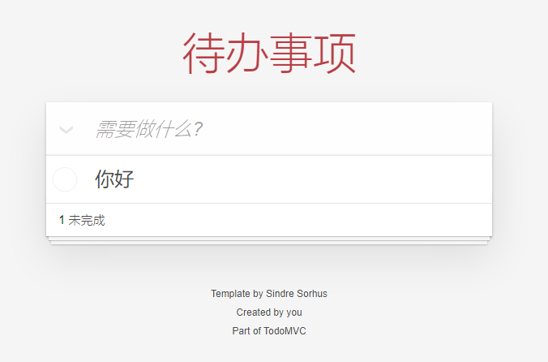
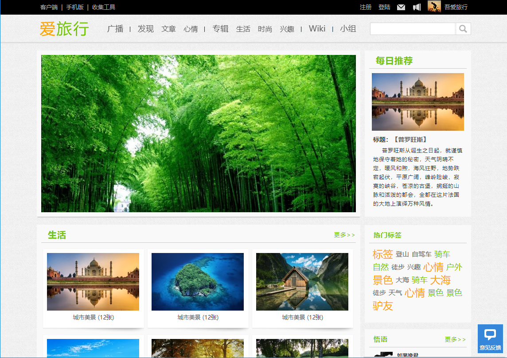
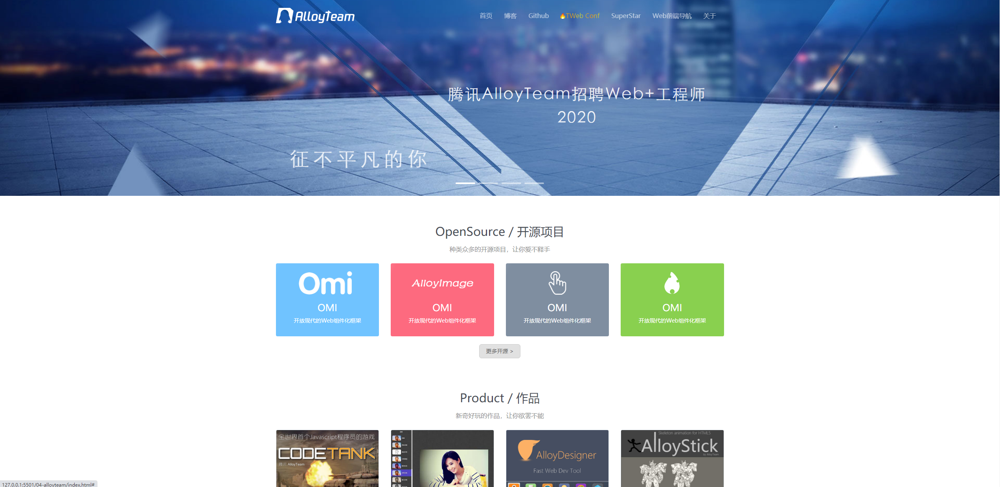

# jQuery - day02

> 今天是`jQuery`的第二天哦


## 课程介绍

> 今天重点学点啥呢?

首先有案例:

1. **待办事项:**用来巩固元素的增删改查



2. **爱旅行:**用来巩固位置操作,动画效果



3. 腾讯前端首页-滚动效果1




还有很多需要掌握的知识点哦: 


## 元素位置

> `jQuery`中如何获取元素位置呢?

* `position`和`offset`都可以获取位置
  * 返回的是一个对象

* 两者获取位置的参照物不同:
  * `offset`始终参照的是`html`
  * `position`参照的有定位属性的最近祖先元素

* 对于`margin`两者的处理也不相同
  * `offset`忽略
  * `position`会累加`margin`
* 如果要设置位置的话只能通过`offset`方法

**总结：**

1. `offset`方法和`position`方法哪个参考的是`html`?

   `offset`方法,`position`方法参考的是最近并且有定位的祖先元素

2. `offset`方法和`position`方法哪个可以用来设置位置?

   `offset`方法可以设置位置,但是没有动画效果

3. 如果元素有`margin`哪个方法会一起计算进去呢?

   `offset`会把`margin`也计算进去,而`position`不会


## 滚动距离

> `jQuery`中如何获取滚动距离呢?

* 获取元素滚动距离

```javascript
$('选择器').scrollTop()
$('选择器').scrollLeft()
```

* 获取网页的滚动距离

```javascript
$('html').scrollTop()
$('html').scrollLeft()
```

* 设置滚动距离

```
$('html').scrollTop(值)
$('html').scrollLeft(值)
```


**小结:**

1. 对于内容可以滚动的元素可以通过`scrollTop`或者`scrollLeft`获取滚动距离,如何获取网页的滚动距离呢?

   把`html`作为选择器即可

调用`scrollTop`和`scrollLeft`方法可以让元素滚到指定位置,但是并没有动画效果,咱们先用这个,今天晚一些的时候就会学习动画啦,别着急


## demo - 腾讯全端

> 完成腾讯全端案例

* 腾讯全端首页的需求有:
  * 顶部变色
  * 返回顶部
* 分析并实现顶部变色效果
* 分析并实现返回顶部效果

**小结:**

1. 如何注册滚动事件?

   通过`$(window).scroll()`注册

2. 如何获取页面滚动距离?

   通过`$('html').scrollTop()`

功能搞定了,但是元素的显示隐藏和返回顶部并没有动画,缺少灵魂,别着急等我们学完了动画效果就来给他注入灵魂!!!!!

## 动画 - 显示&隐藏

> 如何使用`jQuery`的显示隐藏动画

1. 如何使用`show`方法
2. 如何使用`hide`方法
3. 如何使用`toggle`方法
4. 方法中的`this`
5. 动画的持续时间
6. 动画效果
7. 调优demo


## 动画 - 队列及停止

> 如果为元素叠加了多种动画会依次按顺序执行,如果不要这么做可以手动停止他们


## 动画 - 淡入&淡出

> 如何使用`jQuery`的显示隐藏动画

1. 如何使用`show`方法
2. 如何使用`hide`方法
3. 如何使用`toggle`方法
4. 方法中的`this`
5. 动画的持续时间
6. 动画效果
7. `demo`中使用淡入淡出效果


## 动画 - 展开&收起

> 如何使用`jQuery`的展开收起动画

1. 如何使用`slideDown`方法
2. 如何使用`slideUp`方法
3. 如何使用`slideToggle`方法
4. 本质是修改了哪个样式
5. 方法中的`this`
6. 动画的持续时间
7. 动画效果
8. `demo`中使用淡入淡出效果

## 动画 - 自定义动画

> 如何使用`jQuery`中的自定义动画


## demo - 爱旅行

> 通过目前所学的知识完成爱旅行这个案例

1. 回到顶部显示隐藏
2. 回复客服效果
3. 轮播图
4. 回复轮播

## 事件参数

> 中如何使用事件参数呢?

hello,同学们好!

​		我们来学习`jQuery`中的`事件对象`,有时候也称之为`事件参数`,大伙爱叫啥就叫啥.日常开发中使用的频率还行,他在触发事件时为咱们额外提供了一些信息,和功能:比如事件的触发对象,用来阻止冒泡,阻止默认行为什么的.

​		用法和`webapi`阶段基本一致,咱们来看看

```javascript
// 语法
$('选择器').事件(function(event){})
// 比如 点击事件
$('选择器').click(function(event){})
// 比如 键盘抬起事件
$('选择器').keyup(function(event){})
```


​		去浏览器中测试一下.

```html
<!DOCTYPE html>
<html lang="zh">
  <head>
    <meta charset="UTF-8" />
    <meta name="viewport" content="width=device-width, initial-scale=1.0" />
    <title>模板页</title>
    <style>
      body {
        padding: 0 30px;
      }

      p {
        color: #333;
      }
      .box {
        width: 200px;
        height: 100px;
        background-color: pink;
        padding: 20px;
        text-align: center;
        border-radius: 10px;
      }

      input {
        margin: 10px;
      }
      button {
        width: 100%;
        height: 30px;
      }
    </style>
  </head>
  <body>
    <h2>事件对象</h2>
    <p>事件触发时额外提供给开发者的信息,可以用来干不少事情哦</p>
    <div class="box">
      <a href="http://www.itheima.com/">黑马程序员</a>
      <input type="text" />
      <br />
      <button>点我</button>
      <br />
    </div>
    <script src="./jquery/jquery-3.5.1.min.js"></script>
    <script>
    </script>
  </body>
</html>

```

最外层盒子绑定点击事件,查看触发源

```javascript
  $('.box').click(function (event) {
    console.log('event.target:',event.target)
    console.log('box-click')
  })
```

阻止`a`的默认行为

```javascript
  $('a').click(function (event) {
    event.preventDefault()
  })
```


判断键盘按键

```javascript
  $('input').keyup(function (event) {
    console.log('keyCode:',event.keyCode)
    if (event.keyCode === 13) {
      console.log('按下回车')
    }
  })
```


阻止冒泡

```javascript
  $('button').click(function (event) {
    event.stopPropagation()
    console.log('button-click')
  })
```


**小结一下**

事件对象:

* 也可以叫做事件参数用法和`webapi`阶段学习的基本一致
* 在事件触发时额外传递给开发者中的信息和功能
* 可以通过它获取触发源,实现阻止默认行为等功能


## 节点 - 新增

> 在`jQuery`中如何新增(插入)节点


**用法01**-基于创建的jQuery对象进行添加

```javascript
// 基于html创建jQuery对象
let $a = $('<a href="#">超链接</a>')
// 添加jQuery对象
// 在父元素末尾添加
$('选择器').append($a)
// 在父元素开头添加
$('选择器').prepend($a)
// 在兄弟元素之前添加
$('选择器').before($a)
// 在兄弟元素之后添加
$('选择器').after($a)
```


**用法02**-直接添加`html`结构

```javascript
// 直接添加html结构
// 在父元素末尾添加
$('选择器').append('html结构')
// 在父元素开头添加
$('选择器').prepend('html结构')
// 在兄弟元素之前添加
$('选择器').before('html结构')
// 在兄弟元素之后添加
$('选择器').after('html结构')
```


**去测试一下:**

```html
<!DOCTYPE html>
<html lang="zh">
  <head>
    <meta charset="UTF-8" />
    <meta name="viewport" content="width=device-width, initial-scale=1.0" />
    <title>jQuery-day02</title>
    <style>
      body {
        padding: 0 30px;
      }

      p {
        color: #333;
      }
      .container {
        overflow: hidden;
        background-color: pink;
      }
      img {
        margin: 10px;
        float: left;
      }
    </style>
  </head>
  <body>
    <h3>节点操作</h3>
    <p>jQuery 中封装了在指定位置动态添加元素节点的方法。</p>
    <div class="insert">
      <button class="append">父元素结尾添加</button>
      <button class="prepend">父元素开头添加</button>
      <button class="before">兄弟元素前添加</button>
      <button class="after">兄弟元素后添加</button>
    </div>
    <hr />
    <div class="container">
      
      
      
    </div>
    <script src="./jquery/jquery-3.5.1.min.js"></script>
  </body>
</html>

```


**首先是:**父元素结尾添加

```
 // 父元素结尾添加
  $('.append').click(function () {
    $('.container').append(
      ``
    )
  })
```


**接下来:**父元素开头添加

```javascript
  // 父元素开头添加
  $('.prepend').click(function () {
    $('.container').prepend(
      `  `
    )
  })
```


**然后:**兄弟元素前面添加

```javascript
  // 兄弟元素前添加
  $('.before').click(function () {
    $('.Teemo').before(
      ``
    )
  })
```


**最后:**兄弟元素末尾添加

```javascript
  // 兄弟元素后添加
  $('.after').click(function () {
    $('.Teemo').after(
      ` `
    )
  })
```

**小结一下:**

1. `append`、`prepend` 以父元素为参考分别在结尾处和开头处添加新的元素节点
2. `after`、`before` 以当前元素为参考在之前或之后插入新的元素节点
3. `append`、`prepend`、`after`、`before` 均支持直接将 html 字符串做为节点插入


## 节点 - 删除

> 在`jQuery`中如何删除节点呢?


不同于`webapi`中需要通过父元素才可以删除自己,`jQuery`中直接就可以把自己给删咯

```javascript
// 删除自己
$('选择器').remove();
```


为上一节的案例增加点击删除功能

```javascript
$('img').click(function(){
	$(this).remove()
})
```


新增的`img`无法删除自己,原因是为`img`绑定点击事件时默认只能找到页面中现有的标签,点击按钮动态添加的可是没有点击事件的哦,咱们一会再来解决


**总结：**

1. `remove` 方法删除的是当前调用方法的元素节点


## 节点 - 克隆

> `jQuery`中如何基于现有的节点进行克隆(复制)呢?


jQuery 中封装了复制（克隆）元素节点的方法，其用法如下代码所示：

```html
<script>
    // 通过复制获得新的节点 拷贝事件
  $('选择器').clone(true);
   // 通过复制获得新的节点 不拷贝事件
  $('选择器').clone(false);
</script>
```


通过`jQuery`的克隆语法来解决上一节的小问题


总结：

1. `clone` 方法复制得到的元素节点仍是 jQuery 对象
2. 待复制的节点中如果有事件监听，需要为 `clone` 方法传入参数 `true`


## 事件委托

> `jQuery`中如何使用事件委托呢?


jQuery 中封装了事件委托的支持，其用法如下代码所示：

```javascript
  // on 方法内置支持事件委托
  $('祖先元素').on('事件名', '后代选择器', function () {
   
  })
```

使用事件委托来解决之前删除的小问题


总结：

1. 事件委托需要为某个在 DOM 中已经存在的祖先元素添加事件监听
2. `delegate` 方法是 jQuery 中专门的事件委托的方法
3. `on` 方法中也内置支持事件委托，推荐使用 `on` 方法


##  todoList01- 需求交接

> 今天最后一个收尾案例,通过`todoList`来完成,重点练习增删改查


## todoList02 - 新增

> 实现案例中的新增功能


## todoList03 - 删除

> 实现案例中的删除功能


## todoList04 - 全选反选

> 实现案例中的全选和反选功能


