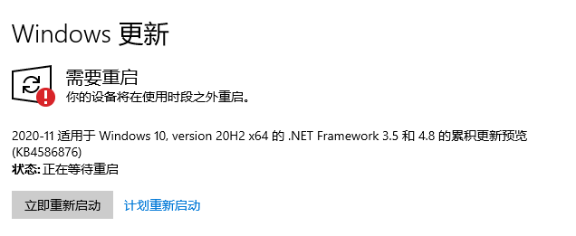
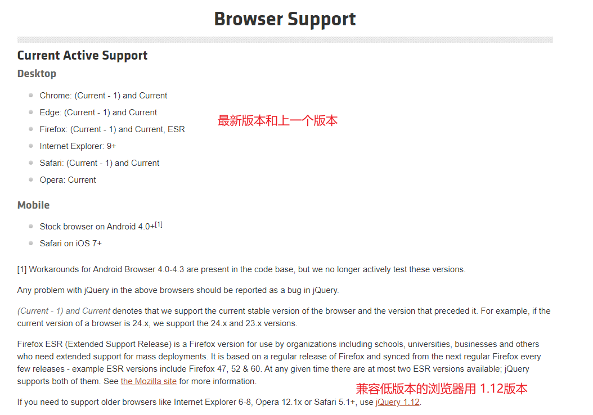
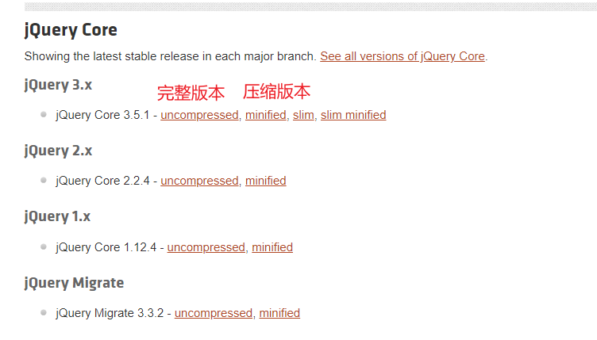

# jQuery-day03

> 今天是jQuery的第三天


测试输入法 测试打字 测试的次数1


## 01-课程介绍

> 第三天的课程重点是表单和插件

(**ppt**)

hello,同学们好！

​		今天是jQuery课程的最后一天，第三天。今天学点什么呢？

​		首先是插件，今天我们会用到一些别人写好的插件，如果没有听过这个词的话可以先理解为是别人封装好的功能，之后会展开进行讲解的哈，通过插件来快速完成一些效果，有多快呢。咻的一下（**手指表情**），知道了如何使用别人开发的插件之后，然后会自己试着实现一下简单的插件。

​		之后是表单相关的内容，如果表单中有多个输入的元素如何处理，如果要校验表单中的数据有怎么办呢？这些今天都会学到哦。

​		除了刚刚说的哪些点以外，还有一些额外的补充知识点，比如入口函数，

​		和之前一样为了让知识更好的学以致用，精心准备了3个案例，第一个是小兔仙儿一个电商类的站点，第二个是360的宣传页，最后是一个管理系统：人员管理系统。

​		好啦，这些就是今天的课程重点，插件和表单加上3个案例

大伙记住了没！

## 02-入口函数

> 在jQ中的入口函数咋写呢，类似于window.onload但是不一样的哦

* 同学问到了入口函数

* jQ中的写法

* 对比window.onload

* 使用注意

  tips:

  1. 使用基本页面进行测试
  2. 使用小兔鲜儿测试

jQuery 中提供了更为简便的入口函数写法

(**ppt**)

hello,同学们好！

​		这一节咱们来学习，jQuery中的入口函数要怎么写？咱们来回忆一下，如果我们把js代码写在页面顶部，但是要操纵后面的dom元素需要怎么写呢？如果希望获取到图片的尺寸需要怎么写呢？想起来没，叫window.什么来着？**对啦，window.onload**,他的执行时机是页面资源加载完毕，包括dom元素解析完毕，外部的css，图片什么的也需要加载完毕，所以写在他内部的逻辑肯定可以获取到页面上的dom元素并且可以获取到对应的图片尺寸呢！

​		window.onload在jQ中要如何写呢？直接调用$方法把window传递进去，jQ并没有提供load方法，所以这里只能用on的方式来注册load事件，逻辑直接写到function里面就好了。这就是jQ中如何写window.onload

```javascript
$(window).on('load',function(){})
```

​		除了可以继续沿用之前的写法以外，jQ还提供了一个ready方法，完整的写法略微有点复杂,调用$方法然后把document传进去接着调用ready方法并传入回调函数，逻辑写在回调函数里面，怎么样写起来挺长的呢。

​		同样的功能还有一种更为简单的写法，直接在调用$方法的时候传入回调函数即可，两种写法功能是一样的，建议使用的是第二种呢。

```javascript
  // 完整写法
  $(document).ready(function () {})
  // 简化写法
  $(function () {})
```

​		这种方式注册的回调函数调用的时机是dom载入完毕，并不会等待外部资源，大伙觉得他和window.onload比那个执行的更早呢？**对啦，window.onload**

​		走咱们去编辑器里面测试一下

(**编辑器 - 基本页面**)

​		现在我们切换到了编辑器，页面中准备了用来测试的元素,一个盒子，一会通过修改他的样式来进行测试。

```html
<!-- 测试元素 -->
<div class="box"></div>
```

​		之前的逻辑都是写在body的最下面，所以不需要考虑dom元素的问题，这次我们写在header里面，首先直接去获取box这个盒子，然后修改他的背景色为橘色,那个盒子会不会变成橘色呢？**对啦，肯定不会啦**代码执行的时候dom元素还没加载呢！123，走你，没变色吧！

```javascript
$('.box').css('backgroundColor', 'orange')
```

​		使用window.onload就可以解决这个问题，我们为window注册onload事件，然后把修改背景色的逻辑写到回调函数里面，123走你，怎么样可以改变颜色了吧，onload里面的逻辑会在页面资源加载完毕执行，这个时候dom元素肯定都有了呢！

```javascript
  window.onload = function () {
    $('.box').css('backgroundColor', 'orange')
  }
```

​		但是现在的写法混杂着之前的写法和jQ的代码，看起来怪怪的，我们把onload的注册替换为jQ的写法，调用$方法把window丢进去，然后通过on的方式为他注册load事件，接着添加回调函数，在回调函数里面去修改box的背景色，这次改成天蓝色,我们把上面的代码注释掉,123走你，怎么样也是的OK的吧！

```javascript
  $(window).on('load', function () {
    $('.box').css('backgroundColor', 'skyblue')
  })
```

​		接下来我们来测试一下jQ提供的ready方法，首先是最完整的写法，调用$方法传入document，然后调用ready传入回调函数，逻辑写在回调函数里面就好，这次依旧修改背景色，换成粉色，把上面的代码注释掉，123走你！变粉了哦！

```javascript
  $(document).ready(function () {
    $('.box').css('backgroundColor', 'pink')
  })
```

​		和上面的代码相比，这种写法还更复杂一些呢，所以更建议的是现在这种写法，调用$方法直接传入回调函数，把上面的修改背景色的逻辑c+v过来，颜色换成深天蓝deepskyblue，再把上面的代码注释掉，123走你，效果和上面是一样的呢，大伙觉着哪种代码少一点呢？**对吧，很明显下面这种要少一些**这种也是建议的用法！

```javascript
  $(function () {
    $('.box').css('backgroundColor', 'deepskyblue')
  })
```

​		从获取dom元素这点来看onload和ready的效果是一样的，那么他们执行的先后有什么区别呢?我们来对比一下，首先把之前的逻辑都注释掉！接着分别注册load和ready里面直接输出一段内容，大伙觉着哪个先执行呢？是onload还是ready呢？提示一下，onload要等到资源加载完毕，ready只需要dom载入就可以了哦？**ready吗**咱们眼见为实，123走你，没错把确实是ready呢，ready不考虑外部资源，只要dom载入了就可以啦，执行的时机会更早一些。

```javascript
  $(window).on('load', function () {
    console.log('load')
  })
  $(function () {
    console.log('ready')
  })
```

​		但是现在代码编写的位置都是body底部，dom元素都可以访问的到，大伙回忆一下咱们jQ阶段的代码写了入口函数吗？**对啦，都没写，因为没有必要写**，除非逻辑依赖外部的资源加载完毕，具体点就是图片的尺寸啦，咱们换个复杂的例子来测试一下！

（**编辑器-小兔仙儿**）

​		为了更好的测试，咱们现在打开的是一个更为复杂的页面，小兔鲜儿的个人中心页，这里面有很多的图片，我们来测试一下获取其中某一张图片的尺寸，就用最下面的这个二维码为例吧，审查元素可以看到他的类名叫做`code`

​		我们来到页面底部，jQ已经导入完毕啦，我们先测试直接获取，首先通过选择器找到图片，获取宽度的方法叫什么来着？**对啦 width**方法，我们把返回值保存一下，然后输出，123，额拿不到。代码执行的时候外部资源不一定加载完毕啦。

```javascript
let width = $('.code').width()
console.log('width:', width)
```


​		用jQ提供的ready可以吗，我们试试看,为了更好的对比，在输出里面加上ready

```javascript
  $(function () {
    let width = $('.code').width()
    console.log('ready-width:', width)
  })
```

​	123走你，好像拿到了，这是因为图片都是本地的速度很快，为了模拟网络环境，我们可以去network里面吧速度弄慢一些，比如fast 3g，接着切换回console窗口，刷新一下页面，怎么样是不是就拿不到啦，所以用ready他不一定拿得到，为了保险用哪个呢？**nice 就是onload**

​		最后我们试试看用load，用jQ的方式来进行绑定,为了对比，我们在console里面加上load

```javascript
  $(window).on('load', function () {
    let width = $('.code').width()
    console.log('load-width:', width)
  })
```

​		123走你，怎么样load里面就可以拿到啦，因为load的执行会等待资源加载完毕哦！

(**ppt**)

好啦，以上就是这一节的所有内容，小结一下！

1. window.onload和ready哪个先执行

   ready，因为ready只需要考虑dom元素加载完成，不需要考虑外部资源

2. window.onload和ready哪个可以获取图片尺寸

   window.onload 

3. 开发中用哪个？

   看情况讨论

   现在js都是在body底部载入，所以代码执行的时候dom元素都已经可以获取到了，这个时候用不用都是可以的。但是代码中如果要确保可以获取到图片的尺寸就需要用window.onload咯

大伙记住了没！


## 03-轮播图插件-slick

> 轮播图作为一个非常常见的功能，有很多现成的插件，咱们来学习一下slick

* 轮播图插件

  * 常用的功能封装成插件，直接使用即可

* 插件的含义用vscode插件讲解

* jQuery插件的含义

* 插件使用套路

* 调整

  * 配置调整
    * 小圆点
    * 箭头
  * 样式调整
    * 审查元素找到样式
    * 直接覆盖

* 小结：

  * slick是谁的插件？

    jQuery，需要依赖于jQuery才可以执行

  * 是否需要把用法和配置背下来？

    不需要，随用随查，结合翻译英文也不可怕

  * 插件的样式可以调整吗？

    可以，直接用自己的样式覆盖默认的样式即可

  


（**ppt**)

​		hello，同学们好！

​		这一节咱们来学习如何制作轮播图....，what?...又是轮播图(**问号表情**)，js里面写过一次啦，到了jQ里面又要在写一次啊。。。。

​		轮播图作为一个非常常见的功能，在很多的网页中都可以看得到，既然是一个很常用的功能，天天从头写一遍有没有必要呢？**对啦，肯定没有必要**，所以这一节咱们不是自己写，而是直接使用别人写好的插件来制作轮播图，这也是咱们之后开发中经常会用到的做法，常见的功能就不用从头写啦，直接使用别人封装好的插件或者库什么的，快速实现，因为还有更重要的逻辑代码在等着我们呢。

​		首先得解释一下，插件他是干嘛的呢？为程序附件功能，咱们用的编辑器应该都是vscode，他默认有一些基本的功能，比如代码提示格式化什么的，如果要为他添加一些更高级的功能咋办呢？比如保存刷新，更改主题配色什么的，这个时候就可以通过安装插件来实现啦，这些插件都是为vscode附件功能的，那么如果没有了vscode他们能够独立运行吗？**对啦，是无法独立运行的呢**

​		这一节咱们学习的轮播图插件也是一样，是jQuery的插件，名字叫做slick，既然是jQ的插件就意味着他需要依赖于jQ才可以正常的运行哦

，有同学可能要问啦，轮播图的插件只有这一个吗？**不是哦，有很多呢**，咱们课堂上学习的是稳定好用的，大伙重点需要掌握的是使用的套路，**插件太多记不住，唯有套路留人心**

​		那么套路是什么呢？

1. 下包：首先把需要使用的插件下载到本地
2. 导包：jQuery的插件需要在jQ的后面导入，因为他依赖jQ哦，有的插件还需要用到css，根据需求导入就好！
3. 用包：根据文档提供的步骤使用它，别乱用哦

就好像你买了一个豆浆机，你非要往里面放螺丝，能不能做成螺蛳粉呢？**应该是做不了的**。

​		好啦，套路已经告诉大伙啦，咱们来看看具体的使用步骤：

​		首先是下包，这个已经事先搞定啦。接下来是导包，需要导入的文件有两部分，第一部分是样式文件，有两个分别是slick.css和slick-theme.css

```html
  <!-- 引入插件所需要的样式表 -->
  <link rel="stylesheet" href="./assets/slick/slick.css">
  <link rel="stylesheet" href="./assets/slick/slick-theme.css">

```

​		然后需要导入jq和slick的js，jQ应该是在slick的前面还是后面导入呢？**对啦，在slick的前面**因为轮播图是jQ的插件，先有jQ才可以使用它呢，确保导入完毕之后就可以进入下一步啦！

​		结构不能乱弄，最基础的结构是外层一个大盒子，内部添加轮播的内容，3页就弄3个，4页就弄4个，轮播项里面的内容根据需求调整就好啦，可以是文字，可以是图片。

​		最后通过jQ的选择器找到刚刚定义的那个结构，然后调用slick方法最基本的轮播图就搞定啦！如果默认的功能满足不了需求咋办呢？这个时候就需要调整设置啦？

​		这里我们列出了常用的配置，比如自动轮播啊，显示箭头什么的。在调用slick方法的时候当做对象的键值对传递进去就好啦，如果是样式不符合需求的话直接添加自己的覆盖掉就好啦。

​		slick插件的配置还有很多，一会咱们去官方文档确认一下。

好啦，咱们先来试试看基本的使用。

(**编辑器**)

​		现在我们切换到了编辑器，页面中准备了测试用的结构:最外层是一个叫做slider-container的盒子，内部slider就是轮播区域，轮播图嘛，这里直接放了5张图片，一会我们让图片动起来。

​		在他的下面是2个精美的箭头，对精美的箭头，对应到页面上的那两个红色文字，一会我们通过他俩来演示自定义箭头。

```html
<!-- 测试用标签 -->
<div class="slider-container">
  <!-- 轮播图区域 -->
  <div class="slider">
    <div></div>
    <div></div>
    <div></div>
    <div></div>
    <div></div>
  </div>
  <!-- 自定义左右箭头 -->
  <div class="control">
    <div class="prev">上一个</div>
    <div class="next">下一个</div>
  </div>
</div>
```

​		在页面的顶部有一些样式，主要是调整了轮播区域的尺寸，和左右红色箭头的外观，除此之外没有其他的内容啦。

​		基本的结构已经分析完啦，咱们来导包（**步骤贴图**），在页面的平级目录下有下载好的jQ和slick插件。咱们先把样式导了，页面中有自己的样式，外部样式导入的位置建议是自己样式的上面还是下面呢？**nice，建议是上面**，这样的话我们就更容易去覆盖默认的样式，在权重一样的情况下离元素近的样式生效。

```html
<link rel="stylesheet" href="./slick/slick.css" />
<link rel="stylesheet" href="./slick/slick-theme.css" />
```


​		接下来是导入js文件（**步骤贴图**），先到如jq，再倒入插件，插件的目录里面有两个js文件，一个的名字里面有mini,就和jQ的迷你版本一样，功能上和完整版本没有区别，但是文件更小一些，上线之后建议使用mini版本，咱们现在是开发阶段，就用完整的吧！

​		导入完毕之后就是调用方法啦，通过选择器找到准备好的轮播图区域，然后调用slick方法，见证奇迹的时刻，123走你，轮播图就搞定咯(**手指表情**)

​		接着咱们来测试一下配置，首先打开自动轮播图，加上autoplay，保存之后，等一会，自动切换起来啦！一直移动有点晃眼睛，我们把它先注释掉

​		默认显示了箭头，如果要隐藏咋办呢？**对啦，设置arrows**，我们把它改为false，保存，箭头就木有啦。

​		不过一般轮播图都有箭头的，我们还是把它放出来吧，这次用我们自己设计的箭头来替代，设置上一页的，箭头直接把我们希望作为箭头元素的选择器给他就好啦，保存之后，默认的上箭头没有啦，我们点红色的文字试试看，哇塞给力，右边就不测试啦，一样的玩法呢。

​		轮播图的小圆点我们也把它放出来吧，属性名叫dots，设置为true，咋样出来了吧，点他还可以切换呢。不过现在显示的区域在轮播区域的外部，我们给他弄到轮播图内部去，通过审查元素的方式可以看到小点是放在一个ul里面的类名叫做slick-dots,默认设置了定位，位置是负的，我们把它改成0看看，怎么样上去啦，直接把这个类名c+v到编辑器里面，然后把刚刚测试的位置弄进来，能不能盖住默认的样式？**nice，肯定改的住**，123走你！怎么样小点点就到轮播图内部去啦！

​		最后再来改一个轮播图的高亮样色，现在默认是黑色，我们把它换成黄绿色，因为现在打开了自动轮播图不太好早，我们把自动轮播关了线，注释掉，接下来通过审查元素的方式找到高亮的那个区域，有个类名呢，显示的是什么元素呢，li点开，button点开，有个为元素，是他吗？我们直接改改样式试试看，哎呀，果然变了，接下来就简单了，直接把这个选择器c+v到编辑器里面，然后设置他颜色为黄绿色就好了，123走你，颜色就改变啦！

​		好啦，轮播图的基本使用调整配置和样式就演示完毕啦，接下来我们去看看他的官方文档。

（**浏览器**）

​		现在我们打开的是插件的官网，哇塞全部都是英文，如果你和我一样英文水平不太好的话可能有想要把他关掉的冲动，咱们有翻译工具呀，直接整页翻译，现在是不是舒服多啦！咱们来稍微微看看，首先是下包，看到了那个绿色的按钮吗，点他，里面有个下载zip，就可以把代码下到本地啦。

​		接着继续往下看，导入样式，导入js没错吧，再来就是配置了，全屏翻译有时候会翻译一些不需要的内容，我们先把他关掉，刚刚咱们用到的配置都在这里面吧，其他的还有不少呢，咱们用不用背下来呢？**不用沉默，明确告诉大家**，不需要，不仅是配置，步骤也不需要背下来，随用随查，如果需求中需要重度使用这个插件用多了自然而然就熟悉啦，如果工作中只是稍微用一点点基本的效果，咱们课堂上讲解的就够用啦！你去把插件的配置背下来反而有点费力不讨好呢(**笑的表情**)，记住了啊，别背，随用随查。

​		好啦，以上就是这一节的所有内容，咱们来小结一下！

（**ppt**)

 1. slick的js文件导入的位置是jQ之前还是之后？

    之后，因为依赖于jQ

	2. 是否需要把使用步骤和配置背下来？

    可以，

## 04-懒加载插件 - lazyload

> 图片懒加载也是一个常用的功能，咱们来学习一下lazyload插件的使用并把他整合到项目中去

(**ppt**)

hello,同学们好！

​		这一节咱们来学习懒加载插件，名字叫做lazyload,作用是让图片的加载变的不那么迅速。从立刻加载变成看到了再去加载，这个功能在图片很多的网页用的较多，比如电商网站,像京东淘宝都有用呢。

(**浏览器**)

​		咱们去看看具体是个什么效果，现在打开的是京东的首页。接下来我要滚动屏幕咯，注意看。

​		下面的图片最开始图片区域是灰色的，稍等一会之后才加载出来。我们去network里面再去确认一次。首先滚到页面顶部，然后刷新一下页面，现在把默认的内容全部清掉，注意看我要滚咯。

​		在滚动的时候他一直不停的加载图片，也就是说页面默认打开的时候只加载了用户可以看到的图片，看不到的先不去加载，页面滚到了之后才会去加载。

​		懒加载是一种网页性能优化的方式，打开页面之后只请求可以看到区域的图片，让页面的加载速度更快，也节省了用户的流量呢。

​		这个功能自己写的话，需要在页面滚动的时候判断滚动的距离，从而计算出图片是否可见，可见再去加载。莫慌，这个功能我们不用自己写，还是用插件来完成哈。

(**ppt**)

​		还记得插件使用的套路嘛？提示就3步，下包，导包，用包。下包和之前一样直接去官网下载即可。咱们重点看导包和用包。

​		这个插件没有css文件，只需要在jQ之后导入插件即可。

```html
<!-- 先导入jQueery -->
<script src="./jquery/jquery-3.5.1.js"></script>
<!-- 再导入lazyload插件 -->
<script src="./assets/jquery.lazyload.min.js"></script>
```

​	接下来是用包，需要调整图片的属性，默认img标签的src属性用来设置图片地址，我们需要改成data-original，如果用src的话图片会立刻就加载。

​		最后通过选择器调用希望懒加载的图片，然后调用插件提供的方法lazyload就搞定啦。

​		走，咱们切换到编辑器测试一下。

(**编辑器**)

​		现在我们切换到了编辑器，页面中除了已经导入好了jq和插件以外还准备了一些用来测试的元素，首先是一个大盒子 ，在他下面是一张图片

```html
<!-- 测试标签 -->
<div class="wall"></div>
<!-- 图片 -->


```

​		因为一会要测试的是懒加载功能，所以盒子的高度比较大有3000px，这样图片默认看不到啦，但是现在图片地址是通过src设置的，所以我们来到浏览器，打开network刷新一下可以看到虽然图片没有看到但是他加载了，很明显这不是我们要的效果，接下来我们把插件整合进来。

​		首先调整哪个属性来着（**红色箭头**）？**对啦，src属性**，我们把把他换成data-original，保存之后可以看到network里面就没有加载图片啦，但是现在滚到底部图片也是加载不了的。

```html


```

​		然后是通过选择器找到图片，然后调用lazyload方法就好啦，保存之后，我们切换到浏览器，然后返回页面顶部，接着刷新一下现在network里面并没有加载图片，我们清除默认的内容，然后滚到页面的底部，怎么样图片就加载出来啦，就是这么的easy。

```javascript
// 找到希望懒加载的图片并调用lazyload方法
$('.lazyload').lazyload()
```

（**ppt**）	

​	好啦，基本的使用已经演示完啦，咱们接着去官方文档里面确认一下，看看是不是这样的呢。

(**浏览器**)

​		现在我们切换到了官方文档，和上一节看到的轮播图插件有点类似，虽然都是英文的界面，咱们就找重点的部分，首先是下载，看到了这个绿色的按钮没，点他，最下面的download就是下载。

​		咱们再往下看看，这里是导入的顺序，先导入jq再倒入插件

```html
<script src="jquery.js" type="text/javascript"></script>
<script src="jquery.lazyload.js" type="text/javascript"></script>
```

​		然后是图片，需要把地址设置给data-original属性

```html

```

​		最后就是调用插件提供的方法啦lazyload，咱们来回忆一下刚刚是不是这样做的，导入插件，设置属性，然后调用方法。

(**ppt**)

​		好啦，以上就是这一节的所有内容，咱们来小结一下。

1. 使用懒加载插件之后，看不到的图片会不会加载？

   不会，看到了才会加载

2. 图片很多的网页用这个可以提升加载速度吗？

   可以，因为不会加载所有的图片，数据的传输量更小，在网速不变的情况下，加载的速度肯定会更快一些呢！

大伙记住了没！

## 05-小兔鲜儿

> 使用刚刚分析的插件小兔仙儿的功能

(**ppt**)

​		hello，同学们好！

​		这一节咱们来做一个案例：小兔鲜儿，巩固之前所学的知识。首先我们来确认一下具体的需求。

(**浏览器**)

​		现在我们切换到了浏览器，这是一个电商网站，基础的布局已经全部搞定啦，咱们需要做的就是添加功能，第一个功能是这个轮播的效果，他会自动的轮播，左右还有箭头可以通过鼠标点击切换图片，在最下面还有导航的小点。

​		第二个效果是什么呢？现在我们打开netword，刷新一下页面，然后清除默认的内容，注意看咯，我要滚了！123走你，随着页面的滚动，图片都加载出来啦，这个叫做什么来着？**对啦 图片的懒加载**

(**ppt**)

​		好啦，刚刚已经把需要完成的需求都确认了一遍，一共有2个，分别是：轮播图和图片的懒加载，咱们先来看看第一个轮播图咋做！

(**浏览器**)

​		我们现在打开的是基础模板，通过审查的方式去确认需要操纵哪些元素，最外层的盒子叫做xtx_banner,它里面有一个ul包裹li的结构，再往下就是a和img了，这部分符合之前学习的slick插件的结构要求(**结构截图**)

​		下面a标签制作的按钮，默认看不到呢，我们有鼠标放上去看看，看到了吗，按钮做了鼠标悬停显示的效果。

​		再往下是一个叫做指示器的盒子，他默认没有高度，我们给他加上来看看他在哪里。他的位置是在右侧可以看到的图片区域的中间。

```html
<div class="xtx_banner">
  <ul>
    <li>
      <a href="javascript:;">
        
      </a>
    </li>
	...
  </ul>
  <!-- 切换按钮  -->
  <a href="javascript:;" class="prev sprites"></a>
  <a href="javascript:;" class="next sprites"></a>
  <!-- 指示器 -->
  <div class="indicator"></div>
</div>
```

​		我们切换到示例程序看看效果，轮播图出现的小圆点放置的位置正好就是在图片区域的中间位置(**箭头示例**)，这部分一会研究一下如何实现

### 轮播图

(**ppt**)

​		轮播图的具体需求和涉及的元素我们已经确认完毕啦。现在来分析一下如何实现他们。

​		首先轮播图不用再自己从头写啦，我们前几节不是学了一个轮播图插件slick吗，我们先把他整合进来，这个没啥难度，下包导包就好。

​		接下来就是调用插件方法啦，方法的名字和插件同名，叫做什么来着？**对啦，叫做slick**。不传入任何的参数已经有基础的功能啦，如果默认的配置满足不了我们，就需要调整配置啦，如果样式不满足也可以调整样式。

​		样式可以通过审查元素的方式来定位，配置的话之前说过一次啦，不用记，咱们随用随查

​		好啦，实现的思路已经分析完毕啦，咱们来搞定他！

(**编辑器**)

​		我们来到了编辑器，当前打开的是基础模板，首先我们来到页面顶部，可以看到slick插件的css文件已经导入了，下面是我们自己的样式。

```html
<!-- 导入 slick的样式 -->
<link rel="stylesheet" href="./assets/slick/slick.css" />
<link rel="stylesheet" href="./assets/slick/slick-theme.css" />
```


​		接下来拉到页面的最下面，可以看到,jQ已经导入完毕，在他的下面轮播图插件，还有我们一会要用的懒加载插件都已经导好啦，我们只需要添加自己的逻辑即可，逻辑写哪里呢？最下面有个外部的js文件，我们打开他。里面除了一个自执行函数以外全部空空如也，逻辑一会就写这里面。

```javascript
<script src="./assets/jquery/jquery-3.5.1.js"></script>
<script src="./assets/slick/slick.js"></script>
<script src="./assets/lazyload/jquery.lazyload.js"></script>
<script src="./js/index.js"></script>
```

​		我们首先通过选择器找到轮播图区域，就是那个xtx_banner里面的ul标签，默认不设置任何的属性，直接调用slick方法保存之后我们可以看到基础效果已经有了，但是不会自动轮播，自定义的按钮也无效呢，还有导航点也没有出现，这些就需要修改配置啦，属性记不住没关系，咱们查文档(**贴出ppt**)

​		这几个需求好像都讲过呢，首先是自定义左右箭头，属性名叫做prevArrow和nextArrow直接把类名设置过去即可，自动轮播叫做autoplay,也加上，然后是小圆点叫做dots。123走你。自动轮播有了，点击按钮切换有了，小圆点也有了。。额但是感觉位置不太对呢。

​		咱们来对比一下示例程序，小圆点需要放在图片可视区域的中间，这个效果肯定可以通过修改样式来搞定，那么有没有对应的配置呢？**对，没有讲过**。咋办呢，随用随查，我们去看看文档里面有没有。

（**浏览器**）

​		我们现在来到了浏览器，当前打开的是轮播图插件的配置位置，小圆点的因为叫dots，哎，这个配置里面有dots，我们翻译一下看看是什么意思：更改导航点的添加位置，直接给选择器就好啦，好像有戏哦，之前我们在确认结构的时候有个盒子他说出的位置正好就是图片可视区域

(**编辑器**)

​		咱们去试试看，加上去之后123走你，哇塞，他就搞定咯。为啥呢，我们通过审查元素的方式看看

​		外面那个盒子的尺寸正好是图片可视区域，导航点就是ul套li，通过text-align把li放到了ul的中间，ul包裹在indicator里面之后，小点就变到了这个盒子的中间，正好就是图片可视区域的中间啦，大伙思考一下是不是这么一回事。。。好啦第一个需求轮播图就搞定啦

```javascript
  // 轮播图
  $('.xtx_banner ul').slick({
    nextArrow: '.next',
    prevArrow: '.prev',
    autoplay: true,
    dots: true,
    appendDots: '.indicator',
  })
```


### 图片懒加载

(**ppt**)

​		接下来咱们来完成第二个需求，图片懒加载首先去确认一下需要通过懒加载的图片。

```html

```

(**浏览器**)

​		现在打开的是基础模板，我们可以看到除了最开始的图片以外，默认都是灰不拉几的，咱们通过审查元素的方式来看看是什么。首先他设置了src属性，对应的是一张灰色的图片，所以页面上所有的这些灰色的图片都是用了同一个占位图片。

​		data-original已经设置好了，这张图片是什么呢？我们来试试看，直接把里面的值c+v设置给src属性，怎么样，希望显示的图片就出来啦。

​		他还有一个类名，叫做lazyload，我们换几张图片看看，哎都是一样的，src都是占位图片，都设置好了data-original,类名都叫做lazyload。

(**ppt**)

​		结构已经确认完啦，咱们来分析一下如何实现：

​		首先整合懒加载插件，下包还有导包，这个咱们刚刚确认过，已经做好啦。然后是设置图片的地址到data-original，这个也做好了哦，并且这些个图片都有一个相同的类名，叫做什么？**nice lazyload**，我们只需要通过做个作为选择器找到他们，然后调用插件的方法就好啦，方法名也叫作lazyload。

(**编辑器**)

​		实现的思路已经分析完毕啦，走！去搞定他.

​		我们切换回了编辑器，通过选择器找到所有需要懒加载的图片，然后调用lazyload方法就好啦，保存之后我们测试一下。

​		注意看我要滚咯！123走你，之前看不到的图片滚到了对应位置之后是不是就可以看到啦！

(**ppt**)

​		好啦，小兔鲜儿的两个需求都搞定啦，咱们来小结一下！

1. 工作中所有的功能都需要纯手写吗？

   不需要，一些常见的功能可以通过插件来快速完成

2. 插件的使用方法，详细配置要不要背下来？

   不需要，随用随查，用多了自然而然就熟啦

大伙记住了没！


## 06-fullpage插件

> 360案例中的切屏效果用的是fullpage插件，如何使用呢？


（**ppt**)

​		hello,同学们好

​		这一节咱们来学习一个另外一个插件，他叫做fullpage，也是jQ的插件。他可以用来制作咱们平时在手机或者电脑上见过的那种全屏滚动的页面，这一类的页面主要的作用是营销或者推广，大伙想一想平时在手机或者电脑上见过这样的页面吗。。。

(**浏览器**)

​		如果没有见过也没关系，咱们来看看下一节要做的案例360安全导航，他是一个pc端的宣传页，我滚，我滚，我滚。。。。，大伙知道是什么样的页面了吧！

(**ppt**)

​		插件是使用套路还是老三样，下包，导包，用包，fullpage插件在导包的时候需要导入2个东西，首先是他的样式文件，然后在jq之后导入他的js文件 cv  x xx

```html
<!-- 导入 fullpage 配套样式 -->
<link rel="stylesheet" href="./fullpage/jquery.fullpage.css" />

<!-- 导入 jQuery -->
<script src="./jquery/jquery-3.5.1.js"></script>
<!-- 在 jQuery 之后导入 fullpage 插件 -->
<script src="./fullpage/jquery.fullpage.js"></script>

```

​		接下来是他的结构,外层的容器用个有意义的标记就好，比如id或者class都可以，内部就是每一屏的容器啦，每一屏要显示的内容放到对应的盒子里面就好，需要注意的是：每屏都必须有secion这个类名，如果有需求可以额外的添加其他的类名，但是这个必须存在哦

```html
<div id="fullpage">
  <div class="section">第一屏</div>
  <div class="section">第二屏</div>
  <div class="section">第三屏</div>
</div>
```

​		基本的结构准备好了之后就是通过选择器找到外层容器，然后调用fullpage这个方法就好，可以传入一个对象，可以通过传入对象的方式来调整配置，这里列出常用的部分。如果有必要的话可以去官网查阅更多的配置呢。

（**编辑器**）

​		走去编辑器测试一下。

​		现在我们切换到了编辑器fullpage插件和jQ已经下载好了并且放到了页面的同级目录下面，先滚动到页面的顶部导入他的样式文件，通过link标签设置href属性导入需要的文件，文件中有个名字带mini的，功能上和不带mini的一样吗?**对啦，是完全一样的**，上线之后建议用mini，开发阶段用哪个都可以哈，我们导入完整的那个。

```html
<!-- 导入 fullpage 配套样式 -->
<link rel="stylesheet" href="./fullpage/jquery.fullpage.css" />
```

​		接下来来到页面的底部，我们导入jQ，然后再导入fullpage插件

```html
<!-- 导入 jQuery -->
<script src="./jquery/jquery-3.5.1.js"></script>
<!-- 在 jQuery 之后导入 fullpage 插件 -->
<script src="./fullpage/jquery.fullpage.js"></script>
```

​		先别着急调用方法，默认的结构还没准备呢，最外层的盒子的标记可以用id，用class也可以，我们就用id吧。叫做fullpage。然后是他内部的区域，我们弄3个，每个区域的容器都必须有的类名叫什么(**红色箭头**)？**nice secion**

```html
<div id="fullpage">
  <div class="section ">1屏</div>
  <div class="section ">2屏</div>
  <div class="section ">3屏</div>
</div>
```

​		最后就是调用方法啦，通过选择器找到id为fullpage的盒子，然后调用fullpage方法，我们默认先什么都不传，123走你。效果已经搞定了吗？我们用鼠标滚滚，哇塞搞定了哦。

```javascript
  $('#fullpage').fullpage({
  })
```

​		每个页面默认的颜色都是白色，不太容易区分，我们来添加一些样式好了，为3个区域分别添加各自的类名，one,two,three

```html
<div id="fullpage">
  <div class="section one">1屏</div>
  <div class="section two">2屏</div>
  <div class="section three">3屏</div>
</div>
```

​	,然后去到页面的顶部添加样式，自己的样式建议是在外部样式的下面还是上面呢？**对啦，建议放在下面**,第一个设置黄绿色，第二个设置天蓝色，第三个设置绿黄色，保存之后我们再来测试一下，怎么样这次的切换效果就很明显了吧，我们通过审查元素去看看，打开之后可以看到每个区域都设置了高度100%，并且插件会捕获我们的鼠标滚动和键盘的方向键，然后实现切屏的效果。

```html
<style>
  .one {
    background-color: yellowgreen;
  }
  .two {
    background-color: skyblue;
  }
  .three {
    background-color: greenyellow;
  }
</style>
```

​		最后再来测试一下这些属性，首先是导航区域，属性名叫做navigation，默认值是false我们设置为true把他开启来，123走你，看到了吗右边出现了导航呢，如果想改变位置咋办呢，可以通过navigationPosition他支持设置左右，默认值是right，我们把它改成left，123走你，怎么样就去左边了哦。

​		然后是锚链接，他设置的是一个什么类型的值啊(**红色箭头**)？**nice 是一个数组**，设置的顺序和区域的顺序是对应的，我们来试试看分别设置为one,two,three.123走你，页面并没有任何改变，大伙注意看url的变化。我滚，我滚，看到了吗，滚动到对应的区域之后，会把刚刚设置的锚链接的值添加到url中，这样做的目的是什么呢，我现在切换到第三页，然后刷新页面，还是在第三页哦，他的作用就是可以直接通过锚链接快速定位到某个区域，如果不写的话每次刷新就都是第一页啦。

​		最后是回调函数,afterLoad，他会在区域加载完毕执行，并且会传递给我们2个参数，第一个是锚链接的名字，第二个是索引，我们来接收并打印一下，添加完毕之后，123走你，我们切换到console窗口，我滚，我滚，打印了吗？**对啦，打印了好几次呢**，每次都会在切屏动画播放完毕之后调用，并且可以获取到锚的名字和索引呢，至于这2个能干嘛，这就需要结合具体的需求进行分析啦，现在先了解基本的用法即可。

（**ppt**）

​		好啦，fullpage插件的基本使用已经演示完毕啦，咱们来小结一下。

1. fullpage插件在使用的时候一定要传入配置吗？

   不一定，不传入任何的配置也有默认的功能

2. fullpage插件的区域容器一定要添加什么类名？

   section，必须有这个类名，但是可以添加额外的类名

大伙记住了没！

## 07-360

> 把刚刚的fullpage插件整合到360案例中

(**ppt**)

​		hello，同学们好！

​		这一节咱们来学习一个叫做安全导航的案例，通过他来巩固目前所学的知识，首先去网页确认一下具体的需求。

(**浏览器-示例**)

​		现在我们切换到了浏览器，现在看到的是示例程序，刷新一下，会有一个酷炫的动画效果，其他页面可以通过鼠标滚轮或者上下箭头切换，每次切换一个页面之后都会有动画，如果向回滚动的话动画还是在的，咱们这个阶段重点学习的是jQ，所以这个案例的基础布局已经全部搞定啦和动画已经写好啦，还需要完成的就是全屏滚动和滚动完毕之后的动画效果。

(**浏览器-模板**)

​		现在我们看到的是基础的模板，通过审查元素可以看到最外层的容器，还有每一屏的容器都已经做好了，每个页面都是没有开始动画的样子。那么动画咋做呢？

```html
<!-- 外层容器 -->
<div id="fullpage" class="fullpage">
  <div class="section current"></div>
  <div class="section"></div>
  <div class="section"></div>
  <div class="section"></div>
  <div class="section"></div>
</div>

```

​		咱们切换到实例程序，依旧是通过审查元素的方法去确认一下，首先以第一页为例，我们直接审查中间有动画的文字，可以看到在样式区域有一个叫做current的类名，样式中有过渡transition，接着我们切换到第二页，还是审查有动画的元素那个盾牌，他的类名里面也有current，样式中也有过渡。

​		同时注意一个细节,他的后面跟上了section这个类，中间是没有空格的这种选择器叫什么来着？**交什么。。对啦交集选择器**，意思是同时需要拥有这两个类名，难道说就是这个类名带来的动画效果吗，我们可以尝试自己增删这个类名试试看。

```css
.current.section:nth-child(2) span{}
```

​		这个类名加在哪里的呢？**看到了吗，在最外层的盒子上哦**  我们直接区域的最外层盒子，看到了吗就在这个位置呢，并且当前显示的是那个区域current这个类就加在哪个盒子上面。我们先把他删掉，哎！还原成默认的状态啦，然后再把它加上去，哇塞动画就出来了哦。

​		所以要给某个区域添加动画效果，本质就是添加current这个类。

（**ppt**）

​		好啦，关键的结构，还有需求我们已经确认完毕了，现在一起来分析一下要如何的实现。需求就一个全屏滚动，需要完成的功能是全屏滚动，切换完毕之后有动画，并且往回滚动也是有动画的哦。

​		全屏滚动直接可以使用上一节学习的插件来完成，还记得叫什么名字吗？**nice，fullpage**插件，我们先把他整合到项目中来这步操作没有难度直接下包导包就好。

​		基本的结构已经准备好了，我们直接找到他的最外层容器，然后调用插件提供的方法，名字叫什么呢？**对啦，也是fullpage**。这样基本的全屏切换效果就已经有啦。

​		接下来就要考虑动画效果啦，每次动画播放是在切屏执行完毕才开始呢，好像有这么一个回调函数来着，还记得叫什么吗?**after... nice afterLoad**，他会在每次切屏完成之后执行，参数有2个分别是锚链接和索引，通过参数找到区域的盒子，然后给他添加动画的类名就好啦，叫curr什么来着？**nice current**。

​		但是如果用户来回切换也是有动画效果的呢，这个要怎么实现呢,添加类名会有动画效果，重复添加是不会触发的，那如果把动画的类名移除咯，再添加上去会不会把动画再触发一次呢，好像有搞头，咱们学过移除类名的方法吗？**remove。。。 对啦removeClass**。

​		走！咱们去编辑器测试一下


(**编辑器**)

​		现在我们来到了编辑器，当前打开的是基础模板，我们可以看到在页面的顶部已经导入好了fullpage的样式文件。

```html
<!-- 导入fullpage的样式 -->
<link rel="stylesheet" href="./assets/fullpage/jquery.fullpage.css" />
```

​		最外层的容器id叫做fullpage，内部的每个区域都有section这个类名符合fullpage插件的要求

```html
<!-- 外层容器 -->
<div id="fullpage" class="fullpage">
  <div class="section current"></div>
  <div class="section"></div>
  <div class="section"></div>
  <div class="section"></div>
  <div class="section"></div>
</div>
```

​	

​	再往下看在页面的底部jQ和fullpage插件也都已经导入完毕啦，最下面有个外置的js文件，打开之后我们可以到里面就一个自调用函数，一会逻辑直接写里面就好啦！

```html
<!-- 导入 jQuery -->
<script src="./assets/jquery/jquery-3.5.1.js"></script>
<!-- 在jQuery之后导入 fullPage -->
<script src="./assets/fullpage/jquery.fullPage.js"></script>
<script src="./js/index.js"></script>
```

​		我们首先把全屏滚动效果整合进来，通过选择器找到fullpage这个盒子，然后直接调用fullpage这个方法，保存之后切换到浏览器，我滚，我滚。。。怎么样滚动效果就搞定咯。

```javascript
;(function () {
  // 整合全屏滚动效果
  $('#fullpage').fullpage({
    afterLoad(anchor, index) {
      $('.section').removeClass('current')
      setTimeout(function () {
        $('.section')
          .eq(index - 1)
          .addClass('current')
      }, 100)
    },
  })
})()
```

​		接下来就需要添加动画效果了，动画效果需要在区域加载完毕之后添加，刚刚已经分析过了可以写在回调函数里面，叫什么名字来着?**对啦，afterLoad**，他有2个参数，第一个是锚链接，第二个是索引，咱们来输出一下看看能不能拿得到。

```javascript
  console.log('anchor:', anchor)
  console.log('index:', index)
```

​		保存之后切换到浏览器，然后打开console窗口，我滚，我滚。。。索引可以拿得到，但是锚链接是undefined，咱们并没有定义所以肯定拿不到哈，但是有索引就够了，每次切换的时候我们只需要给当前显示的区域添加动画效果即可，每个区域都有相同的类名section，咱们学过一个方法可以结合索引获取指定的元素，叫e什么来着?**nice 叫eq方法**，不过他要的索引是从0开始，我们现在获取到的索引是从1开始，咋办呢？**对啦，减一**就好啦，找到之后再添加类名即可，类名叫做current

```javascript
$('.section')
  .eq(index - 1)
  .addClass('current')
```

​		保存之后，我们刷新一下页面，元素出来了，但是并没有动画效果？类名加上去没呢？我们审查元素看看，他加上去了，但是动画并没有播放，我们滚动看看，唉，之后的屏幕有动画效果，唯独第一次没有，每个页面的动画类名都是在滚动动画切换完毕之后才添加上去的，我们刷新一下，第一页的动画类名立刻就添加上去了，而那个时候元素还没来得及做动画呢？咋办呢？简单，我们直接让类名的添加稍微晚一点就好了呗，咱们有没有学过让代码延迟执行的方法啊，settim...?**nice settimeout**用定时器就好啦，也不用延迟太久，比如100毫秒。接着把逻辑丢进去就好啦，保存之后，哇塞动画就可以播放咯！

```javascript
  setTimeout(function () {
    $('.section')
      .eq(index - 1)
      .addClass('current')
  }, 100)
```


​		现在还有最后一个小问题，我滚动到第二个页面，在滚回第一个页面,第一个页面并没有重新播放动画，current这个类名已经加过一次了，要动画重新播放我们需要移除这个类，逻辑写哪呢？还是写在afterLoad里面就是啦，每次切换完毕之后，我们先移除类名，再添加类名呗，直接通过选择器找到所有的section，然后把它的current类名移除，保存之后切换到浏览器，第二页，ok，第一页，完美。。现在动画效果就可以重复播放啦！

​		好啦，安全导航这个案例咱们就做完啦，小结一下

（**ppt**）

1. 使用的回调函数叫什么名字?

   afterLoad

2. 回调函数中的第二个参数是什么？

   索引


## 08-表单 - 提交事件

> 表单提交事件及应用

* 

（**ppt**）

​		hello，同学们好！

​		这一节咱们来学习一下提交事件。谁的事件呢？表单的！

​		表单默认有提交数据的能力，但是现在基本不怎么用，为啥呢？咱们来测试一下

(**编辑器**)	

​		现在我们来到了编辑器，页面中准备了一些测试用的元素，最外层是一个form表单，里面有2个输入的标签，下面是一个提交按钮，还有一个button，除此以外没有任何其他的内容啦

```html
<form>
  <input type="text" placeholder="用户名" />
  <br />
  <input type="password" placeholder="密码" />
  <br />
  <input type="submit" value="提交" />
  <button>提交</button>
</form>
```

​		我们来测试一下，来到浏览器，随便输入一些内容，然后点击第一个提交按钮，额页面刷新了，我们再输入一些内容，这次点击第二个按钮，他是一个button，额，页面又刷新了，我还不信了，再输入一些内容，这次点击回车，ohon页面再次刷新了。

​		

（**ppt**）

​		发现问题了吗，对于一个普通的表单，当我们点击提交按钮，或者在输入区域点击回车他都会刷新页面，提交按钮不仅仅只有type登录submit的input标签，在表单里面的button默认也是提交按钮。

​		虽然早起通过表单提交数据的时候确实会刷新页面，但是现在其实见得不多，大伙回忆一下，比如登录吧，输入完用户名或者密码之后点击提交，一般是先弹出个提示，要么用户米密码错误，要么登录成功，之后才会跳转，并没有立刻刷新页面呢。

​		那如何解决这个问题呢，当我们点击提交或者在输入区域按下回车的时候默认会触发表单的submit事件，我们只需要在这个事件里面阻止默认行为，剩下的就看需求是什么了，比如提交数据啊，表单校验什么的。

​		阻止默认行为可以通过事件参数来搞定，那个方法大伙还记得吗？**prevent。。。，对啦，preventDefault方法**，还一种简单一些的，直接return false也可以阻止，咱们来测试一下。

（**编辑器**）

​		咱们又回到了编辑器，通过选择器找到form表单，注册什么事件来着?**sub...nice submit**事件，他可以直接注册，我们先输出一些内容看看，保存之后切换到浏览器，打开开发者界面切换到console窗口，我点，打印了，但是页面瞬间刷新了。

​		咱们接下来阻止他的默认行为，先来看看事件参数的做法,先定义参数就叫做event吧，然后在函数中调用方法preventDefault，再次切换到浏览器，我点，怎么样这次就没有刷新啦。

​		还一种代码会少一些，我们直接return false，为了测试我们把上一行代码注释掉，保存之后切换回浏览器，123走你，也是可以的吧。

​		什么，返回true可以吗，试试看呗，返回编辑器，把返回的值替换为true，切换回浏览器，我点！好像并没有什么用呢，所以记住了哦只有返回false才可以呢。

```javascript
  $('form').submit(function (event) {
    console.log('submit')
    event.preventDefault()
    return false
  })
```

​		回调函数中具体写什么逻辑就要根据需求来进行分析啦，这一节咱们就记住如何阻止行为就可以啦。

​		好啦，以上就是这一节的所有内容，小结一下

(**ppt**)

小结:

1. 点击提交按钮或者在输入框中按回车都会触发表单的什么事件？

   submit事件

2. submit事件中return什么值可以阻止默认行为?

   false


## 09-插件 - 日期选择器

> 日期选择器插件

​             


（**ppt**）

​		hello,同学们好！

​		这一节咱们来学习日期选择器，他也是一个jQ的插件，名字叫做datepicker，他的作用是让用户在不同的浏览器中用相同的方式来选择日期，大伙平时用过日期选择器吗？**唉应该都用过哈** 比较常见的是用来输入生日呢

​		虽然原生的标签可以弄出日期选择器，但是有一定的兼容问题，同时不同浏览器的显示效果略微有点不同，所以日期选择还是用插件居多。

​		用法还是老三样，下包，导包，和用包。但是这个插件在使用的时候略微有点不同哦，哪里不同呢？这个插件默认显示的语言是英文，如果要设置为中文首先在导包的时候需要额外的到导入一个语言包文件，导入的顺序是插件的后面

```html
<!-- 导入日期选择器的样式 -->
<link rel="stylesheet" href="./datepicker/datepicker.css" />

<!-- 导入jQuery -->
<script src="./jquery/jquery-3.5.1.js"></script>
<!-- 导入日期选择器插件 -->
<script src="./datepicker/datepicker.js"></script>
<!-- 导入语言包 -->
<script src="./datepicker/i18n/datepicker.zh-CN.js"></script>
```

​		然后准备一个输入框，通过选择器找到他，最后就是使用插件提供的方法啦，默认不需要传递任何参数就有基本功能，但是显示的是英文，如果要替换为中文，首先保证上一步的导包没有问题，然后就是传入配置啦，属性名叫做language，值是zh-cn，简体中文的意思。

```javascript
<!-- 准备html结构 -->
<input type="text" class="datapicker" />

  // 调用插件方法
  $('.datapicker').datepicker({
    language: 'zh-CN',
  })
```


​		如果希望调整更多的配置就去文档里面随用随查啦，这是官网地址。

​		走，咱们去测试一下。

(**编辑器**)

​		现在我们切换到了编辑器，和页面平级的目录下我们已经下载好了插件和jQ。 

​		首先来到页面的顶部，要先把样式给导入咯。

```html
<!-- 导入日期选择器的样式 -->
<link rel="stylesheet" href="./datepicker/datepicker.css" />
```

​		在页面的中间准备了一个输入框，一会就把插件设置给他。

​		接着来到页面的底部，先导入jQ，然后再导入插件，语言包我们先不管他，看看默认是哪国语言。

​		最后通过选择器找到插件，然后调用提供的方法datepicker就好咯，123走你。咱们切换到编辑器，点击输入框，哇塞，一个日期的选择器就出来了哦，我们随便点一个，选中之后日期就自动填充到了输入框里面哦，再点可以继续修改，怎么样就是这么简单。

​		不过现在显示的语言是什么文呢？**对啦，是英文**，如果要设置成中文要导入一个什么包呢？**nice 语言包**，语言包在插件目录下面的i18n目录下面，这里解释一下i18n的意思，他是国际化的缩写，我们来看看这个单词`internationalization`，很长的一个单词吧，在i和n的中间有18个字母，所以直接就简写成i18n，大伙之后只要看到这个就是国际化的意思，记住了哦。

​		里面有很多的文件，我们随便点开一个，比如第一个吧，额，这是哪国语言呢，反正肯定不是中文。。中文在哪呢？我们直接滚到最下面，打开，看到了吗，会到编辑器我们把这个文件导入进来，然后在调用方法的时候传入配置language，设置的值就是语言包的名字，datepicker之后的那个值，我们试试看zh-cn。保存之后切换到浏览器，我点，怎么样就是中文了吧！

```html
<!-- 导入语言包 -->
<script src="./datepicker/i18n/datepicker.zh-CN.js"></script>
```


​		接下来我们来测试一下那两个配置，自动设置和自动关闭，现在插件默认不会自动选择当前日期，并且我们选中日期之后不会关闭，需要点击外部才会关闭。我们把那两个配置加上，都设置为true,注意看咯，123走你。

```javascript
  $('.datapicker').datepicker({
    language: 'zh-CN',
    autoPick: true,
    autoHide: true,
  })
```

​		切换到浏览器，默认把今天的日期选中啦，接下来点击弹出选择框，再来随便选择一个值，选择区域就自己关闭了哦，怎么样配置可就生效了哦。

​		好啦，以上就是这一节的所有内容，小结一下。

（**ppt**）

 1. 插件默认显示的语言是中文还是英文?

    英文

2. 为了设置插件的语言为中文，需要导入什么?

   中文语言包

大伙记住了没！

## 10-插件 - 表单验证

> 如何使用表单验证插件

(**ppt**)

​		hello，同学们好！

​		这一节咱们来学习jQuery的表单验证插件，他的名字叫做validate,作用是验证用户在表单中输入的内容，咱们来回忆一下，我们在注册的时候，如果用户名不填，或者密码强度不够，或者不勾选用户协议能不能注册呀？**对啦，很明显是注册不了的**，并且根据错误的不同会有与之对应的提示信息，这就是表单验证的功能。

​		如果要自己写的话大概思路是获取输入的内容，进行验证，但是这一节咱们用插件来完成这个功能，使用套路还是老三样，下包，导包，还有用包，但是使用的时候略微有点繁琐，大伙注意看咯。

​		首先是导包，这个没有什么难度，先导入jQ，然后是插件

```html
<!-- 导入jQuery -->
<script src="./jquery/jquery-3.5.1.js"></script>
<!-- 导入validate插件 -->
<script src="./jquery-validate/jquery-validate.js"></script>
```

​		然后是用包，最后就是调用方法啦，通过选择器找到希望校验的表单，然后调用validate方法，可以传入的配置比较多，比如校验时机，是否禁用表单提交，校验成功和失败会触发相对应的回调函数，valid和invalid。	如果要在页面中添加错误信息，就需要用到description属性啦，这个一会单独演示如何使用，先继续往下看

​		校验规则直接使用插件提供的自定义属性为需要验证的表单元素添加即可，如果希望这个值不能为空直接添加data-required就好啦，如果对格式有要求可以使用data-pattern属性，然后传入具体的正则表达式，比如这个，能看出来含义是什么吗？**正则的标记比较多，一时半会记不住没关系哈**前半部分指的是只能输入字母和数字，长度最起码6个。有一个细节需要注意，表单元素要放到form里面才可以正常解析呢。

```html
  <input
    type="password"
    name="password"
    data-required
    data-pattern=".{6,}"
  />
```

​		

（**编辑器**）

​		现在我们切换到了编辑器，页面中默认已经准备好了测试用的标签，最外层是一个form表单，里面有ul和li，前2个输入标签分别是昵称和密码，之后的是是否同意协议。

```html
<form action="">
  <ul>
    <li>
      昵称:
      <input type="text" name="nickname" />
      <span class="error" id="nickname-error"></span>
    </li>
    <li>
      密码:
      <input type="password" name="password" />
      <span class="error" id="password-error"></span>
    </li>
    <li>
      <label>
        <input type="checkbox" value="true" name="agree" />
        同意注册协议
      </label>
      <span class="error" id="agree-error"></span>
    </li>
    <li>
      <button class="btn">提交</button>
    </li>
  </ul>
</form>
```

​		页面中已经导入好了jQ，接下来我们把插件也导入进来在和当前页面平级的目录下面

```html
<!-- 导入jQuery -->
<script src="./jquery/jquery-3.5.1.js"></script>
<!-- 导入 validate插件 -->
<script src="./jquery-validate/jquery-validate.js"></script>
```

​		然后我们调用插件的方法，通过选择器找到form表单，然后调用插件的方法，名字叫做什么来着?**对啦 validate**,我们先不传递任何的属性，只传入2个回调函数，分别是valid和invalid，第一个的意思是验证成功，第二个是验证失败，我们分别打印一些内容,保存之后点击提交，看到了没，我多点几次，打印了验证成功，但是页面刷新啦，因为表单里面的提交按钮点击之后默认会刷新页面，有没有配置可以阻止这个呢？**nice sendForm属性**，我们把它设置为false，怎么样就没有了吧！

```javascript
  $('form').validate({
    valid () {
      console.log('验证成功')
    },
    invalid () {
      console.log('验证失败')
    }
  })
```

​		但是为啥是校验通过呢？咱们现在可没有添加任何的校验规则哦，给昵称添加一个非空校验，那个属性叫什么来着（**属性贴图**）？**对啦，data-required**不需要设置任何的值，直接加上去就好啦。保存之后再测试一下，怎么样这次就进到了验证失败里面哦，我们输入一些内容试试看，再点，这次就又验证成功啦！

​		再来测试一下正则表达式,我们来到第二个输入框，为他添加正则的校验属性名叫做data-pattern,正则已经准备好啦（c+v）ppt中的，只限制了长度最少6个，咱们试试看，先把昵称输入内容，然后密码全部输入数字，点击提交，失败啦，加几个字母进去，再点，怎么样就测试通过了哦。

```html
<input data-required type="text" name="nickname" />
<input data-pattern=".{6,}" type="password" name="password" />
```


​		现在已经可以知道校验成功和失败啦，但是页面中并没有任何的提示信息，接下来咱们来看看description这个属性要咋用，直接在页面上弄出提示信息！

（**ppt**）

​		description这个属性需要配合插件提供的自定义属性来使用，属性有2个第一个是data-describedby,他设置的是信息显示的位置，直接设置元素的id即可，然后是data description,他配置的是到底显示什么错误信息，需要和description中的属性对应，设置的是具体显示的错误信息,为了更好的理解，接下来结合具体的代码来解释一下。

​		首先是data-describedby这个属性，他里面设置的值是password-error，正好和下面的那个span的id是一致的，这样设置之后这个输入框的错误信息就会放到那个span里面，那么只能用span吗？**nice，只要id可以对上即可，**

```html
  <input
    type="password"
    name="password"
    data-required
    data-describedby="password-error"
    data-description="password"
    data-pattern=".{6,}"
  />
  <span class="error" id="password-error"></span>

```

​		然后是错误的信息，我们可以看到data-description里面并没有具体的信息，而是一个值，这个值在哪呢？咱们往右看,看到了吗（**箭头**）？**对啦，在这呢**description是一个对象，在他的里面有password这个属性，里面对应的又是一个对象，分别对应到2个错误信息，如果内容为空，会使用required里面的信息，如果正则校验失败会使用pattern之后的信息，走，咱们去测试一下！

(**编辑器**)

​		我们又回了编辑器，找到密码框，首先为他设置data-describedby设置的值是他下面的那个span。我们直接把id拷贝过来，

​		接下来为他设置data-description指定错误的信息，就给password把。

```html
  <input
    data-describedby="password-error"
    data-description="password"
    data-pattern=".{6,}"
    data-required
    type="password"
    name="password"
  />
  <span class="error" id="password-error"></span>
```


​		最后来到js代码这里，添加description，上面设置的是password，这里设置的要和上面一样，我们也写password.最后就是提示的信息啦，required对应到非空验证，如果没有输入内容，就提示密码不能为空哦，接下来是pattern，正则验证的是长度，需要大于等于6，写完之后，切换到浏览器，123走你，我点，完美！

```javascript
  password: {
    required: '密码不能为空哦!',
    pattern: '密码长度大于等于6'
  }
```

​		我们再把用户名给弄了，玩法类似非空已经加了，我们只需要设置data-describedby和data-description，id给成他下面的那个span的id，属性的值改成nickname，写完了没？**nice，还没写完呢**，下面还要加一些，格式类似，我们直接c+v，这次没有正则的，我们把pattern移除，然后把属性名改成nickname，提示信息改成用户名不能为空，123走你，nice。

​		

​		最后我们再把勾选那个给弄了，加上非空验证，然后设置data-describedby和data-description，然后回到下面把提示信息给弄了，这次是必须勾选协议，123走你，perfect

​		虽然要设置的东西较多，但是套路是类似的呢

好啦，以上就是这一小节的内容，小结一下

（**ppt**）

1. 这一节学习的插件是用来验证什么的？

   验证表单，验证用户输入的

2. 案例中验证密码长度用的是什么技术？

   

## 11-克隆

> 用模板字符串在创建复杂接口时不是很利于操作，可以尝试一下jQ提供的clone方法哦

(**ppt**)

​		hello，同学们好！

​		这一节咱们来学习jQuery中的克隆方法，他可以直接把一个jQuery对象拷贝一份，用法非常简单，直接调用clone方法即可，不需要传递任何参数就可以拷贝，如果希望连事件一起拷贝可以传入参数true.

​		需要注意的是返回的依旧是jQ对象，所以咱们之前学过的那些方法都可以用的哦。

​		走去编辑器测试一下。

（**编辑器**）

​		现在我们切换到了编辑器，页面中准备了一些测试用的标签,首先是2个按钮，一会分别来测试普通克隆和带事件的克隆。在他们的下面是一个叫做box的盒子，里面有个按钮，宽高都是100，背景色是粉色，按钮在盒子中间。

```html
<button class="clone">克隆(不带事件)</button>
<button class="deep-clone">克隆(带事件)</button>
<div class="box">
  <button>按钮</button>
</div>
```

​		因为要测试克隆的时候带事件，我们先给box里面的按钮绑定一个点击事件，在点的时候把box的背景色编程黄绿色。

​		首先通过选择器找到box里面的按钮，为他绑定点击事件，这里的this是按钮，他是dom对象还是jQ呢？**对啦，dom对象**，所以为了使用jQ的方法我们通过$方法把他包装一下，接下来我们要改变的不是他而是他的父元素，可以通过哪个方法获取呢？**nice parent方法**，记住是方法哦，然后调用css方法修改背景色，设置的值为黄绿色。

```javascript
  $('.box button').click(function () {
    $(this)
      .parent()
      .css('backgroundColor', 'yellowgreen')
  })
```

​		保存之后切换到浏览器，我点，怎么样就变色了哦。

克隆用的盒子已经准备好啦，接下来我们测试第一个按钮，普通的克隆，直接通过选择找到box，调用clone方法，我们把它的返回值存起来，因为是jQ对象所以建议用什么开头呢？**对啦，$**，然后添加到body的末尾，还记得用哪个方法吗?**appen。。。nice append**方法。写完之后切换到浏览器，我点，怎么样克隆出来了一个一模一样的盒子，我们点一下，并没有变色，不传递参数是不会携带事件的，但是现在的写法有点小问题，我再点注意看咯，哎，成4个了，我继续点，额，成8个。为啥呢？我这边通过审查元素的方法查看一下克隆出来的元素，类名也叫box哦，代码里面写的也是box，第一次没有问题页面中就一个，但是再克隆找到的就是2个了，然后就是4个，呈指数倍增加哦，这就是为什么会这样。

```javascript
  $('.clone').click(function () {
    let $clone = $('.box')
      .clone()
    $('body').append($clone)
  })
```

​		咱们把代码稍作调整，我只要第一个box，可以用什么方法呢？          .first()**对啦，可以用first**找到第一个，我们把代码加上去,我再点，我点，我点，现在一次就克隆一个出来啦，点点看，都是没有事件的呢。

```javascript
  $('.clone').click(function () {
    let $clone = $('.box')
      .first()
      .clone()
    $('body').append($clone)
  })
```

​		最后来测试一下带事件的克隆，为最后一个按钮绑定点击事件，内部的逻辑和上一个差不多，我们直接c+v,这次调用方法的时候传入true，保存之后切换到浏览器，我点，盒子可以克隆出来，我们点盒子里面的按钮，123走你，变色了，说明事件也拷贝过来啦！

​		开发的时候具体用哪种根据需求具体分析就是啦。

​		好啦，以上就是这一节的所有内容，小结一下

（**ppt**）


1. 克隆方法得到的是什么对象？

   jQuery对象

2. 希望事件一起克隆需要传递什么参数?

   true

## 12-获取dom对象

> jQ提供了很多便捷的方法，但是有些方法只有dom对象才有，如何将jQ对象转为dom对象呢？


(**ppt**)

​		hello，同学们好！

​		这一节咱们来学习一下如何从jQuery对象中获取dom对象.有同学可能要纳闷了（**问号表情**），jQ的方法简单又好用，为啥要把里面的dom对象再弄出来呢。jQ的方法确实简单好用，但是！他并没有封装所有的方法，有一些dom对象的方法他就没有封装，比如video标签的play，pause，就是播放暂停视频的方法，还有表单的reset方法他都没有封装

```javascript
  // 播放视频
  video标签.play()
  // 暂停视频
  video标签.pause()
  // 重置表单
  form表单.reset()
```

​		那咋办呢，第一种做法呢是用咱们之前学过的trigger来触发,传入要触发的方法名就好啦

```javascript
  // 播放视频
  $('video').trigger('play')
  // 暂停视频
  $('video').trigger('pause')
  // 重置表单
  $('form').trigger('reset')
```

​	第二种就是直接通过dom对象调用咯，但是如何从jQ对象里面取出dom对象呢方法有2种，第一种是直接调用get方法传入索引，第二种是通过中括号的方式传入索引，索引是从0开始，获取到的都是dom对象，可以直接使用dom对象的那些方法呢。

```javascript
  // get方法获取
  .get(索引)
  // 中括号获取
  [索引]
```

​		走，咱们去编辑器里面测试一下！

（**编辑器**）

​		现在我们来到了编辑器，页面中准备了一些测试用的标签,首先是两个按钮，分别用来测试播放和暂停，在他下面是一个video标签，设置了src属性，指向的是和他平级目录下面的video文件夹下面的视频.

​		在他下面是一个form表单，可以输入用户名和密码，最下面是一个按钮，一会用它来测试重置方法

```html
<!-- 测试标签 播放器 -->
<button class="play">播放</button>
<button class="pause">暂停</button>
<br />
<video src="./video/video.mp4"></video>
<!-- 测试标签 form -->
<form action="">
  <input type="text" placeholder="请输入用户名" />
  <br />
  <input type="password" placeholder="请输入密码" />
  <br />
  <input type="button" class="reset" value="重置" />
</form>
```

​		我们首先来测试一下获取dom对象,首先通过选择器找到所有的button，保存到变量里面并且输出一下，保存之后切换到浏览器，打开console窗口，我们可以看到里面确实有2个dom元素，但是他现在是jQ对象，我们试着把第二个按钮取出来，用get方法索引给几呢?**对啦，给1就好**，因为索引是从0开始呢，获取之后保存到变量里面，这次是dom对象开头不用加$,输出一下看看，123走你，怎么样拿到了吧

​		然后我们测试一下中括号，这次我们获取第一个按钮，索引从0开始，所以他的是0，取出来之后输出一下，123走你，没问题吧！

​		中括号和get方法的作用一模一样，用哪个都无所谓，不过中括号的写起来短一些，整整少了一个符号呢（**手指表情**）

```javascript
  // 1.get方法
  let $button = $('button')
  console.log($button)
  let pauseBtn = $button.get(1)
  console.log(pauseBtn)

  // 2. 中括号
  let playBtn = $button[0]
  console.log(playBtn)
```

​		接下来结合播放和暂停测试一下，现在我们可以看到页面中的那个video标签并没有播放，我们为播放按钮绑定点击事件，然后控制他的播放,首先测试直接找到video测试play保存之后，我点。。。报错了，jQ确实没有封装这个方法吧。接下来测试一下dom的方式调用，通过jQ的选择器找到video这个标签，然后用中括号的方法，获取到video标签，我们输出一下看看，保存之后点一下，某问题。。接下来调用play方法，我点，咋样，是不是播放起来啦！

​		刚刚说了还有什么方法可以触发播放呢（**贴图**）？**对啦，trigger**，trigger是jQ的方法，我们直接调用即可，保存之后，123走你，怎么样也是ok的哦

```javascript
$('.play').click(function () {
    // $('video').play()
    // let video = $('video')[0]
    // console.log(video)
    // video.play()

    $('video').trigger('play')
  })
```

​		暂停的玩法和播放基本一致，我们直接c+v把播放改成暂停，我们先测试dom对象直接调用，保存之后，123我点，播放起来啦，我再点，暂停啦，完美，接下来把代码换成trigger，我点，播放啦，我再点，暂停啦，perfect。

​		再来测试一下重置，代码也是类似的，我们直接拷贝过来，重置按钮的类名叫啥来着（**箭头**）？**nice trigger**,在点击事件里面我们找到form表单，然后转为dom对象，接下来直接调用reset方法，保存之后切换到浏览器，我们输入一些内容，我点，内容清空了，页面并没有跳转哦，最后再来测试一下trigger,把reset丢进去，输入一些内容，我再点，完美！

​		对于jQ没有封装的dom方法，我们可以用trigger来触发，或者直接转为dom对象再去调用。

​		好啦，以上就是这节的所有内容，小结一下:

(**ppt**)


1. 可以使用 [] 还有一个什么方法来获取dom对象？

   get方法

2. 索引从几开始?

   从0开始


## 13-人员管理 - 新增功能

> 完成新增功能

### 01 弹框及插件整合

(**ppt**)

​	hello，同学们好！

​		从这一节开始咱们来做一个人员管理的案例，核心功能就是操纵页面上的人员信息，咱们平时上网一般浏览数据居多，这一类的功能见到的比较少，咱们来看看在什么情况下会碰到类似于这样的界面，这样的功能。

(**浏览器**)

​		现在打开的是咱们传智研究院在线的项目体验平台这个项目的名称叫做黑马面面，我们登陆进去，这是一个典型的数据管理后台或者叫管理系统，咱们之后的课程中会有不少类似于这样的项目，这类项目的作用是提供一个图形化的界面给用户管理网站的数据，我们随便点开一个看看，比如企业管理，可以新增，可以修改，

​		而我们现在这个人员管理的案例就是从这类项目中提取出来的一个页面，用来巩固目前所学知识的一个综合案例呢。

(**浏览器--示例代码**)

​		好啦，搞明白了这类功能会在什么项目中出现之后咱们再次回到人员管理这个案例中来，看看咱们要实现的需求具体有哪些？现在打开的是示例程序，点击新增，会弹出一个框框，如果什么内容都不输入点击新增会提示错误，正确输入之后，点击确定，页面上就多了一条内容了哦，我们再次打开新增框里面的内容就被清掉啦，如果想要修改某条数据可以点击编辑，修改完毕之后点击确认即可，想要删除直接点击即可删除，并且是有动画的哦。

（**ppt**）

​		需要实现的需求已经确认完毕啦，一共有3个，分别是新增，删除，和修改，咱们先来分析并完成新增功能

（**浏览器**）

​		首先切换到浏览器去确认一下功能的细节，首先是点击新增弹框，弹出的时候有个淡入的效果，不是立刻出现，然后点击提交，如果内容全部为空，会有提示信息，如果手机号格式不对也有会提示信息，全部输入正确之后点击提交就可以新增到页面上啦，同时弹框会消失，也有动画的效果哦，再次点击新增，所有的内容都被清空啦！随便输入一些内容点击提交触发了表单校验，但是我不想新增了直接点击关闭，然后再次打开弹框我们可以看到内容和错误的提示都被清空啦。

(**ppt**)

​		通过刚刚的确认细节好像有点多哦（**表情**）。。我们把他拆分成2个吧，先来完成弹框及插件整合，再来完成新增及关闭弹框。

​		首先是弹框及插件整合，在我们点击新增按钮的时候需要把框框弹出来，这个比较简单直接绑定点击事件即可，新增框的出现是有动画效果的，是一个淡入的动画，大伙还记得咋写吗？**对啦，fadeIn**。

​		接下来就是日期插件啦，要不要背下来使用步骤呀？**nice 不需要，随用随查，越用越熟**

​		最后就是表单校验插件啦，和日期插件一样结合文档随用随查，校验的规则首先是非空，手机号的格式要不要校验呢？**对啦，肯定要校验，手机号不能乱写呢**，格式的校验就需要结合正则表达式啦,这里已经提前准备好啦，一会咱们直接用。

(**编辑器**)

​		实现的思路已经分析完毕啦，走咱们切换到编辑器搞定他！

​		现在打开的是基础模板，jQ已经导入完毕啦，在页面的底部有一个外置的js文件，一会逻辑全部写在他里面的自调用函数中，页面平级目录下面插件已经下载好了，全部放在assets目录下。

```javascript
;(function () {
  // 1.点击弹框
  // 2.日期选择器
  // 3.表单校验
})()

```

​		首先来完成点击弹框,通过审查元素找到新增按钮，他的类名叫做app，为他绑定点击事件，点击事件里面把谁弄出来呢，继续审查元素，我们可以到这里有个叫做dialog-wrap的盒子，他默认的display为none，我们把这个样式取消看看，哇塞弹框出来啦，就是他！会到编辑器，找到这个盒子，然后用淡入的方式让他出现，咋写来着？**对啦，fadeIn**，保存之后切换到浏览器，我点，nice!

```javascript
;(function () {
  // 1. 点击弹框
  $('.add').click(function () {
    $('.dialog-wrap').fadeIn()
  })
  // 2.日期选择器
  // 3.表单校验
})()
```

​		接下来是整合日期选择器插件(**导包贴图**)，插件要导入的东西有点多，首先是样式，我们来到html页面的顶部，页面中有我们自己的样式，那么插件的样式在上面还是下面导入呢？**nice，上面**然后滚到页面的最底部，在jQ之后导入插件，这个插件默认是因为所以我们还需要导入语言包，在i18n的目录下面，大伙还记得i18n是什么意思吗？**对啦，国际化**的意思，其中的18值的是中间有18个字母，因为这个单词是在是太长了(**单词文字**)。

```html
<!-- 导入日期选择器的样式 -->
<link rel="stylesheet" href="./datepicker/datepicker.css" />

<!-- 导入jQuery -->
<script src="./jquery/jquery-3.5.1.js"></script>
<!-- 导入日期选择器插件 -->
<script src="./datepicker/datepicker.js"></script>
<!-- 导入语言包 -->
<script src="./datepicker/i18n/datepicker.zh-CN.js"></script>
```

​		接下来就是调用方法啦(**方法贴图**)，加给哪个元素呢？我们通过审查元素的方式找到输入日期的文本框，他的类名叫做birthday，通过选择器找到他，然后调用datepicker方法，先什么都不传，保存之后点击测试一下，123走你，英文的日期选择器就出来啦，接下来设置为中文，传入language，设置的值是语言包最后的那个名字zh-ch，再把自动关闭也加上去吧，保存之后再来测试一下，完美！

```javascript
  $('.birthday').datepicker({
    language: 'zh-CN',
    autoHide: true,
  })
```

​		最后就是整合表单校验插件啦(**导包贴图**),首先是导包，在jQ之后导入插件，然后切换到js页面，找到表单然后调用方法，我们首先把默认的提交给禁用咯，然后添加表单校验通过的回调函数，先输出一些内容

```javascript
  $('.form').validate({
    sendForm: false,
    valid() {
      console.log('校验通过')
    },
  })
```

​		校验规则的添加需要返回到html页面（**自定义属性截图**），我们来找到3个输入框，他们都需要非空验证，全部加上data-require,手机号需要额外的添加正则的验证，我们也整合上去，正则直接拷贝准备好的那个（**露出正则截图**），正确输入一些内容之后点击提交，校验通过啦，如果输入错误页面上需要有额外的提示。

```html
<form class="form">
  <label class="required">
    姓名:
    <input data-required type="text" class="nickname" />
    <span class="error" id="nickname-error"></span>
  </label>
  <label class="required">
    手机:
    <input
      data-required
      data-pattern="^(13[0-9]|14[01456879]|15[0-35-9]|16[2567]|17[0-8]|18[0-9]|19[0-35-9])\d{8}$"
      type="text"
      class="mobile"
    />
    <span class="error" id="mobile-error"></span>
  </label>
  <label class="required">
    生日:
    <input data-required type="text" class="birthday" />
    <span class="error" id="birthday-error"></span>
  </label>

  <div class="control">
    <a class="btn cancel">取消</a>
    <button class="btn">提交</button>
  </div>
</form>
```

​		接下来整合自定义的提示，首先是通过 data-describedby设置内容显示的位置，在他的隔壁有个span标签，是他吗，我们把它放出来看看，往里面写点内容，怎么样是红色的吧，就是他咱们把他的id设置上去，然后在通过data-description设置属性的名字就设置的和类名一致吧，nickname接下来直接拷贝一份，第二个也整上去，名字改成mobile，然后是第三个，改成birthday，保存之后切换到js文件，最后就是设置description属性啦（**红色箭头指一下**）

```html
<input
  data-required
  data-describedby="nickname-error"
  data-description="nickname"
  type="text"
  class="nickname"
/>
<input
  data-required
  data-pattern="^(13[0-9]|14[01456879]|15[0-35-9]|16[2567]|17[0-8]|18[0-9]|19[0-35-9])\d{8}$"
  data-describedby="mobile-error"
  data-description="mobile"
  type="text"
  class="mobile"
/>
<input
  data-required
  data-describedby="birthday-error"
  data-description="birthday"
  type="text"
  class="birthday"
/>
...
```

​		切换到js文件，description添加的位置和之前的属性是平级的，咱们一个一个来，首先是nickname他只有非空，非空的提示设置的属性叫什么来着?(**红色箭头**)，提示信息设置成，昵称不能为空!，加个叹号醒目一些，然后是手机号，直接拷贝一份，属性名改成mobile，信息改成手机不能为空，他还有正则的验证，提示消息写成：手机格式有误!最后就是生日啦，他和第一个一样设置非空即可。

​		保存之后切换到浏览器，点击弹框，某问题，什么都不写，点击提交报错啦，nice，输入正确的内容，手机号格式故意写错，再点提示信息就变啦。

​		好啦，现在新增的第一部分：弹框及插件整合，视频先停一下，一会再去完成后半部分

### 02添加及关闭弹框

（**ppt**）

​		hello，同学们好！

​		新增的第一部分咱们已经搞定啦，接下来咱们来完成第二部分：添加及关闭弹框。为了更好的分析实现步骤，咱们再去示例程序确认一下具体的功能。

(**浏览器**)

​		首先打开新增框，正确输入姓名，手机号，日期之后点击提交，页面上回多一条数据，审查元素看看他是个什么标签,我们可以看到他其实是一个tr，内容放在前面3个td里面，最后一个td里面是2个按钮分别是编辑和删除。

```html
  <tr>
    <td class="td-name">小红</td>
    <td class="td-mobile">18888881111</td>
    <td class="td-birth">1990年02月08日</td>
    <td>
      <button class="btn edit">编辑</button>
      <button class="btn del">删除</button>
    </td>
  </tr>
```

​		接下来试试看关闭弹框，随意输入一些内容，然后点击取消，数据现在并没有清空，然后弹框在慢慢的消失，再次打开输入的内容以及错误提示都清空了，也就是说数据是在弹框的消失动画播放完毕之后才清空的呢，并且无论是取消，点击xx还是新增成功之后都需要清空内容哦。

（**ppt**）

​		功能的细节已经确认完毕啦，咱们来分析一下实现步骤：

​		首先来分析一下关闭弹框并清空内容这个逻辑，因为要出现3次呢，分别是新增成功，点击取消以及点击xx。弹框并不是立刻消失，而是淡出的方式消失，咱们学过这个方法吗？**对啦，学过哦，叫做fadeOut**，数据需要在动画播放完毕之后清空，我们一会写在回调函数里面就好，表单的清空有个方法，咱们上一节试过一次还记得叫什么吗？**nice，叫做reset**，要么通过trigger触发，要么通过通过dom元素触发，一会用的时候需要注意一下，错误提示也需要清空，三个提示都是span直接把内容干掉就好。这段逻辑要执行3次，直接c+v好不好？**对啦，不太好，这里我们抽取一下**

​		关闭并清空的逻辑分析完毕之后，咱们回过头来思考一下新增的时机，是在表单校验通过之后才新增，咱们上一节整合插件的时候好像有一个校验通过的回调函数，名字叫什么来着?**额，单词不会念啊，可以拼出来哈**叫做valid，一会逻辑写里面就好

​		最后就是新增数据啦，需要把我们输入的内容全部填充进去，之前我们使用模板字符串的方式来创建新的元素的，今天学了一个克隆的方法，咱们这里用克隆好不好呀？**嘿嘿，谢谢支持！**一会如何准备模板需要好好思考一下了哈。设置内容也就意味着需要获取到输入的值，3个都是输入框，获取value就好，在jQ里面获取value用什么方法呢？**nice val方法**，最后就是追加到页面上了，这个比较简单用append就好

（**编辑器**）

​		实现的思路已经分析完毕啦，走，去搞定他！

​		现在我们又切换到了编辑器，首先来完成关闭并清空弹框，打开新增框，通过审查元素的方式找到取消按钮，类名叫做cancel，为他绑定点击事件，点击事件中需要清空表单，以及错误提示，表单的类名叫form，我们通过选择器找到他，清空的方法可以用reset，咱们使用dom的方式去调用还是用trigger呢?**什么，用dom元素的方式啊**好勒，直接用中括号获取到表单，然后调用reset方法，保存之后去测试一下，随便输入一些内容，点击取消，表单空了

​		接下来是错误提示，所有的错误信息都是在form里面的span中，用户有可能错1个，2个，或者都错了，所以我们直接全部清空是不是更省事啊！通过选择器找到他们，我管你三七二十一全部干掉，span是双标签，要设置内容用什么方法呀？**nice text html方法都可以**这里用text吧，内容里面并没有html结构呢，直接设置为空，保存之后切换到浏览器，打开新增框，随便输入一些内容，点击提交把错误提示弄出来，然后再点击取消，新增框消失之后再次点击新增，这次是不是就都清掉啦！

```javascript
  $('.cancel').click(function () {
    $('.dialog-wrap').fadeOut(function () {
      $('.form').trigger('reset')
      $('.form span').text('')
    })
  })
```

​		这段逻辑要执行多次，我们把它抽取一下，创建一个方法，就叫做clear吧，把刚刚回调函数里面的代码直接剪切进去，快捷键是ctrl+x，然后在点击事件里面调用一次，保存之后测试一下，点击新增，输入一些内容，点击取消，再次打开，完美！

```javascript
  function clear() {
    $('.dialog-wrap').fadeOut(function () {
      $('.form').trigger('reset')
      $('.form span').text('')
    })
  }

  $('.cancel').click(function () {
    clear()
  })
```

​		然后是点击xx清空，审查元素找到他，看到了没，类名叫啥啊？**对啦，close**通过选择器找到他为他绑定点击事件，回调函数里面调用clear方法就好啦，保存之后测试一下，点击新增，输入内容，点击关闭，perfect

```javascript
  // 5.点击关闭
  $('.close').click(function () {
    clear()
  })
```

​		最后就是新增啦，表单校验通过之后会执行哪个回调函数来着(**箭头**)?**nice volid**，刚刚说了用克隆的方法来创建tr，页面中准备了一个模板，我们审查元素看看，他所处的位置是tbody中，我们通过选择器找到他， 然后调用clone方法，clone方法返回的是dom对象还是jq对象呀？**对啦，是jQ对象**，然后把它添加到tbody中，用append方法，正确输入内容之后，点击新增，加上去啦，再点，额。。。怎么加了2个啊，这个选择器找到的是一个tr吗？**对啦，不是一个，而是tbody中的所有**，我们只要第一个，所以加上限制条件，第一个，first，保存之后测试一下，正确输入内容之后，点击新增，加上去啦，现在就是一次加一个啦。

​		然后是设置内容逻辑写在克隆之后，添加之前，首先获取到3个输入框的值，分别是nickname,mobile,birthday他们都是输入框，value值如何获取呀？**nice val方法**，把获取到的值保存起来，然后设置给tr里面的3个td。我们来看看类名叫啥？

​		第一个是td-name,他是tr的子元素，用find方法可以找到的吗?**nice，找得到**这个方法是找后代，子元素也是后代呢，找到之后通过text方法把内容设置进去，另外2个一样，搞定之后在最后把清空的方法调用一次，应该搞定了吧！

```javascript
valid() {
  console.log('校验成功')
  let $tr = $('tbody tr').first().clone()
  let nickname = $('.nickname').val()
  let mobile = $('.mobile').val()
  let birthday = $('.birthday').val()
  $tr.find('.td-name').text(nickname)
  $tr.find('.td-mobile').text(mobile)
  $tr.find('.td-birth').text(birthday)
  $('tbody').append($tr)
  $('.dialog-wrap').fadeOut(function () {
    $('.form').trigger('reset')
  })
}
```

​		最后测试一次，点击新增，正确输入内容，点击新增之后页面上多了一条数据，再次打开新增框，内容也被清空啦,amazing！

好啦，新增的第二部分逻辑就搞定啦，咱们一会再来完成剩余的需求！

## 13-人员管理-删除功能

> 完成删除功能

（**ppt**）

​		hello,同学们好！

​		这一节咱们来继续完成人员管理后续的需求，现在已经搞定了新增，接下来是删除！

（**浏览器**）

​		为了更好的分析，咱们再去示例程序确认一下删除的细节，删除的逻辑比较简单想要删除哪个，直接点击删除就好，点了之后删除有没有动画呀?**什么，没看清**再点一次注意看咯，看清楚了吧，是有一个淡出的动画呢!动画播放完毕页面上就看不到了，我们通过审查元素的看看，tr确实被删掉了呢！

​		页面上默认存在的元素可以被删除，新增的可以吗？咱们试试看，点击新增输入一些内容，保存之后，点击新增数据的删除，哇塞，他也是可以删除的哦。

​		好啦删除功能的细节已经确认完毕，咱们来分析一下实现步骤！

(**ppt**)

​		删除的逻辑是鼠标点击触发的，所以首先要为他绑定点击事件，但是点击新增是可以添加元素的哦，这种情况用什么方法来绑定事件呢？**提示一下，事件委..，对啦事件委托**，通过on把事件绑定给他们的祖先元素即可，绑定点击事件.

​		我们点击的是删除按钮，但是播放动画的是那一整行，也就是tr啦，他是按钮父元素的父元素，咱们学过获取父元素的方法吗？**paren。。。nice parent方法 点两次就好啦！**，然后播放淡出动画，名字叫做fadeOut

​		最后就是删除啦，需要在动画播放完毕之后删除，逻辑可以写在回调函数里面，jQ里面如何删除元素来着?**remo。。。对啦，remove方法**直接就可以把自己删除啦！

​		思路好像已经分析完了对吧！但是这里还隐藏着一个坑哦，如果tbody里面的所有tr都被删了就会有bug，至于是什么bug呢，一会来演示一下，大伙可以先思考一下。

​		好啦，走去搞定他！

(**编辑器**)

​		现在切换到了编辑器，首先通过委托的方式来绑定事件，tr是动态创建的，把事件绑给tbody可以吗?**没错，是可以的**因为tbody始终都在，我们找到他，用on的方式为他绑定点击事件，触发的元素是他内部的删除标签，通过审查元素的方式确认名字，叫做del，我们把它写到第二个参数里面，然后就是回调函数啦。

​		回调函数中的this是点击的删除按钮，我们输出一下看看,保存之后切换到浏览器，打开console窗口，我点，没错把，是删除按钮，而且是dom元素呢，为了使用jQ方法需要把它转一下，写一个$方法把this丢进去，然后写两次parent找到他所在的tr，这次是dom对象还是jQ对象呀？**对啦，是jQ对象**，咱们也输出一下，保存之后，我点，没错吧是jQ对象哦，既然是jQ对象变量名就加一个$用作标记

​		然后就是播放动画啦，淡出的写法是fadeOut,因为删除的逻辑要写到动画播放完毕，我们为他添加回调函数，回调函数中直接用$tr调用remove方法就可以把它删掉啦，因为$tr就是删除按钮所在的行呢。

````javascript
  // 6.删除
  $('tbody').on('click', '.del', function () {
    console.log('this:', this)
    let $tr = $(this).parent().parent()
    console.log('$tr:', $tr)
    $tr.fadeOut(function () {
      $tr.remove()
    })
````


​		保存之后测试一下，我点！完美！唉，刚刚不是说有坑吗，坑在哪呢？

​		注意看咯，现在tbody里面是没有tr的，我们再来新增一下，正确输入内容，点击新增，额(**写bug表情**)，咋加不上去呢？也没有报错，我们去看看新增的逻辑，我们用的是克隆的方法，需要找到tbody里面的第一个tr，但是，我们刚刚干了什么事？**对啦，我们把唯一的tr删掉啦**，现在还有tr让我们克隆吗？**没错，已经没有模板克隆啦！**咋办呢？

​		这个tr之所以会被删掉，是因为用户看得到，如果看不到不就好啦，我们直接调整样式让他藏起来把，切换到style页面，找到tbody里面的第一个tr，设置display为none

```html
  <tr style="display: none;">
    <td class="td-name">小红</td>
    <td class="td-mobile">18888881111</td>
    <td class="td-birth">1990年02月08日</td>
    <td>
      <button class="btn edit">编辑</button>
      <button class="btn del">删除</button>
    </td>
  </tr>
```

​		保存之后切换到浏览器，默认的tr就看不到啦，我们新增一个试试看，输入内容，点击提交，额。。怎么加不上去啦（**写bug表情**），而且没有报错，我们审查元素看看，有几个tr？**对啦，有2个**并不是没加上去，而是加上去了，但是没显示出来。

​		找到问题所在剩下的就简单啦，我们在新增的时候把tr显示出来就好，找到新增的逻辑，$tr就是克隆出来的那个，现在他是看不到的，在把他添加到页面上之后，把他显示出来，咱们学过把元素显示出来的方法吗?**sho。。。nice 有个show方法可以显示元素**，我们就用这个方法试试看。

​		保存之后，切换到浏览器，新增，输入内容，提交，完美，点击删除，也是ok的，因为tbody中自始至终都隐藏了一个tr，所以之前无法新增的bug，就木有啦。

​		这里也许有同学会有疑问！如果用户通过审查元素发现藏了一个tr，然后把它删掉怎么办，这个问题问得好！。。这种用户是高级用户，你是限制不了他的，我们只需要保证普通用户的使用即可，什么叫普通用户呀，就是就算无意之中打开了开发者界面，他的第一反应应该是，我干了什么，快关掉，关掉，而不是去审查元素，大伙想想是不是这么一回事（**手指表情**）

​	

好啦，删除的逻辑就搞定啦，咱们一会再来完成剩余的需求

## 13-人员管理-编辑功能

> 完成人员管理的编辑功能

### 01 进入编辑状态

(**ppt**)

​		hello,同学们好！

​		这一节开始咱们来完成最后一个需求编辑，和之前一样先去看看编辑的细节

(**浏览器**)

​		希望编辑哪一个，直接点击即可，会弹出一个编辑框，调整内容，然后点击保存即可，如果输入格式有误，或者为空，也会触发表单校验。正确输入之后点击提交，页面就会更新为修改之后的数据啦。

​		这就是修改需要实现的功能，整体的套路和新增有点类似，只不过新增弹出的框里面是没有内容的，标题叫做新增，编辑需要把这一行的内容填充进去然后标题叫做编辑。

​		审查元素可以发现页面上只有一个弹框，并且新增和编辑的弹框外观非常类似，就哪里不一样啊（**红色箭头**）?**对啦，就是顶部标题**，感觉没有必要专门弄一个新的弹框来制作编辑，直接把新增框拿来共用就好了，页面的结构会少一些，相对的逻辑会多一些，因为需要在代码中去区分新增和编辑的逻辑。

(**ppt**)

​		编辑的细节已经确认完毕啦，为了一会实现的时候思路更加清晰，我们也把他拆成2部分，首先是进入编辑状态，然后是保存此次修改，我们先来分析并完成第一部分。

​		首先是进入编辑状态，逻辑是在我们点击编辑按钮的时候触发的，考虑到页面上的tr可以动态的创建，所以事件的绑定和上一节删除一样，用委托来做，绑定的也是点击事件

​		然后需要获取到这一行的数据，我们点的是按钮，数据在他所在的tr里面呢，可以使用parent方法找到tr，然后结合find方法挨个的获取数据。

​		接下来就是修改弹框标题和内容并且显示出来啦，显示用的是淡入，方法名叫什么呀?**对啦，fadeIn**,三个输入区域都是input标签直接通过val方法就好

​		进入编辑好像到这就够了，考虑到是共用一个弹框，一会得试试看有没有bug

​		好啦，实现的思路已经分析完毕，走去搞定他！

(**编辑器**)

​		现在来到了编辑器，现在页面上是空的，因为上一节做删除的时候我们把页面中唯一的那个tr给藏起来了，这样不利于测试，我们先切换到html页面，c+v多弄一个tr，然后把这个的style删掉，让他显示出来便于测试。

​		接下来返回js文件，需要绑定点击事件，点击编辑按钮弹框啦！做法和上面的删除类似，都是事件委托，找到tbody用on方法绑定点击事件，触发的是编辑按钮，名字咱们去瞅瞅，看到了吗叫什么？**对啦，叫做edit**，返回编辑器，把这个加上去，然后到回调函数中，我们需要获取到这一行的内容，就是获取到tr啦，和上面也好像哦，两次parent即可获取tr，然后通过find方法挨个找到名字，手机和生日，我们输出一下看看

```javascript
    console.log(name, mobile, birth)
```

​		都拿到了之后，就是弹框啦，我们先点击新增把他弄出来看看，标题需要调整一下，审查元素可以发现他是一个什么标签？**nice，h3**，在弹框里面的h3，我们通过选择器找到他，用哪个方法可以修改他的内容呀?**没错，text和html都可以**但是这里没有标签需要解析，咱们用text方法，设置为编辑，接下来挨个的设置三个输入框，名字，手机和生日，最后就是把他弹出来啦，用fadeIn

```javascript
  // 7. 进入编辑状态
  $('tbody').on('click', '.edit', function () {
    let $tr = $(this).parent().parent()
    let name = $tr.find('.td-name').text()
    let mobile = $tr.find('.td-mobile').text()
    let birth = $tr.find('.td-birth').text()
    console.log(name, mobile, birth)

    $('.dialog-wrap .title h3').text('编辑')
    $('.nickname').val(name)
    $('.mobile').val(mobile)
    $('.birthday').val(birth)
    $('.dialog-wrap').fadeIn()
  })
```

​		保存之后点击编辑，弹出来啦，内容也填充进去啦，好像没啥问题。。。

​		别急，我们点击新增看看，我点，输入框是空的，但是这个标题(**写bug表情**)，在搞事情啊，为什么呢？点击编辑我们把它变成了这样，但是点击新增的时候并没有还原，想到这就简单啦，直接翻到上面 找到新增的弹框，把修改标题的逻辑丢进去，然后内容改成新增即可，咱们来测试一下，点击编辑，ok，在点击新增，完美！

​		好啦，进入编辑状态就搞定啦，接下来咱们来完成最后的部分，保存修改

### 02 保存此次修改

(**ppt**)

​		hello,同学们好！

​		这一节咱们来完成编辑的最后一段逻辑，保存此次修改。

​		保存需要我们点击提交来触发，数据校验通过之后才可以进行，校验通过会触发插件的一个回调函数，名字叫做什么来着?**对啦，valid**，这点和新增是类似的。

​		接下来就是修改当前编辑tr的数据啦，我们在编辑按钮的点击事件中可以获取到编辑的tr，在校验成功的回调函数valid里面也要拿到，这里如何共享tr需要好好考虑一下

​		因为弹框是共用的，所以点击提交既可以新增，也可以编辑我们需要通过什么样的判断来执行两者的逻辑呢？

​		还有就是别实现了编辑功能，新增功能出问题了哦。

​		好啦，大概的实现思路已经分析完毕，更为具体的内容就需要结合代码来推进啦，走去编辑器，搞定他！

（**编辑器**）

​		又来到了编辑器，新增和修改使用的是同一个提交按钮，校验通过之后都会进入到valid这个回调函数中，如果是新增直接append即可，如果是编辑的话我们如何在这里拿到需要修改的tr呢？

​		咱们往下看，在点击编辑的时候我们可以拿到这个tr，但是这个变量是局部的，valid里面拿得到吗?**对啦，拿不到**，既然局部拿不到，我们给他弄出去呗，来到页面的上面，我们定义一个变量保存编辑的tr，就叫$editTr把，默认设置为undefined

```
let $editTr = undefined
```


​		然后回到编辑按钮的点击事件中，我们把这里面获取到的tr赋值给他，这样valid里面就可以拿到啦，接下来我们回到valid里面，如何把新增和编辑的逻辑区分开来呢？

```javascript
$editTr = $tr
```

​		咱们刚刚加了一个变量，默认是undefined，如果点击了编辑他就有值了哦，用它有没有搞头！**嘿嘿，好像有戏**，我们加一个判断，如果他为空，就是新增，else就是编辑，我们先输出一些内容，保存之后我们先点击新增，输入内容，点击提交，加上去啦。然后点击编辑，修改内容，再点击提交，这次输出了编辑，怎么样逻辑就区分开啦！

```javascript
if($editTr===undefined){
	新增
}else{
	编辑
}
```

​		接下来完成编辑的逻辑，我们需要获取到表单中的三个内容，取值的逻辑和上面一样，我们直接c+v，修改的是$editTr，我们来挨个替换3个td的值，替换完毕之后，就是关闭弹框，然后清空内容，这里可以直接调用clear方法，好像搞定啦。

​		咱们来测试一下，点击编辑，修改内容，点击提交，完美,再次点击编辑，删除一个内容，点击提交校验不通过，无法修改，ok！

​		那么新增功能受影响了吗？我们点击新增，输入内容，点击提交，额。。。（**写bug表情**）怎么变成了编辑了。。。。。

​		莫慌，来分析一下，现在判断新增和编辑的标记是$editTr这个变量，默认是空，所以第一次点击新增是没问题的，但是当我们点击编辑之后，他就有值了，这个时候再去点击新增，然后点击提交，因为$editTr有值，他走的逻辑就是编辑。

​		问题已经分析出来啦，如何处理呢？关键点是变量没有清空，我们清空就好啦，什么时候清空呢？点击新增的时候可以吗？**好像可以，走试试看**，来到新增按钮的点击事件中，为$editTr赋值为空，这样每次点击新增，都会清空他，点击编辑又会为他赋值，好像可以啦。

​		测试一下，点击编辑，修改并保存，然后点击新增，输入内容，点击提交，这次是新增的了哦，刚刚的bug咱们就解决啦，编辑到这就做完咯，3个需求也全部搞定啦，

​		好啦，以上就是人员管理案例的所有内容，小结一下


（**ppt**）

1. 是否需要记忆插件的使用步骤?

   不需要，随用随查，越用越熟

2. 弹框的出现和隐藏动画分别是什么?

   淡入，和淡出或者说fadeIn和fadeOut

3. jQ的删除方法remove是删除自己，还是子元素呢?

   自己，dom的语法中的删除需要通过父元素来完成

大伙记住了没

## 14-表单 - 序列化

> 案例中获取表单数据用的是挨个获取的方式，有没有方法可以一次性获取所有呢？有哦，可以通过序列化

（**ppt**）

​		hello，同学们好！

​		这一节咱们来学习表单序列化，这个词听起来很高大上有木有(**手指表情**)，他的作用其实很简单,帮助我们快速获取form标签里面表单元素的value值，

​		方法的名字叫做serialize，首先获取到form标签，然后就可以调用啦，他是一个jQ的方法，为了能够正常获取数据需要为表单元素设置name属性，否则可是拿不到的哦。

​		获取到的是一个字符串，格式很有规律 name1=value1&name2=value2

​		走咱们去测试一下！

(**编辑器**)

​		现在我们切换到了编辑器，页面中默认准备了一些测试用的标签,最外层是一个form表单，里面有3个输入框，目前都没有name属性，底部是一个button按钮，在form表单里面的button默认就是提交按钮，点他会刷新页面吗?**对啦，会刷新的哦**。我们点点看，怎么样，刷新了吧!

```html
<form>
  昵称: <input type="text" />
  <br />
  爱好: <input type="text" />
  <br />
  好友: <input type="text" />
  <br />
  <button>提交</button>
</form>
```

​		为了避免点击刷新，我们首先给form表单注册一下submit事件，可以通过事件参数来阻止默认行为，或者可以return 什么来阻止呢?**nice return false**，保存之后切换到浏览器，我点，页面就没刷新了吧.

​		接下来测试一下serialize方法，submit事件是绑定给表单的，里面的this就是表单元素，我们通过$方法把他转成jQ对象，然后调用serialize方法，获取到返回值之后保存起来，接着输出一下，保存之后切换到浏览器，我点，额。。。啥都没有，输入一些内容试试看，再点，还是没有

​		为了获取到数据，需要设置name属性哦，我们加上试试，昵称设置为nickname，先试这一个，保存之后切换到浏览器，现在什么都不输入，点击提交，拿到了name哦，因为没有输入内容，后面跟的是空呢，输入一些内容试试，比如jack，保存之后点击提交，nice拿到啦！

​		接下来把剩下的name属性加上，爱好是habbit,好友是friend，保存之后，我们切换到浏览器输入jack，他的爱好是swim，游泳，好朋友是rose。然后点击提交，哇塞这次拿到了几个？**对啦，3个都拿到啦**。

```html
<form>
  昵称: <input type="text" />
  <br />
  爱好: <input type="text" />
  <br />
  好友: <input type="text" />
  <br />
  <button>提交</button>
</form>
<script src="./jquery/jquery-3.5.1.js"></script>
<script>
  $('form').submit(function () {
    let data = $(this).serialize()
    console.log('data:', data)
    return false
  })
</script>
```


​		虽然格式听规整的，但是他的类型是字符串，要取出里面的值的话还是要解析一下的，不过这个格式的数据我们不需要直接使用，在学习了前后端交互之后，我们只需要把这个原生不动的提交给服务器就好啦，现在可以不用去回忆字符串的方法呢.


(**ppt**)

​		好啦，以上就是这一节的所有内容，小结一下!

1. serialize方法要能够获取到value值，表单元素要有什么属性?

   name属性

2. 获取到的数据是什么格式?(对象，字符串)

   字符串，key=value&key2=value的格式，目前掌握语法即可，在之后的课程中会用到这个方法呢

大伙记住了没


## 15-插件机制

> 如何自己写插件，以及jQuery内部那些方法添加的方式

* 通过官方文档确认插件写法:https://api.jquery.com/jQuery.fn.extend/

（**ppt**）

​		hello，同学们好！

​		这一节咱们来学习一下jQuery的插件机制，他的作用是可以让我们往jQuery的原型上添加功能，咱们之前用过的那几个插件都是通过这种方法添加到jQ里面的呢。

​		语法非常简单,调用jQuery.fn.extends方法,传入对象，插件直接写成对象的方法即可,方法的名字就是我们要添加的功能，要添加多个的话，写多个键值对就好!

```javascript
  jQuery.fn.extend({
    插件名 (参数) {
      // 逻辑
    }
  })
```

​		等会(**问号表情**),之前学习的方法不都是$开头吗，这次怎么是jQuery呢，其实$就是jQuery的别名

​		还有哦，jQuery内部也是通过这个方法添加功能的呢，这两个小点咱们一会去源码里面确认一下

(**编辑器**)

​		现在我们来到了编辑器，首先来测试一下这个方法可以用吗,我们添加一个sayHello方法，保存之后它添加的位置是jQuery对象，我们需要弄一个jQ对象，就找到那个box把，获取到之后输出一下，方法添加的位置是原型上，我们点开看看。

```javascript
  jQuery.fn.extend({
    sayHello () {
      console.log('你好！')
    }
  })
```

​		s比较靠后，我点，怎么样找到了哦，确实加上去了呢，咱们来测试一下，调用sayHello,完美！

````javascript
let $box = $('.box')
$box.sayHello()
````

​		接下来问大伙一个问题sayHello里面的this是谁呢?**别想太复杂**，咱们学习this的时候说过 方法里面的this是调用者，现在sayHello是谁调用的呢？**对啦，是$box**这个jQ对象，所以this就是他，咱们输出看看，123走你，怎么样没错吧！

​		基本的语法测试完毕啦，接下来咱们来实现一个小插件吧，一个改变背景色的插件，传入参数，然后修改背景色。

​		首先调用刚刚演示的方法，修改背景色的话，起个名字叫做setBgColor把，先不考虑传参，直接写死，这里面的this是谁呀？**谁调用就是谁啦，**并且是jQ对象哦，我们通过this.css的方式来修改背景色，先写死一个颜色吧，黄绿色，保存之后测试一下

​		找到box那个盒子，然后调用这个方法，123走你，变绿了吧！功能搞定啦，但是颜色是写死的，我们把它写活，作为参数传递进去，定义一个形参color，里面的颜色就是用这个参数

​		保存之后咱们再来测试一下，这次传入一个具体的颜色，比如橘黄色，123走你，完美，想变什么就变什么。

​		之后咱们再去源码里面确认一下jQuery这个变量的关系。

项目中有2个jQ看源码的话用哪个比较好呢?是名字里面有mini的还是没有mini的，**对啦，没有mini的**，有mini哪个是压缩的版本，应该是看不懂的，不信，我们点开试试。。。。。

​		还是看这个吧。

​		首先我们来到139行左右,这里声明了一个jQuery的局部变量，内部是通过 new的方法调用了构造函数，然后返回实例化的对象。构造函数内部的逻辑可以先不管他，

```javascript
jQuery = function (selector, context) {
  // The jQuery object is actually just the init constructor 'enhanced'
  // Need init if jQuery is called (just allow error to be thrown if not included)
  return new jQuery.fn.init(selector, context)
}
```

​		接下来直接到页面底部，这里有一行代码，把jQuery赋值给了window的$和jQuery属性，也就是说导入jQ之后，页面中会多几个全局变量啊？**对啦，2个**我们之前用了一个$，现在发现jQuery也是一个东西。

```javascript
window.jQuery = window.$ = jQuery
```

​		我们切换刚刚的逻辑里面，把jQuery换成$，123走你，怎么样 效果一样把！

接下来我们看看jQ内部是如何添加功能的，会到源码直接搜索jQuery.fn.extend，css方法用过吗，find方法用过吗，hide方法用过吗，怎么样他内部也是通过这个方法来添加功能的哦，这些功能都会被添加到原型上，所以我们每次获取到的jQ对象，都可以使用这些方法呢。

​		好啦，以上就是这一节的所有内容，小结一下

(**ppt**)

  1. 通过jQuery.fn.extend是往什么地方添加功能?

     原型

		2. 导入jQuery之后，除了通过$还可以通过哪个变量来调用功能?

     jQuery对象

大伙记住了没！


## 16-工具方法

> d方法些其他的工具方法,我们来看看如何使用

（**ppt**）

​		hello,同学们好！

​		这一节咱们来学习jQuery提供的工具方法，jQuery 除了封装了大量的 DOM 操作外，还提供了一些工具方法，这些方法通过 $ 或 jQuery 直接调用

​		比如,可以通过$.each遍历数组，第一个参数传入数组，然后传入回调函数，数组有几项回调函数就会执行几次，每次遍历的时候会把数组的内容传递给回调函数，回调函数的第一个参数是数组的每一项，第二个参数是下标，我们就可以在回调函数里面获取并使用这些数据啦。

​		还可以通过$.map来基于现有数组生成新的数组，用法和each类似，但是在回调函数里面可以返回一个值，每次执行返回的结果最终会被放到一个新增数组中。

```javascript
  // 遍历数组
  $.each(数组, function (值, 下标) {})
  // 遍历并返回新数组
  $.map(数组,function(值,下标){
    // 返回新的值
  })
```

​		这里我们只演示了2个，但是jQ提供的工具方法可不仅仅只有这几个哦，考虑到ES6 及更高版本新增的特性正在逐渐替代这些工具方法，我们只需要有个基本的了解就好啦。

​		走，切换到编辑器测试一下这2个方法

(**编辑器**)

```javascript
  let arr = ['北京', '上海', '广州', '深圳']

  // 1. $.each方法 类似于forEach方法
  $.each(citys, function (value, index) {
    console.log('value:', value)
    console.log('index:', index)
  })
  // 2. $.map方法 类似于 map方法
  let arr2 = $.map(citys, function (value, index) {
    console.log('value:', value)
    console.log('index:', index)
    return value + '校区'
  })
  console.log(arr2)
```

(**ppt**)

​		好啦，以上就是这一节的所有内容，小结一下

1. jQuery提供的工具方法只有2个？

   有很多

2. jQuery的工具方法和ES6及更高版本的新特性更推荐用哪个?

   后者

## 17-版本差异

> 1.x的特点，2.x的特点，3.x的特点

（**ppt**）	

​	hello,同学们好!

​		这一节咱们来学习jQuery的版本差异？

​		咱们目前使用的`jQuery`是最新的版本,有没有其他版本呢,兼容性咋样呢?不知道大伙是否有这样的疑问呢.咱们这一节就来解释一下版本的差异,以及适用场景.

​		现在最新的版本是`3.5.1`,我们可以把他掰成两半来理解:`3`和`其他`,其中`3`是大的版本,相比于上一个版本会有很多更改,可能是颠覆性的,这里可以对比电脑或者手机的操作系统:

1. windows7,8,10

后面的`.x`可以理解为对bug的修复或者新增小功能,就和操作系统的更新差不多



如果更新不好可能会蓝屏哦,开个玩笑啦.

jQuery主要有`3`个大版本,分别是

* 1.x:兼容低版本的ie,最后一个版本是`1.12.4`

* 2.x:放弃了低版本的ie并不再更新

* 3.x:放弃了低版本的ie,更新中

兼容信息可以在这个网址查看:

https://jquery.com/browser-support/

如果需要下载这些版本可以去这个地址下载:

https://code.jquery.com/

咱们一起去看看，首先是兼容性查看



然后是下载链接：



大伙收藏一下,防止之后找不到啦。小结一下:

1. 有哪些:我们只考虑大版本,主要有`1.X`,`2.X`,`3.X`
2. 用哪个?
   1. 不考虑兼容低版本的`ie`用最新版本即可
   2. 如果要兼容`ie`那就只能选择`1.x`版本的最后一个咯,`1.12.4`
   3. `2.x`不更新了不要去用它哈

大伙记住了没


​         看 吧是                        


